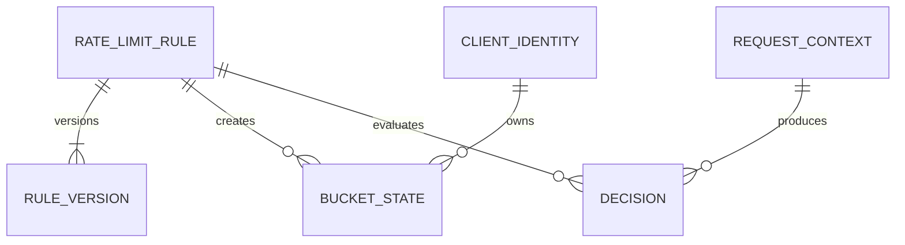
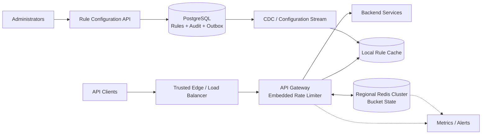
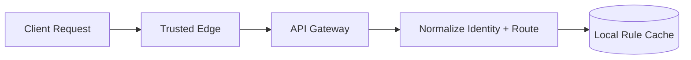
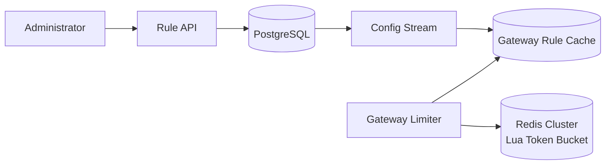
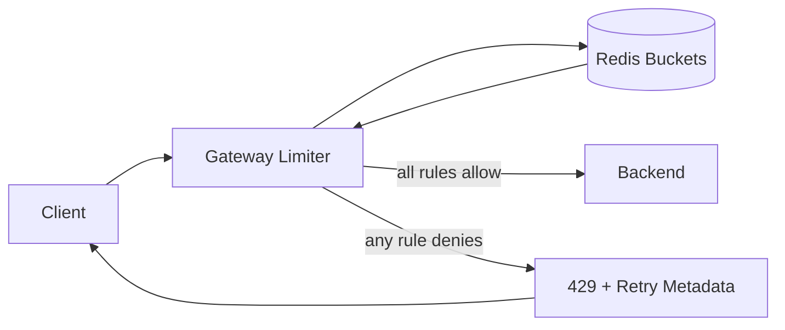

# Distributed API Rate Limiter

This is an original interview guide inspired by the structure and topics in
[Hello Interview's distributed rate-limiter breakdown][source]. It focuses on
the decisions most useful in a 60-minute system design interview rather than
reproducing the source.

[source]: https://www.hellointerview.com/learn/system-design/problem-breakdowns/distributed-rate-limiter

Source reviewed: 2026-09-14.

## 0. One-Minute Design

The rate limiter runs inside the API gateway so every protected request is
checked before reaching a backend and no extra rate-limiter service hop is
required. The trusted edge authenticates API keys or JWTs, normalizes the
client IP and route, and supplies that context to the limiter.

Each gateway keeps versioned rules in a local in-memory cache. For every
matching rule, it builds a bucket key from the rule and client identity, then
executes an atomic token-bucket Lua script in a regional Redis Cluster. The
script refills tokens according to elapsed Redis server time and consumes the
request cost only when enough tokens remain.

If every applicable rule allows the request, the gateway forwards it to the
backend. Otherwise it immediately returns `429 Too Many Requests` with limit,
remaining, reset, and retry information. Interactive requests are rejected,
not queued.

A separate control plane stores rules in PostgreSQL and publishes versioned
changes to gateways. Redis state is sharded by identity, replicated across
availability zones, and expired after idle buckets refill. Per-rule failure
policies decide whether a Redis outage fails open, fails closed, or uses a
conservative local emergency limit.

## 1. Requirements

### Functional

1. Identify clients by authenticated user ID, API key, IP address, or a
   configured combination.
2. Enforce configurable HTTP request limits, such as 100 search requests per
   minute per user.
3. Reject requests that exceed a limit with HTTP `429` and useful limit,
   remaining, reset, and retry metadata.

### Out of Scope

- Long-term storage of individual rate-limit decisions.
- Complex usage analytics and billing.
- Client-side limiting as the security boundary.
- Perfectly strict global consistency across regions.
- General DDoS scrubbing and bot detection.

### Non-Functional

| Goal | Target |
|---|---|
| Latency | Add less than 10 ms at p99 to a protected request |
| Availability | Keep the data plane highly available with an explicit fail-open or fail-closed policy per rule |
| Scale | Process 1 million rate-limit checks/second across 100 million daily active users |
| Enforcement consistency | Make each bucket update atomic while accepting short-lived rule-propagation and cross-region quota differences |

The system favors a low-latency, highly available approximation over a
globally serialized counter. Security-sensitive rules can choose stricter
failure behavior.

### Capacity Estimate

At peak:

```text
1,000,000 protected requests/second
  x 1-3 identity-scope checks/request
  = 1-3 million atomic bucket evaluations/second
```

If one Redis shard safely sustains about 50,000-100,000 Lua evaluations/second
with production headroom, the cluster needs tens of primary shards, plus
replicas. The exact count must come from benchmarking the real script and
network.

Suppose one active bucket consumes roughly 200 bytes after Redis overhead:

```text
100 million active buckets x 200 bytes
  ~= 20 GB per active rule dimension
```

Idle-key expiration is essential because the theoretical combination of all
users, routes, and rules is much larger than the active working set.

## 2. Core Entities

| Entity | Purpose |
|---|---|
| ClientIdentity | Trusted user, API-key, IP, or composite scope value |
| RequestContext | Method, normalized route, identity set, timestamp, and token cost |
| RateLimitRule | Matcher, scope, algorithm, capacity, refill rate, priority, and failure policy |
| RuleVersion | Immutable version and effective time of a rule change |
| BucketState | Current scaled token count and last refill time for one rule/identity pair |
| Decision | Allow or deny result plus limiting rule and response metadata |



A rule defines policy; a bucket stores one client's current usage under that
policy:

```text
Rule:
  search-user-v3 -> 100 requests/minute, burst capacity 20

Bucket:
  user-42 + search-user-v3 -> 7.5 tokens remaining
```

The system does not persist every `Decision`. It emits aggregate allow/deny,
latency, rule-version, and failure-mode metrics asynchronously.

## 3. APIs and Interfaces

The rate limiter's data plane is normally embedded in an API gateway or
sidecar. `CheckAndConsume` below is a logical interface; it need not be a
network API. The rule-management endpoints form a separate authenticated
control plane.

| Functional requirement | API or interface |
|---|---|
| Identify the client | Existing protected HTTP request plus trusted gateway identity extraction |
| Configure and enforce limits | `PUT /v1/rate-limit-rules/{ruleId}` plus internal `CheckAndConsume` |
| Reject excessive traffic | HTTP `429 Too Many Requests` response from the gateway |

### Functional Requirement 1: Identify a Client

A protected request may contain authentication credentials:

```http
GET /v1/search?q=redis HTTP/1.1
Host: api.example.com
Authorization: Bearer <access-token>
X-API-Key: <api-key>
```

The trusted edge derives normalized context:

```json
{
  "requestId": "req-701",
  "method": "GET",
  "routeId": "GET:/v1/search",
  "identities": [
    {
      "type": "USER",
      "value": "user-42"
    },
    {
      "type": "API_KEY",
      "value": "key-id-17"
    },
    {
      "type": "IP",
      "value": "203.0.113.8"
    }
  ]
}
```

The gateway validates the JWT and uses its `sub` claim, resolves an API key to
an internal key ID, and obtains the source IP from a trusted proxy chain. It
never uses the raw API secret as a Redis key and never trusts a client-supplied
`X-Forwarded-For` value that did not pass through the controlled edge.

Normalize parameterized paths such as `/v1/users/123` to a bounded route ID
like `GET:/v1/users/:id`. Otherwise user-controlled paths could create
unbounded bucket keys and bypass endpoint rules.

### Functional Requirement 2: Configure and Enforce Rules

An administrator creates or replaces a versioned rule:

```http
PUT /v1/rate-limit-rules/search-user
Authorization: Bearer <admin-access-token>
If-Match: "2"
Content-Type: application/json
```

```json
{
  "scope": "USER",
  "matcher": {
    "method": "GET",
    "routeId": "GET:/v1/search"
  },
  "algorithm": "TOKEN_BUCKET",
  "capacity": 20,
  "refillTokens": 100,
  "refillPeriodSeconds": 60,
  "requestCost": 1,
  "failureMode": "FAIL_CLOSED",
  "effectiveAt": "2026-09-14T23:00:00Z",
  "enabled": true
}
```

```http
HTTP/1.1 200 OK
Content-Type: application/json
```

```json
{
  "ruleId": "search-user",
  "version": 3,
  "status": "SCHEDULED"
}
```

`If-Match` prevents two administrators from silently overwriting each other.
The service validates that capacity, refill rate, request cost, matcher, and
failure policy are safe before storing the immutable version.

For each protected request, the embedded limiter conceptually calls:

```jsonc
// CheckAndConsume input
{
  "requestId": "req-701",
  "method": "GET",
  "routeId": "GET:/v1/search",
  "identities": {
    "userId": "user-42",
    "apiKeyId": "key-id-17",
    "ip": "203.0.113.8"
  },
  "cost": 1
}
```

```jsonc
// CheckAndConsume output
{
  "allowed": false,
  "limitingRuleId": "search-user",
  "ruleVersion": 3,
  "limit": 100,
  "remaining": 0,
  "retryAfterMs": 17000,
  "resetAfterMs": 17000
}
```

All rules matching the route and available identities are evaluated. A request
is allowed only when every applicable rule allows it. The gateway derives
`cost` from trusted route/rule metadata; a client cannot choose its own cost.

### Functional Requirement 3: Return an HTTP 429

When a rule denies the request, the gateway does not call the backend:

```http
HTTP/1.1 429 Too Many Requests
Content-Type: application/json
RateLimit-Limit: 100
RateLimit-Remaining: 0
RateLimit-Reset: 17
Retry-After: 17
```

```json
{
  "error": {
    "code": "RATE_LIMIT_EXCEEDED",
    "message": "Too many search requests.",
    "ruleId": "search-user",
    "retryAfterSeconds": 17
  }
}
```

The `RateLimit-*` fields describe the policy that caused the denial.
`Retry-After` tells the client when retrying can be useful. Legacy APIs may use
`X-RateLimit-Limit`, `X-RateLimit-Remaining`, and `X-RateLimit-Reset`.

Allowed responses may include the same limit and remaining metadata. Clients
should still use exponential backoff with jitter after a `429` rather than
retrying in a synchronized burst.

## 4. High-Level Design



This architecture separates the **control plane**, which changes policy, from
the **data plane**, which evaluates every request. The three workflows below
use subsets of these same components.

### Concrete Component Choices

| Component | Default choice | Why / alternative |
|---|---|---|
| Edge | Cloud load balancer plus WAF/DDoS service | Supplies trusted source metadata and drops volumetric attacks before Redis |
| Data-plane placement | Envoy, NGINX, or API-gateway filter | Avoids a separate service network hop; a gRPC sidecar is an alternative |
| Rule cache | In-process immutable snapshot | Rule matching requires no database or Redis read |
| Bucket store | Redis Cluster | Low-latency atomic scripts, TTLs, replication, and automatic sharding |
| Atomic operation | Preloaded Lua script invoked with `EVALSHA` | Performs refill, decision, consume, and expiry in one server-side operation |
| Rule database | PostgreSQL | Durable versions, validation, optimistic concurrency, and audit history |
| Configuration distribution | Kafka compacted topic | Replayable versioned updates; watch APIs or managed pub/sub are alternatives |
| Observability | Prometheus-compatible metrics and tracing | Measures added latency, denials, failures, hot keys, and version rollout |

The concrete interview design uses **an embedded gateway filter, PostgreSQL,
Kafka, and regional Redis Clusters with Lua**. The control plane can be
temporarily unavailable without stopping gateways that hold a last-known-good
rule snapshot.

### 4.1 Workflow for API 1: Identify a Client



1. **Terminate and sanitize at the edge.** Strip untrusted forwarding headers,
   attach the verified source address, and pass the request to the gateway.
2. **Authenticate credentials.** Verify the JWT or API key before using its
   identity. Anonymous traffic receives an IP identity only.
3. **Build every applicable scope.** An authenticated request may be subject to
   user, API-key, IP, endpoint, tenant, and global rules simultaneously.
   Prefer user or API-key limits for fairness; shared NATs and carrier gateways
   make IP limits coarser, so configure their thresholds accordingly.
4. **Normalize the route.** Match a registered route ID rather than the raw URL,
   query string, or attacker-controlled path.
5. **Match local rules.** Read an immutable in-process rule snapshot and select
   the versions effective at the current time.

**Why these choices:** identity extraction at the gateway is difficult for a
client to bypass; trusted normalization prevents spoofing and key explosion;
and a local rule cache removes control-plane storage from the per-request path.

### 4.2 Workflow for API 2: Configure and Enforce a Rule



1. **Store an immutable rule version.** The Rule API validates the update and
   commits version 3 with `effectiveAt`, actor, and audit metadata.
2. **Distribute the version.** Commit a configuration outbox row with the rule,
   then publish it through CDC to a compacted Kafka topic. Gateways apply only
   monotonically newer updates and periodically compare checksums with
   PostgreSQL.
3. **Match without remote reads.** For each request, the gateway finds all
   matching rules in its local snapshot.
4. **Build bucket keys.** A user rule might use
   `rl:{user:42}:search-user`; the Redis hash tag keeps the same user's
   related keys on one cluster shard.
5. **Execute atomically.** One preloaded Lua script per affected shard reads
   buckets, calculates refill using Redis time, conditionally consumes request
   cost, sets idle TTLs, and returns decision metadata. Execute independent
   shard calls concurrently.
6. **Combine decisions.** If any user, API-key, IP, tenant, endpoint, or global
   rule denies, the overall request is denied.

**Why these choices:** versioned configuration enables audit and rollback;
Kafka distributes changes without gateway polling on every request; Redis
shares usage across all gateway instances; and Lua closes the
read-modify-write race in one round trip.

### 4.3 Workflow for API 3: Allow or Reject



1. **Evaluate before backend work.** The gateway runs the limiter after
   authentication but before expensive application processing.
2. **Forward an allowed request.** Preserve the original request and optionally
   attach trusted decision metadata for backend observability.
3. **Fail fast on denial.** Return `429` immediately. Do not queue an
   interactive request because queueing consumes resources, makes latency
   unpredictable, and encourages client retries.
4. **Choose the response policy.** When several rules deny, report the rule
   with the longest required wait or the most restrictive reset.
5. **Handle limiter failure explicitly.** Apply the strictest configured
   fail-open, fail-closed, or local-emergency policy among rules whose state
   could not be checked rather than silently defaulting. A fail-closed
   infrastructure error normally returns `503 Service Unavailable`, not a
   misleading quota `429`.
6. **Emit asynchronous metrics.** Record the rule ID/version, identity type,
   decision, failure mode, and latency without logging secrets or raw
   identifiers.

**Why these choices:** the gateway protects all backends consistently; fast
failure minimizes wasted work; useful headers allow well-behaved clients to
back off; and explicit failure modes prevent a Redis incident from producing
an accidental policy.

## 5. Shared Token-Bucket Semantics

### Algorithm Options

| Algorithm | Benefit | Cost |
|---|---|---|
| Fixed-window counter | Simplest state and implementation | Allows a burst at the boundary between windows |
| Sliding-window log | Exact count over the last interval | Stores one timestamp per request and uses more CPU/memory |
| Sliding-window counter | Small state and smoother than fixed windows | Approximation assumes distribution within adjacent windows |
| Token bucket | Supports a controlled burst plus steady refill | Requires correct refill math and parameter tuning |

Choose **token bucket** because API traffic is naturally bursty and each bucket
stores only a scaled token count and last-refill timestamp.

### Token-Bucket Calculation

For a capacity of 20 tokens and a refill of 100 tokens per 60 seconds:

```text
refill rate = 100 / 60 tokens per second

refilled = min(
  capacity,
  previous_tokens + elapsed_time * refill_rate
)

if refilled >= request_cost:
    allowed = true
    remaining = refilled - request_cost
else:
    allowed = false
    retry_after = (request_cost - refilled) / refill_rate
```

    Capacity 20 controls the largest immediate burst. Refilling 100 tokens each
    minute controls the long-run rate.

    Store tokens as fixed-point scaled integers, such as microtokens, so every
    gateway and Redis node applies the same rounding policy. New or fully expired
    buckets start full, allowing the configured burst.

The entire read, refill, compare, decrement, write, and TTL update runs in one
Lua script. Separate `GET` and `SET` calls are unsafe:

```text
one token remains
Gateway A reads 1
Gateway B reads 1
both allow
```

An atomic script serializes both evaluations, so only one consumes the token.

### Layered Rules

A request can match several policies:

```text
User user-42:       100 search requests/minute
API key key-id-17:  10,000 requests/hour
IP 203.0.113.8:     500 requests/minute
Search endpoint:    50,000 requests/second
```

Rules for one scope can share a Redis hash slot and be evaluated together.
Rules across unrelated user, IP, and global shards cannot participate in one
Redis Cluster transaction. Evaluate them independently and deny if any denies.
Some tokens may be conservatively consumed from one bucket before another
bucket rejects the request; this can under-admit but never increases backend
load.

Strict all-scope atomicity would require a coordinator or distributed
transaction and is usually not worth the latency and availability cost.

## 6. Data Model

PostgreSQL stores durable policy; Redis stores ephemeral usage. No relational
database query occurs on the request path.

### PostgreSQL Control Plane

| Table | Important key or index |
|---|---|
| `rate_limit_rules` | PK `(rule_id, version)`; scope, matcher, algorithm, capacity, refill, cost, fail mode, effective time |
| `rule_heads` | PK `rule_id`; current version and status |
| `rule_audit_events` | Append-only PK `(rule_id, sequence)`; actor, old/new version, reason, and timestamp |

Rules are immutable after publication. A rollback creates a newer version with
the earlier parameters rather than rewriting history.

### Redis Data Plane

```text
Key:
  rl:{user:42}:search-user

Hash fields:
  tokens_scaled
  last_refill_ms
  rule_version

TTL:
  longer than the time required for an empty bucket to refill fully
```

The `{user:42}` hash tag keeps that identity's related keys in one Redis
Cluster slot. IP and API-key scopes use their own normalized tags.

Use a Redis memory policy that does not silently evict active limiter keys.
Capacity alarms and idle TTLs are safer than allowing memory pressure to reset
a bucket to full.

### Local Rule Snapshot

Each gateway stores:

```text
route_id -> ordered matching rule versions
snapshot_version
loaded_at
checksum
```

Updates replace an immutable snapshot atomically, so request threads never see
a partially applied configuration.

## 7. Deep Dives

Each deep dive corresponds directly to one non-functional requirement:

| Non-functional requirement | Deep dive |
|---|---|
| Latency | 7.1 Gateway placement, local configuration, and one-round-trip Lua |
| Availability | 7.2 Redis failover, last-known-good rules, and explicit failure modes |
| Scale | 7.3 Redis sharding, hot keys, global limits, and regional quotas |
| Enforcement consistency | 7.4 Atomic updates, rule versions, clocks, and bounded overshoot |

### 7.1 Latency: How Do We Add Less Than 10 ms?

**Addresses:** p99 rate-limiter overhead on every protected request.

Placement options:

| Placement | Advantage | Drawback |
|---|---|---|
| Application library | No extra service hop | Every service must integrate and update it correctly |
| Central rate-limit service | One implementation and policy point | Adds a network hop and a new availability dependency |
| API gateway filter | Central enforcement without another hop | Gateway becomes more sophisticated |

Choose the gateway filter. Then:

- Keep rule matching entirely in process.
- Preload the Lua script and call it with `EVALSHA`.
- Perform refill and consume in one Redis round trip.
- Pipeline rules sharing a hash slot and evaluate unrelated shard calls in
  parallel rather than adding their network latencies serially.
- Maintain persistent, bounded Redis connection pools.
- Deploy gateways and Redis in the same region and preferably the same zone
  topology.
- Use strict sub-10-ms Redis timeouts and avoid retries on the request path.
- Measure queueing, connection-pool wait, network, script, and total limiter
  latency separately.

Deploy a regional limiter close to users rather than sending every request to
one global Redis cluster. Cross-region quota differences are an explicit
consistency tradeoff.

Local token leasing can eliminate many Redis calls, but it introduces unused
quota, bounded overshoot, and more failure reasoning. Add it only if
benchmarking shows regional Redis cannot meet the latency target.

### 7.2 Availability: What Happens When Dependencies Fail?

**Addresses:** keeping the data plane available without exposing backends to an
uncontrolled traffic surge.

Redis Cluster shards state across masters and keeps replicas in separate
availability zones. Automatic failover promotes a replica when a master dies.
Because replication can lag, a promoted replica may have slightly older bucket
state and briefly over-admit requests.

The control plane is not on the request path. Gateways continue using their
last-known-good rules when PostgreSQL or the configuration stream is down.
Alert if a snapshot exceeds its maximum allowed age.

Failure behavior is a product and security decision:

| Mode | Behavior | Suitable example |
|---|---|---|
| Fail closed | Reject when the bucket cannot be checked | Login, writes, expensive operations, backend protection |
| Fail open | Forward and emit an alert | Low-risk reads where availability dominates |
| Local emergency limit | Apply a conservative per-gateway bucket | Degraded compromise when some over-admission is acceptable |

The concrete social-platform default is fail closed for protected endpoints:
a short period of rejection is safer than turning a Redis incident into a
database-wide outage. Low-risk rules may explicitly choose another mode.

Use circuit breakers so gateways stop waiting on an unhealthy Redis shard.
Monitor fail-mode activations, replica promotion, denied percentage, Redis
memory, script latency, connection saturation, and backend load.

### 7.3 Scale: How Do We Handle 1 Million Checks/Second?

**Addresses:** horizontal throughput, hot identities, and large global rules.

Redis Cluster maps keys to 16,384 hash slots and spreads those slots across
many primaries. Hash by the scoped identity so all requests for one bucket
reach the same shard:

```text
user rule    -> hash(user_id)
API-key rule -> hash(api_key_id)
IP rule      -> hash(normalized_ip)
```

Scale gateway instances independently; every instance routes to the same
shared bucket through Redis Cluster. Add shards based on measured Lua
throughput, CPU, network, and p99 latency rather than an optimistic operations
number.

A single abusive identity can create a hot key on one shard. Once its bucket is
empty, gateways may briefly cache the deny-until time, block the identity at
the edge, or move it to a short-lived deny list. Volumetric attacks should be
handled by a WAF or DDoS service before reaching Redis.

For legitimate high-volume clients:

- Offer batch APIs to reduce request count.
- Encourage client-side smoothing while retaining server enforcement.
- Allocate a dedicated rule or shard for exceptionally large tenants.
- Lease small token batches to gateways when bounded approximation is
  acceptable.

Do not put a million-request-per-second global limit on one Redis key. Divide
the global budget across shards, gateway groups, or regions and periodically
rebalance unused quota. This trades perfect utilization for bounded load and
removes the hot counter.

Use idle TTLs to keep memory proportional to recently active buckets, not all
possible user/rule combinations.

### 7.4 Enforcement Consistency: How Accurate Is the Limit?

**Addresses:** race-free per-bucket decisions with accepted distributed
approximation.

Per bucket, Redis Lua provides strong atomic read-modify-write behavior.
Use Redis server time for refill calculations so gateway clock skew does not
change token counts. Fixed-point tokens make rounding deterministic.

Configuration remains versioned and eventually distributed:

1. The Rule API commits a new immutable version with `effectiveAt`.
2. Kafka publishes it to every gateway group.
3. Gateways atomically swap local snapshots.
4. A periodic checksum detects a missed event.
5. Metrics include the applied `ruleVersion` so rollout convergence is visible.

When parameters change, the stable bucket key retains its state. The Lua script
detects a newer `rule_version`, conservatively clamps tokens to the new
capacity, applies the documented migration policy, and records the version.
This avoids granting a fresh full bucket during every rule rollout. A
versioned-key strategy is simpler but permits a one-time extra burst.

Multi-region enforcement cannot be both independent and globally exact without
cross-region coordination on every request. Allocate each region a quota slice
and periodically rebalance. The maximum overshoot is bounded by outstanding
regional or gateway leases.

Layered rules on different Redis shards are not one atomic transaction. The
conservative independent-evaluation behavior is documented: it may consume
tokens from a bucket even when another rule denies, but it cannot over-admit
because of that partial consumption.

## 8. Important Tradeoffs and Failures

| Situation | Decision |
|---|---|
| Two gateways consume the final token concurrently | Atomic Lua script lets only one succeed |
| Client spoofs `X-Forwarded-For` | Trusted edge strips it and supplies verified source metadata |
| Redis master fails | Promote a replica; tolerate bounded over-admission from replication lag |
| Entire Redis shard is unreachable | Apply the matched rule's explicit fail mode |
| Rule database is unavailable | Continue with last-known-good gateway snapshots |
| Gateway misses a rule event | Periodic version/checksum refresh repairs it |
| Active bucket is evicted | Prevent with memory reservation, no-silent-eviction policy, and alarms |
| One identity becomes a hot key | Edge block or briefly cache denial; isolate legitimate high-volume clients |
| Global limit becomes a hot key | Partition quota across shards or gateway groups |
| Gateway clock differs | Use Redis server time for refill calculations |
| Rule version changes | Atomically migrate and clamp the stable bucket state |
| Regional limiters diverge | Accept bounded overshoot and rebalance regional quota slices |
| Gateway holding leased tokens crashes | Unused lease temporarily reduces capacity; leases expire and replenish |

The central tradeoff is **exact global enforcement versus latency and
availability**. This design is exact for one Redis bucket and intentionally
approximate across independent scopes, shards, and regions.

## 9. Main Design Decisions

| Decision | Why |
|---|---|
| Enforce in the API gateway | Central protection without an extra rate-limit service hop |
| Trusted normalized identities | Prevents spoofing, secret exposure, and unbounded key creation |
| Token bucket | Supports normal bursts while enforcing a steady long-term rate |
| Redis Cluster bucket state | Shared low-latency state across all gateways |
| Atomic Lua script | Eliminates read-modify-write races in one round trip |
| PostgreSQL versioned rules | Durable control-plane history and safe concurrent edits |
| Local immutable rule cache | Keeps configuration storage off the request path |
| Explicit per-rule fail mode | Outages produce intentional rather than accidental behavior |
| Identity-based sharding | All requests for one bucket reach the same Redis shard |
| Partitioned global/regional quotas | Avoids one hot global counter |
| HTTP `429` plus retry fields | Gives clients a standard fast-failure contract |

## 10. Suggested 60-Minute Interview Walkthrough

| Time | Topic |
|---:|---|
| 0-5 min | Clarify protected traffic, identities, layered rules, and failure policy |
| 5-10 min | Three functional requirements, four NFRs, and scale estimate |
| 10-15 min | Core entities and control/data-plane interfaces |
| 15-20 min | Draw the shared high-level design |
| 20-25 min | Workflow 1: trusted client identification |
| 25-32 min | Workflow 2: configure rules and atomically consume tokens |
| 32-36 min | Workflow 3: forward or return `429` |
| 36-42 min | Compare algorithms and explain token-bucket math |
| 42-47 min | Deep dive 1: sub-10-ms request path |
| 47-51 min | Deep dive 2: Redis failure and fail-open versus fail-closed |
| 51-56 min | Deep dive 3: Redis sharding, hot keys, and global limits |
| 56-59 min | Deep dive 4: atomicity, dynamic versions, and regional consistency |
| 59-60 min | Summarize guarantees and approximation boundaries |

If time is limited, prioritize gateway placement, token-bucket math, atomic
Lua, Redis sharding, fail-open versus fail-closed, and the fact that globally
exact limits require expensive coordination.

## References

- [Hello Interview: Design a Distributed Rate Limiter][source]
- [RFC 6585: HTTP 429 Too Many Requests](https://www.rfc-editor.org/rfc/rfc6585#section-4)
- [RFC 9333: RateLimit Header Fields for HTTP](https://www.rfc-editor.org/rfc/rfc9333)
- [Redis: Scripting with Lua](https://redis.io/docs/latest/develop/programmability/eval-intro/)
- [Redis Cluster Specification](https://redis.io/docs/latest/operate/oss_and_stack/reference/cluster-spec/)
- [Redis `EXPIRE`](https://redis.io/docs/latest/commands/expire/)
- [Envoy Global Rate Limiting](https://www.envoyproxy.io/docs/envoy/latest/intro/arch_overview/other_features/global_rate_limiting)
