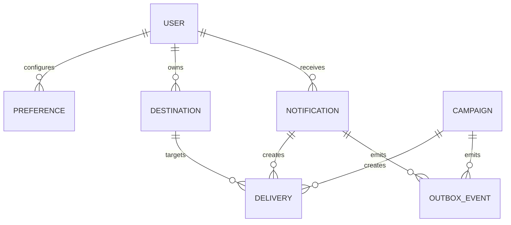
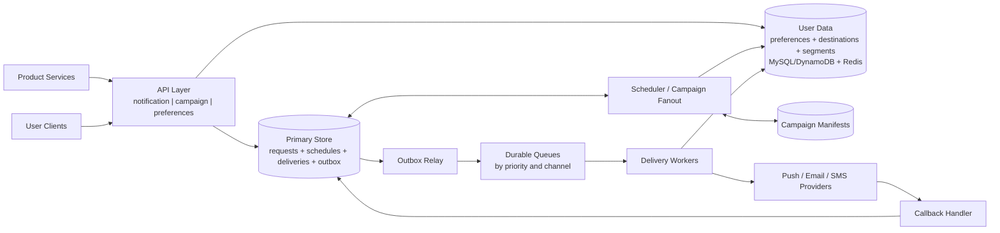
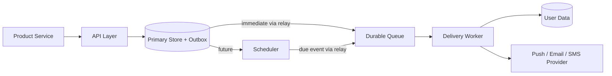
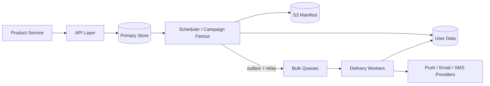
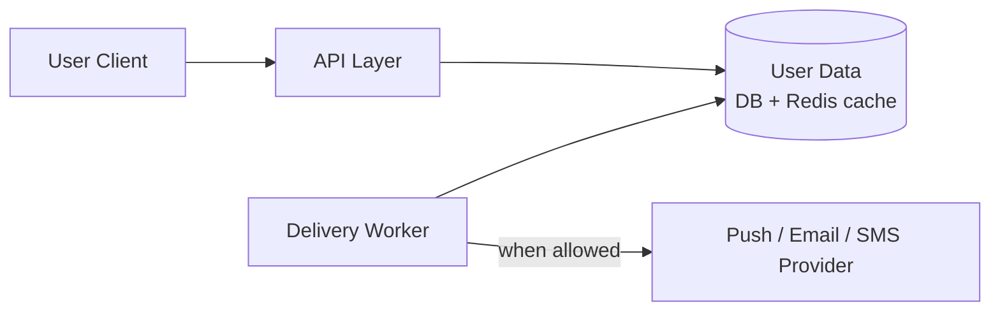
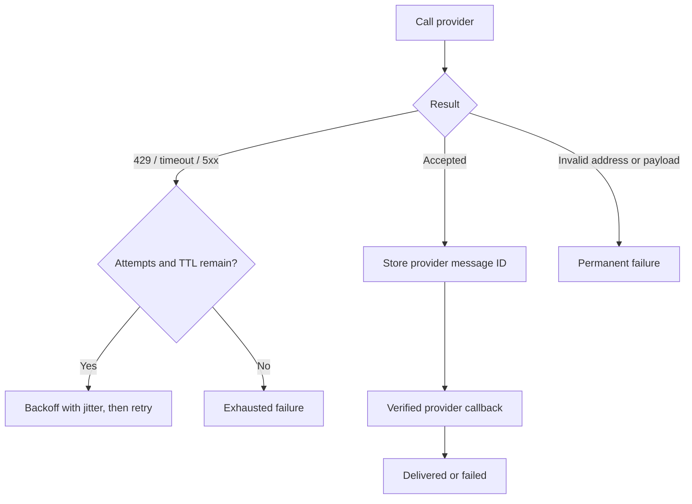

# Multi-Channel Notification System

This is an original interview guide inspired by the structure and topics in
[Hello Interview's notification-system breakdown][source]. It focuses on the
decisions most useful in a 60-minute system design interview rather than
reproducing the source.

[source]: https://www.hellointerview.com/learn/system-design/problem-breakdowns/notification-system

Source reviewed: 2026-09-03.

## 0. One-Minute Design

Internal services submit immediate or scheduled notifications through an
authenticated API. The API stores the request and an outbox event in one
transaction for immediate work, or stores the request and a durable schedule
row together for future work. It then returns `202 Accepted`.

Delivery workers evaluate the user's current preferences, quiet hours, and
destinations before sending. Durable queues separate urgent traffic, such as
login codes, from normal and bulk campaigns. Push, email, and SMS workers call
external providers and retry transient failures.

Campaigns store their content once and expand a stable recipient list in
batches. The system uses at-least-once processing with idempotency at every
internal boundary. This prevents most duplicates, although exactly-once
delivery cannot be guaranteed across an external provider call.

## 1. Requirements

### Functional

1. Send a push, email, or SMS notification to one user, immediately or at a
   future time.
2. Send an immediate or scheduled campaign to a user segment.
3. Honor channel opt-outs and user-local quiet hours.

### Out of Scope

- Template authoring and content management.
- Open-rate and click-through analytics.
- In-app notification feeds.
- Implementing push, email, or SMS networks.

### Non-Functional

| Goal | Target |
|---|---|
| Scale | 10 million notifications/day; bursts of 5,000 deliveries/second |
| Urgent latency | p99 under 5 seconds from acceptance to provider submission |
| Reliability | Accepted work survives service, worker, or broker failures |
| Delivery semantics | At-least-once processing while minimizing duplicate notifications |

The latency target ends at provider submission because the platform cannot
control a carrier, mail server, or offline phone.

### Capacity Estimate

```text
10,000,000 notifications / 86,400 seconds
  ~= 116 notifications/second average

1,000,000-recipient campaign / 300 seconds
  ~= 3,333 recipients/second
```

If each recipient uses 1.5 channels on average, the campaign produces about
5,000 provider calls/second. Burst throughput, not daily average throughput,
drives the design.

## 2. Core Entities

| Entity | Purpose |
|---|---|
| Notification | One producer request for one user, with content, priority, schedule, and expiry |
| Campaign | Shared content, segment reference, schedule, and pacing policy |
| Preference | Per-user category and channel settings, timezone, and quiet hours |
| Destination | Email address, phone number, or push device token |
| Delivery | One notification or campaign send to one destination |
| OutboxEvent | Durable handoff from database state to asynchronous processing |



The logical request and its deliveries are different records. A request may
produce zero deliveries when suppressed or several when a user has multiple
channels or push devices.

## 3. APIs

| Functional requirement | API |
|---|---|
| Send one notification now or later | `POST /v1/notifications` |
| Send a campaign now or later | `POST /v1/campaigns` |
| Manage opt-outs and quiet hours | `GET` / `PUT /v1/users/{userId}/preferences` |

### Functional Requirement 1: Send One Notification

```http
POST /v1/notifications
Idempotency-Key: login-alert-7f24
Content-Type: application/json
```

```json
{
  "recipientUserId": "user-42",
  "category": "SECURITY",
  "priority": "URGENT",
  "channels": ["PUSH", "SMS"],
  "content": {
    "title": "New sign-in",
    "body": "A new sign-in was detected."
  },
  "sendAt": "2026-09-06T03:02:00Z",
  "expiresAt": "2026-09-06T03:07:00Z"
}
```

```json
{
  "notificationId": "ntf-701",
  "status": "SCHEDULED"
}
```

The response status is `202 Accepted`. Omit `sendAt` for immediate delivery.
Return `202 Accepted` only after the notification and its durable work marker
are committed. The marker is an outbox event for immediate work or a schedule
row for future work. Scope the idempotency key to the producer. Reusing a key
with the same body returns the original result; reusing it with different
content returns `409 Conflict`.

The server, not the caller, controls which producers may use urgent or
non-suppressible categories.

### Functional Requirement 2: Create a Campaign

```http
POST /v1/campaigns
Idempotency-Key: fall-sale-us-2026
```

```json
{
  "segmentId": "active-us-shoppers",
  "segmentVersion": 17,
  "category": "MARKETING",
  "channels": ["PUSH", "EMAIL"],
  "content": {
    "title": "Weekend sale",
    "body": "Selected items are on sale."
  },
  "sendAt": "2026-09-07T16:00:00Z",
  "expiresAt": "2026-09-08T04:00:00Z"
}
```

```json
{
  "campaignId": "cmp-88",
  "status": "SCHEDULED"
}
```

The response status is `202 Accepted`. The API stores one campaign record; it
does not create a million delivery rows synchronously. Omit `sendAt` to launch
immediately.

### Functional Requirement 3: Read and Update Preferences

```http
PUT /v1/users/user-42/preferences/MARKETING
```

```json
{
  "channels": {
    "PUSH": true,
    "EMAIL": false,
    "SMS": false
  },
  "timezone": "America/Los_Angeles",
  "quietHours": {
    "start": "22:00",
    "end": "08:00"
  },
  "version": 9
}
```

```http
GET /v1/users/user-42/preferences
```

The `GET` endpoint returns all category-level preferences. Use `version` or
`If-Match` on updates so concurrent clients do not silently overwrite each
other. Both endpoints return the current preference object with `200 OK`.

## 4. High-Level Design



This is one asynchronous pipeline. The three workflows below use subsets of
these same components; they do not introduce separate architectures.

### Concrete Component Choices

| Component | Default choice | Why / alternative |
|---|---|---|
| API layer | Stateless services behind an API gateway | Easy horizontal scaling; language and framework are not important |
| Primary store | MySQL or PostgreSQL | Transactions and unique constraints simplify idempotency and the outbox; DynamoDB is an alternative for known access patterns at larger scale |
| User data | MySQL or DynamoDB, with optional Redis cache | The database remains authoritative; Redis reduces repeated preference and destination reads |
| Outbox relay | Batched database polling | Simple and reliable at this scale; change-data capture is an alternative at higher throughput |
| Queue | SQS Standard | Managed at-least-once work queues, visibility timeouts, and DLQs; Kafka is a good alternative when replay and stream retention matter |
| Scheduler | Sharded due-time table with leased polling | Works with the primary database; EventBridge Scheduler or Cloud Tasks can replace it at moderate scale |
| Campaign manifest | S3 or another object store | Cheap storage and sequential page reads for large recipient snapshots |
| Delivery workers | Stateless containers or serverless workers | Scale independently by channel and priority |
| Providers | FCM/APNs, SES/SendGrid, and Twilio | Avoid building carrier, mail, and mobile push networks |

The concrete interview design uses **MySQL + transactional outbox, Redis as an
optional cache, SQS queues, and S3 campaign manifests**. These are examples,
not requirements: DynamoDB and Kafka can satisfy the same roles with different
operational tradeoffs.

### 4.1 Workflow for API 1: Send One Notification



1. **Accept the request.** The API authenticates the producer, validates the
   recipient and schedule, and verifies that the producer may use the requested
   category and priority.
2. **Deduplicate it.** A unique `(producer_id, idempotency_key)` constraint
   returns the original notification for safe producer retries.
3. **Persist before responding.** For immediate work, one MySQL transaction
   stores the notification and outbox event. For future work, it stores the
   notification and indexed schedule row. Only then does the API return
   `202 Accepted`.
4. **Release the work.** The outbox relay publishes immediate work to SQS.
   The scheduler claims future rows with leases and writes equivalent outbox
   events when `sendAt` arrives.
5. **Choose the actual destinations.** A worker reads current preferences and
   email, phone, or device-token records. Redis may serve this read, but the
   worker falls back to the authoritative database.
6. **Apply policy.** The worker suppresses an opt-out, expires stale work, or
   reschedules until quiet hours end. Deferred work is checked again later.
7. **Send and record.** The worker conditionally creates each destination
   delivery, calls the provider adapter, stores the result, and acknowledges
   the queue message.

**Why these choices:** the database transaction makes acceptance durable; the
outbox closes the database-to-queue failure gap; SQS absorbs bursts and
redelivers after worker failure; stateless workers scale by queue depth; and
late preference evaluation honors changes made after scheduling.

### 4.2 Workflow for API 2: Create a Campaign



1. **Accept one campaign.** The API stores the content, segment version,
   schedule, expiry, and idempotency key. It does not synchronously create a
   row for every user.
2. **Start at the scheduled time.** The scheduler claims the campaign with a
   lease so only one active owner expands it.
3. **Snapshot the audience.** The fanout service queries the versioned segment
   and writes a paged manifest to S3. This provides a stable answer to "who was
   targeted?" and makes retries deterministic.
4. **Expand in pages.** Workers claim manifest pages, write unique
   `(campaign_id, user_id, channel)` outbox events, and checkpoint progress.
5. **Apply backpressure.** The fanout rate follows SQS queue age, worker
   throughput, and provider quotas. It slows rather than flooding the broker.
6. **Reuse normal delivery.** Each recipient enters the same preference check,
   destination lookup, provider call, and retry path used by API 1.

**Why these choices:** S3 is cheaper than copying a large audience into the
transactional database; paged fanout avoids a million-row request path;
checkpoints make crashes recoverable; and separate bulk queues keep campaigns
from consuming capacity reserved for urgent notifications.

### 4.3 Workflow for API 3: Manage Preferences



1. **Read preferences.** `GET` checks Redis first and loads MySQL or DynamoDB
   on a cache miss. It returns category-level channel settings, timezone, quiet
   hours, and a version.
2. **Update safely.** `PUT` conditionally writes the database using `version`
   or `If-Match`. A stale writer receives a conflict rather than overwriting a
   newer choice.
3. **Refresh the cache.** After the database commit, invalidate the Redis key.
   A short TTL bounds stale reads if invalidation is delayed.
4. **Enforce near dispatch.** Delivery workers read the latest preference
   immediately before sending, so a user can opt out after a campaign was
   scheduled.
5. **Apply central policy.** The platform decides whether each category is
   suppressible, deferrable during quiet hours, or mandatory. Callers cannot
   label marketing traffic as security traffic.

**Why these choices:** the database provides durable consent history and
optimistic concurrency; Redis reduces hot read load but is never the source of
truth; and checking near dispatch provides stronger opt-out behavior than
checking only when the notification is created.

## 5. Shared Provider Result and Retry Flow



Only transient errors are retried. Invalid push tokens are disabled so future
notifications do not repeatedly fail.

## 6. Data Model

A relational database is a good default because acceptance, idempotency,
state transitions, and outbox creation benefit from transactions.

| Table | Important key or index |
|---|---|
| `notifications` | PK `notification_id`; unique `(producer_id, idempotency_key)` |
| `campaigns` | PK `campaign_id`; index `(state, send_at)` |
| `preferences` | PK `(user_id, category)` |
| `destinations` | PK `(user_id, channel, destination_id)` |
| `deliveries` | PK `delivery_id`; index `(state, next_attempt_at)` |
| `delivery_attempts` | PK `(delivery_id, attempt_number)` |
| `outbox_events` | PK `event_id`; index `(published_at, created_at)` |

Use stable logical keys to make fanout and retries safe:

```text
ready work: (source_type, source_id, user_id, channel)
delivery:   (source_type, source_id, destination_id)
```

Large campaign recipient manifests can live in object storage or a
wide-column store because workers consume them sequentially by page.

### Delivery States

```text
ACCEPTED -> SCHEDULED -> QUEUED
ACCEPTED ------------> QUEUED
QUEUED  -> SUPPRESSED
QUEUED  -> EXPIRED
QUEUED  -> SENDING -> PROVIDER_ACCEPTED
SENDING  -> RETRY_SCHEDULED -> QUEUED
SENDING  -> FAILED_PERMANENT
PROVIDER_ACCEPTED -> DELIVERED
```

Every update checks the current state or a state version. This prevents
duplicate workers and out-of-order callbacks from moving state backward.

`PROVIDER_ACCEPTED` means the external service accepted the request.
`DELIVERED` is used only when the provider supplies a meaningful delivery
receipt; neither status proves that a human saw the notification.

## 7. Deep Dives

Each deep dive corresponds directly to one non-functional requirement:

| Non-functional requirement | Deep dive |
|---|---|
| Reliability | 7.1 Durable acceptance and recovery |
| Urgent latency | 7.2 Priority isolation |
| Delivery semantics | 7.3 Idempotency and retries |
| Scale | 7.4 Scheduling, fanout, and backpressure |

### 7.1 Reliability: How Do We Avoid Lost Work?

**Addresses:** accepted work surviving service, worker, and broker failures.

The dangerous implementation performs two independent writes:

```text
1. Insert notification into the database.
2. Publish an event to the broker.
```

A crash between them leaves accepted data with no queued work. Publishing
first creates the opposite problem: workers can see an event before its data
exists.

Use a transactional outbox:

1. Insert immediate work and its outbox event in one database transaction.
   For future work, atomically insert the request and indexed schedule row.
2. Return `202` only after commit.
3. A relay publishes unpublished rows to the broker.
4. Mark an event published only after broker acknowledgement.
5. Consumers deduplicate by `event_id`.

The relay may publish twice if it crashes after broker acknowledgement but
before updating the outbox row. This is acceptable because a duplicate is
recoverable, while a lost notification is not.

The scheduler and campaign fanout also write queue-facing outbox events in
their state transactions. A periodic reconciler finds nonterminal records that
have stopped progressing.

### 7.2 Urgent Latency: How Do Critical Sends Avoid Campaign Delays?

**Addresses:** p99 provider submission within five seconds for urgent traffic.

A single priority queue is insufficient because bulk work can occupy every
worker connection and provider quota before urgent work arrives.

Separate queues and capacity:

```text
push.urgent    push.normal    push.bulk
email.urgent   email.normal   email.bulk
sms.urgent     sms.normal     sms.bulk
```

- Reserve worker concurrency and provider quota for urgent traffic.
- Rate-limit each producer so one caller cannot monopolize the system.
- Pace campaign fanout based on oldest queue age and provider throttling.
- Pause bulk work before urgent latency violates its objective.
- Allow urgent work to borrow idle bulk capacity, but not the reverse.

Queue age is the key health signal. Queue depth alone does not show whether
work is flowing or stalled.

### 7.3 Delivery Semantics: How Do We Handle Duplicates and Retries?

**Addresses:** at-least-once processing while minimizing user-visible
duplicates.

At-least-once queues can redeliver after worker crashes or acknowledgement
timeouts. Deduplicate at each boundary:

| Boundary | Key |
|---|---|
| Producer retries | `(producer_id, idempotency_key)` |
| Outbox republishes | `event_id` |
| Campaign page repeats | `(campaign_id, user_id, channel)` |
| Queue redelivers | `event_id`, unique delivery key, and conditional state |
| Provider callback repeats | `(provider, provider_event_id)` |

For transient provider failures, use capped exponential backoff with jitter
and stop retrying after `expires_at`.

Exactly-once user-visible delivery is generally impossible:

1. A provider accepts an SMS.
2. The worker loses the response.
3. Retrying might duplicate the SMS; not retrying might lose it.

Use a stable provider idempotency key or status lookup when supported.
Otherwise choose the risk by category: a rare duplicate may be preferable for
a security alert but not for every marketing message.

### 7.4 Scalability: How Do Scheduling and Campaign Fanout Handle Bursts?

**Addresses:** 10 million notifications/day and bursts of 5,000
deliveries/second.

Store scheduled work in durable time buckets:

```text
(utc_minute_bucket, shard, send_at, job_id)
```

Scheduler workers poll current and overdue buckets, claim rows with leases,
and emit due events through the outbox. Sharding a bucket prevents every 9:00
AM send from hitting one partition.

For a campaign:

- Schedule one campaign job, not one timer per recipient.
- Build a versioned recipient manifest at launch.
- Process recipients in idempotent pages.
- Store campaign content once and reference it from deliveries.
- Slow fanout when channel queues or providers are overloaded.

This converts an unbounded traffic spike into a controlled stream while
preserving durable progress.

## 8. Important Tradeoffs and Failures

| Situation | Decision |
|---|---|
| API crashes after commit but before response | Producer retries; idempotency returns the original result |
| Queue redelivers work | Conditional state update prevents duplicate internal processing |
| Worker crashes while processing | Queue visibility timeout or lease makes work available again |
| Provider returns `429` or `5xx` | Retry with backoff and reduce concurrency |
| Provider accepts but response is lost | Reuse provider idempotency key or accept category-specific duplicate risk |
| Preference service is unavailable | Fail closed for suppressible traffic |
| Campaign overloads a channel | Slow or pause bulk fanout; preserve urgent capacity |
| Callback arrives twice or out of order | Deduplicate and enforce valid forward-only state transitions |

The main tradeoff is **at-least-once versus exactly-once**. Durable retries are
more important than pretending duplicates can never happen. Stable IDs and
idempotent writes make duplicates rare and harmless inside the platform.

## 9. Main Design Decisions

| Decision | Why |
|---|---|
| Asynchronous `202` API | Producer latency is independent of provider latency |
| Database plus outbox | Closes the database-to-broker loss window |
| Separate urgent and bulk capacity | Campaigns cannot delay critical notifications |
| Durable time-bucket scheduler | Supports long delays and large same-time bursts |
| Paged campaign fanout | Avoids synchronous million-recipient expansion |
| Preferences checked near dispatch | Honors changes made after scheduling |
| At-least-once processing | Supports recovery across queues and external APIs |
| Explicit provider statuses | Avoids equating provider acceptance with user receipt |

## 10. Suggested 60-Minute Interview Walkthrough

| Time | Topic |
|---:|---|
| 0-5 min | Clarify channels, scheduling, campaign behavior, and delivery meaning |
| 5-10 min | Functional requirements, non-functional requirements, and capacity |
| 10-15 min | Core entities and APIs |
| 15-24 min | Overview plus API 1 immediate/scheduled workflow |
| 24-30 min | API 2 campaign workflow |
| 30-35 min | API 3 preference workflow |
| 35-41 min | Deep dive 1: reliable acceptance and recovery |
| 41-47 min | Deep dive 2: urgent latency and priority isolation |
| 47-53 min | Deep dive 3: at-least-once delivery and deduplication |
| 53-59 min | Deep dive 4: scheduled campaigns and burst scaling |
| 59-60 min | Summarize tradeoffs |

If time is limited, prioritize the acceptance invariant, priority isolation,
campaign backpressure, and the ambiguous provider-retry problem. Multi-region
active-active delivery, analytics, and rich template systems are optional
follow-ups rather than core design.

## References

- [Hello Interview: Design a Notification System][source]
- [RFC 9110: HTTP Semantics, 202 Accepted](https://www.rfc-editor.org/rfc/rfc9110#section-15.3.3)
- [Transactional Outbox Pattern](https://microservices.io/patterns/data/transactional-outbox.html)
- [Firebase Cloud Messaging Error Codes](https://firebase.google.com/docs/cloud-messaging/error-codes)
- [AWS Builders' Library: Timeouts, Retries, and Backoff with Jitter](https://aws.amazon.com/builders-library/timeouts-retries-and-backoff-with-jitter/)
