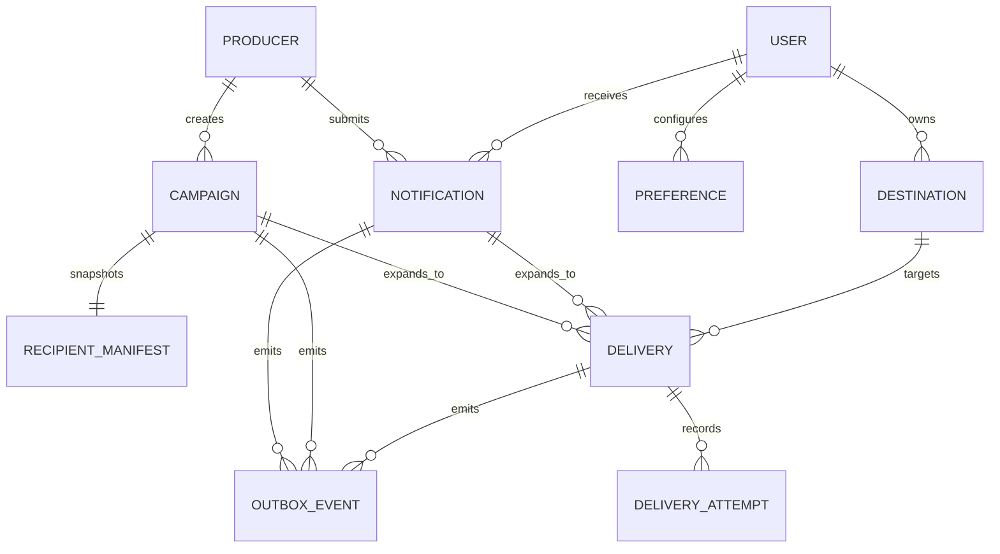
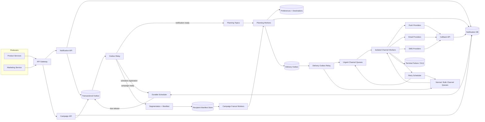
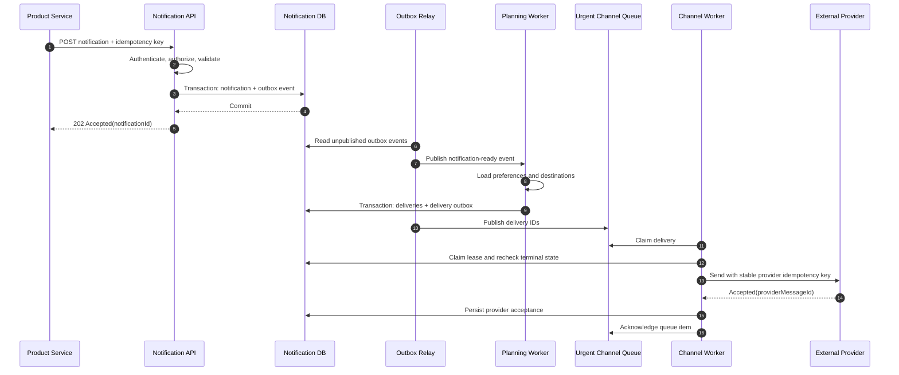
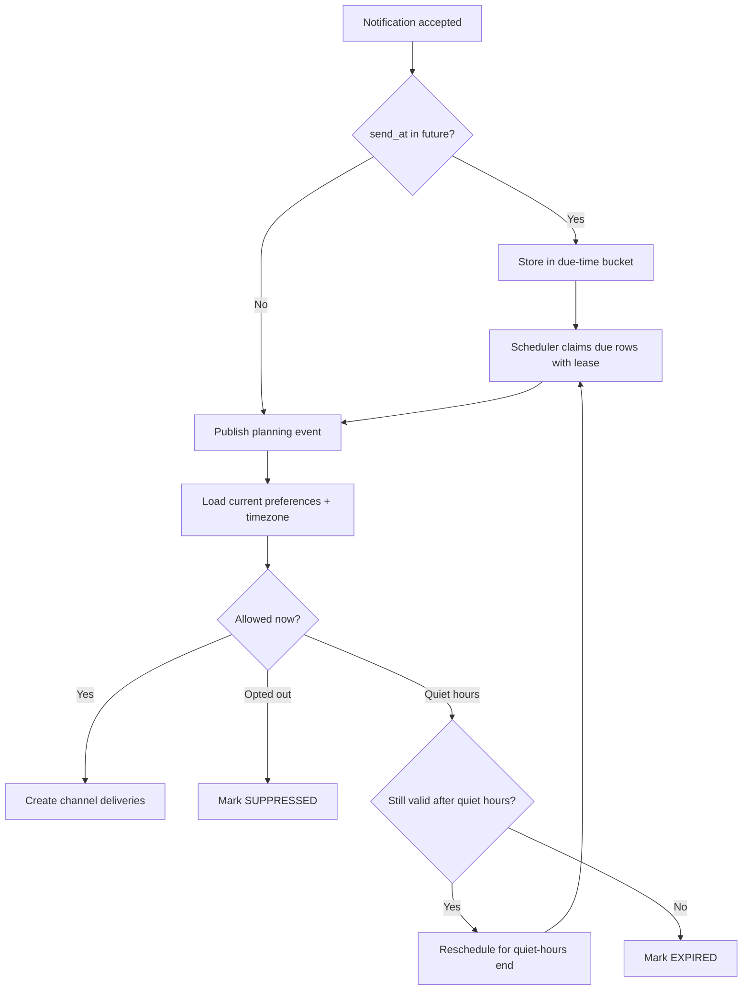
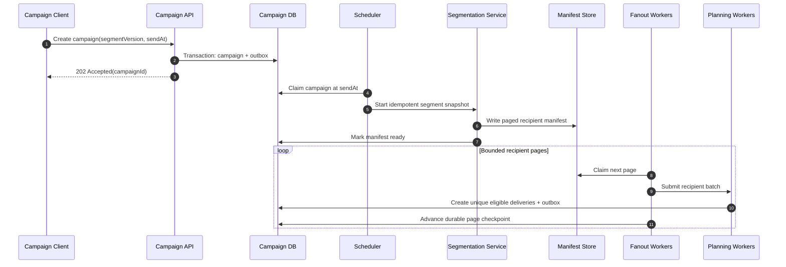
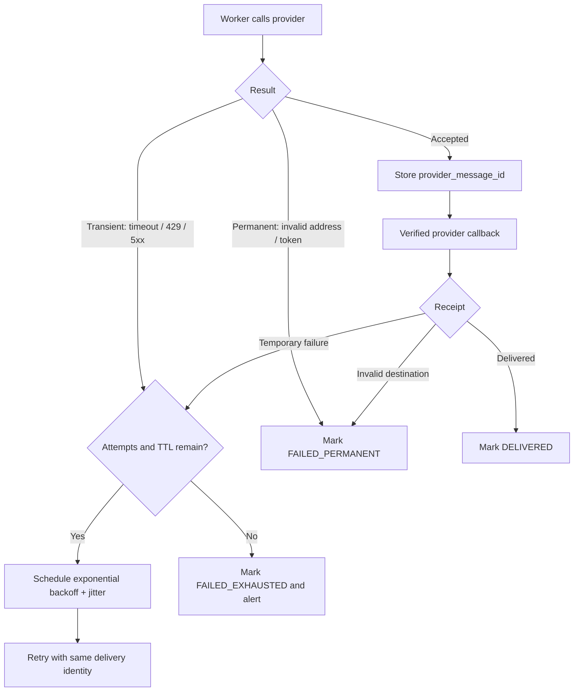
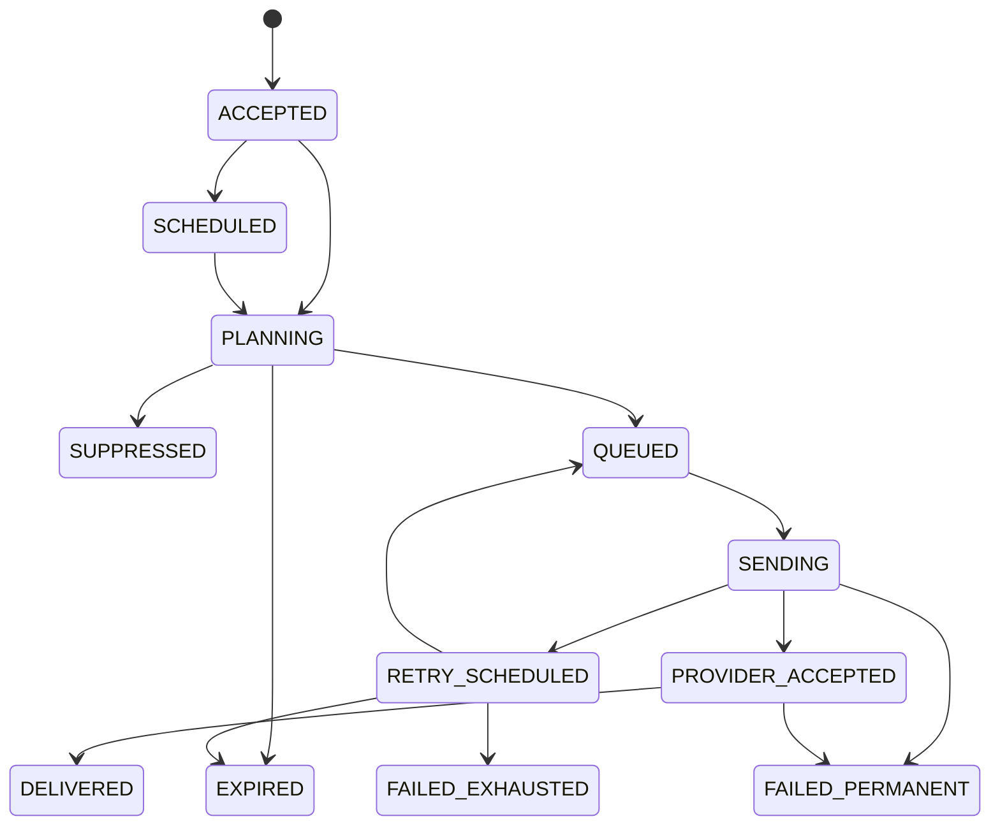

# Multi-Channel Notification System

This is an original, condensed discussion guide inspired by the structure and
topics in [Hello Interview's notification-system breakdown][source]. It focuses
on reasoning, examples, and tradeoffs rather than reproducing the source.

[source]: https://www.hellointerview.com/learn/system-design/problem-breakdowns/notification-system

Source reviewed: 2026-09-03.

## 0. One-Minute Design

Internal product services submit immediate or scheduled notifications through
an authenticated API. The API validates the request, deduplicates it, and
atomically stores both the notification and an outbox event before returning
`202 Accepted`.

Workers turn that durable intent into one delivery per recipient destination.
They evaluate current preferences and quiet hours, then publish work to
separate push, email, and SMS queues. Each channel also has isolated urgent and
bulk capacity so a million-user campaign cannot delay a login code. Channel
workers call external providers, retry transient failures with exponential
backoff and jitter, and persist every attempt and terminal outcome.

Campaigns store their content once. At launch time, a segmentation service
creates a stable recipient manifest, and fanout workers expand it into bounded,
idempotent delivery batches. The system provides at-least-once processing
internally; idempotency keys suppress most duplicates, but exactly-once
delivery cannot be guaranteed across an external provider boundary.

## 1. Requirements

### Functional

1. An upstream service can send a push, email, or SMS notification to one user
   immediately or at a future time.
2. An upstream service can send the same notification to a user segment as an
   immediate or scheduled campaign.
3. A user can configure channel opt-outs and local quiet hours.
4. An upstream service can inspect the accepted request and delivery outcomes.

### Out of Scope

- A rich template editor and content-management workflow.
- Open-rate, click-through, and campaign analytics dashboards.
- An in-app notification feed and unread badge counts.
- Cross-category frequency caps and recommendation logic.
- Implementing email, SMS, or push networks themselves.

### Non-Functional

| Goal | Target / interpretation |
|---|---|
| Scale | 10 million notifications/day and bursts of 5,000 destination deliveries/second |
| Urgent latency | p99 under 5 seconds from acceptance to provider submission when a provider is healthy |
| API latency | p99 under 200 ms because delivery is asynchronous |
| Durability | Once accepted, work remains recoverable until it reaches a recorded terminal state |
| Availability | Worker or broker failures do not lose work; provider outages remain isolated to their channel |
| Semantics | At-least-once internal processing with idempotent state transitions |
| Scheduling | Execute near `sendAt`; small delays are acceptable for normal and bulk traffic |
| Preferences | Honor current consent, channel settings, and quiet hours before dispatch |
| Security | Authenticate producers, encrypt sensitive data, and audit access and preference changes |

`202 Accepted` means the platform durably owns the work. It does not mean the
provider or end-user device has received the notification.

### Example Capacity Estimate

Assume:

- 10 million logical notifications per day.
- 1.5 destination deliveries per notification on average.
- One campaign can target 1 million users over five minutes.
- Roughly 1 KB of metadata and rendered content per logical notification.

```text
10,000,000 / 86,400 ~= 116 notifications/second average

1,000,000 / 300 ~= 3,333 campaign recipients/second
3,333 x 1.5     ~= 5,000 destination deliveries/second
```

The average is modest, but scheduled campaigns create a highly bursty write
and provider-call workload. Thirty days of notification metadata is roughly
300 GB before indexes, delivery attempts, and replication. Campaign content
should therefore be stored once and referenced by recipient deliveries rather
than copied a million times.

## 2. Core Entities

| Entity | Important fields |
|---|---|
| Producer | `producer_id`, allowed categories, quotas, credentials |
| Notification | `notification_id`, producer, recipient, category, priority, content, `send_at`, `expires_at` |
| Campaign | `campaign_id`, segment definition, content, schedule, pacing, state |
| RecipientManifest | Immutable, paged snapshot of campaign recipient IDs |
| Preference | User, category, channel enablement, timezone, quiet hours |
| Destination | User email address, phone number, or push device token and validity |
| Delivery | Logical attempt to one destination, current state, next attempt time |
| DeliveryAttempt | Provider request/response metadata for one try |
| OutboxEvent | Durable handoff from a database transaction to a queue |

The **notification** is the producer's logical intent. A **delivery** is a
channel-specific action. One notification can therefore produce zero
deliveries when suppressed, one delivery for a single channel, or several
deliveries for multiple channels and push devices.

### Relationships



## 3. Interfaces

Use authenticated HTTP APIs because producers submit discrete commands rather
than maintain realtime sessions. Require mTLS or service identity tokens, and
authorize each producer for specific notification categories and volume.

### Send One Notification

```http
POST /v1/notifications
Authorization: Bearer <service-token>
Idempotency-Key: auth-login-7f24
Content-Type: application/json
```

```json
{
  "recipientUserId": "user-42",
  "category": "SECURITY",
  "priority": "URGENT",
  "channels": ["PUSH", "SMS"],
  "content": {
    "title": "New sign-in",
    "body": "A new sign-in was detected.",
    "smsBody": "New sign-in detected. Review your account."
  },
  "sendAt": "2026-09-04T03:02:00Z",
  "expiresAt": "2026-09-04T03:07:00Z"
}
```

```http
HTTP/1.1 202 Accepted
```

```json
{
  "notificationId": "ntf-701",
  "status": "SCHEDULED"
}
```

The idempotency key is scoped to the producer. The database stores a hash of
the request body with the key. A retry with the same key and body returns the
original result; reuse with different content returns `409 Conflict`.

The producer chooses from categories it is authorized to use. It cannot label
marketing traffic as `SECURITY` to bypass opt-outs or gain urgent capacity.

### Create a Campaign

```http
POST /v1/campaigns
Idempotency-Key: fall-sale-us-2026
Content-Type: application/json
```

```json
{
  "segment": {
    "segmentId": "active-us-shoppers",
    "version": 17
  },
  "category": "MARKETING",
  "priority": "BULK",
  "channels": ["PUSH", "EMAIL"],
  "content": {
    "title": "Weekend sale",
    "body": "Selected items are on sale."
  },
  "sendAt": "2026-09-05T16:00:00Z",
  "expiresAt": "2026-09-06T04:00:00Z",
  "deliveryWindowSeconds": 300
}
```

```http
HTTP/1.1 202 Accepted
```

```json
{
  "campaignId": "cmp-88",
  "status": "SCHEDULED"
}
```

Only the campaign is created synchronously. The API does not create a million
recipient rows before responding.

### Update Preferences

```http
PUT /v1/users/user-42/notification-preferences/MARKETING
Content-Type: application/json
```

```json
{
  "channels": {
    "PUSH": true,
    "EMAIL": false,
    "SMS": false
  },
  "timezone": "America/Los_Angeles",
  "quietHours": {
    "start": "22:00",
    "end": "08:00"
  },
  "version": 9
}
```

Use optimistic concurrency through `version` or an `If-Match` header so two
clients do not silently overwrite each other's changes. Category policy
determines whether a notification is suppressible, deferrable, or mandatory.

### Inspect Status

```http
GET /v1/notifications/ntf-701
```

```json
{
  "notificationId": "ntf-701",
  "status": "PARTIALLY_DELIVERED",
  "deliveries": [
    {
      "channel": "PUSH",
      "status": "PROVIDER_ACCEPTED",
      "attempts": 1
    },
    {
      "channel": "SMS",
      "status": "DELIVERED",
      "attempts": 2
    }
  ]
}
```

`PROVIDER_ACCEPTED` is not equivalent to user-visible delivery. The platform
uses `DELIVERED` only when the channel provider supplies a meaningful delivery
receipt.

### Provider Callbacks

```http
POST /internal/v1/provider-callbacks/{provider}
```

Provider callbacks are authenticated by signature, mapped through
`provider_message_id`, deduplicated, and applied as monotonic state
transitions. A delayed callback must not move a delivery from `DELIVERED` back
to `SENT`.

## 4. High-Level Design



### Component Responsibilities

| Component | Responsibility |
|---|---|
| API gateway | Authenticate producers, enforce quotas, and apply request-size limits |
| Notification API | Validate, deduplicate, persist logical requests, and return quickly |
| Notification database | Source of truth for requests, deliveries, attempts, and states |
| Transactional outbox | Close the database-to-broker consistency gap |
| Durable scheduler | Release scheduled work and quiet-hour deferrals near their due time |
| Planning workers | Resolve destinations, evaluate policy/preferences, and create deliveries |
| Segmentation service | Evaluate a versioned segment and produce a stable recipient manifest |
| Campaign fanout workers | Page through manifests and pace recipient expansion |
| Channel queues | Buffer work and isolate channel and priority failure domains |
| Channel workers | Render provider requests, enforce quotas, send, and classify responses |
| Provider adapters | Normalize FCM/APNs, email, and SMS APIs behind a common interface |
| Callback API | Verify provider webhooks and update delivery state idempotently |
| Retry scheduler | Re-enqueue eligible transient failures with backoff and jitter |
| DLQ / terminal store | Preserve exhausted or malformed work for alerting and controlled replay |

The database records durable business state. Queues provide buffering and
parallelism but are not the only record that a notification exists.

## 5. Critical Flows

### 5.1 Accept and Deliver an Immediate Notification



**Key invariant:** the API returns success only after both the logical request
and the event that drives asynchronous processing are committed atomically.

Workers pass IDs through queues and load authoritative state from storage.
This limits sensitive content in broker logs and lets workers reject stale or
cancelled tasks before contacting a provider.

### 5.2 Scheduled Delivery and Quiet Hours



Evaluate preferences close to dispatch rather than only at request creation. A
user who opts out after a campaign is scheduled should not receive it.
Re-evaluate after a quiet-hours deferral because the preference may change
again before the new due time.

### 5.3 Launch a Campaign



A stable manifest makes retries deterministic and answers which segment
version was actually targeted. If product semantics require membership at
send time rather than snapshot time, build the manifest immediately before
fanout and record that evaluation timestamp.

Campaign fanout is paced against queue lag, provider quotas, and the requested
delivery window. A campaign that exceeds safe capacity finishes late rather
than borrowing reserved urgent capacity.

### 5.4 Retry and Provider Callback



If the provider accepted a request but the response was lost, the worker
cannot know whether retrying will duplicate the user-visible notification.
Use a stable provider idempotency key when supported; otherwise accept a small
duplicate risk rather than silently dropping the notification.

## 6. Data Model and Access Patterns

A relational database is a strong default because idempotency, state
transitions, and outbox insertion benefit from transactions. Large campaign
manifests can live in object storage or a wide-column store because workers
read them sequentially in pages.

| Data | Primary key / indexes | Main access |
|---|---|---|
| Notification | `notification_id`; unique `(producer_id, idempotency_key)` | Create and inspect one logical request |
| Campaign | `campaign_id`; index `(state, send_at)` | Claim campaigns due to launch |
| RecipientManifest | `(campaign_id, page_number)` | Read stable recipient pages |
| Preference | `(user_id, category)` | Evaluate channel and quiet-hour policy |
| Destination | `(user_id, channel, destination_id)` | Resolve valid email, phone, and device tokens |
| Delivery | `delivery_id`; unique logical delivery key; index `(state, next_attempt_at)` | Claim, retry, and inspect deliveries |
| DeliveryAttempt | `(delivery_id, attempt_number)` | Audit provider calls |
| OutboxEvent | `event_id`; index `(published_at, created_at)` | Relay unpublished state changes |

### Suggested Delivery Uniqueness

For a single-user notification:

```text
(notification_id, destination_id)
```

For a campaign:

```text
(campaign_id, user_id, destination_id)
```

These unique constraints make repeated planning and campaign-page processing
safe. If product behavior is one push per user rather than one per device,
replace `destination_id` with the chosen user/channel key.

### Notification and Delivery State Model



Every transition is conditional on the current state or state version. This
prevents duplicate workers and out-of-order callbacks from moving state
backward. Terminal states are `DELIVERED`, `SUPPRESSED`, `EXPIRED`,
`FAILED_PERMANENT`, and `FAILED_EXHAUSTED`.

### Retention

- Keep idempotency records at least as long as producers are allowed to retry.
- Keep delivery and attempt metadata long enough for support, audit, and
  provider reconciliation.
- Delete or tokenize raw addresses and phone numbers as soon as business and
  regulatory requirements permit.
- Expire short-lived content such as one-time codes aggressively.
- Compact successful outbox rows only after publication and consumer
  deduplication windows have elapsed.

## 7. Deep Dives

### 7.1 Guaranteeing Accepted Work Is Not Lost

A naive flow has a dangerous dual write:

```text
write notification to database
publish message to broker
```

If the process crashes between those operations, the API may have accepted a
notification that no worker will ever see. Reversing the order can produce a
queue item whose database row does not exist.

Use a transactional outbox:

1. Insert the notification and outbox event in one database transaction.
2. Return `202` only after commit.
3. Relay unpublished outbox rows to the broker.
4. Mark an event published only after the broker acknowledges it.
5. Let consumers deduplicate by `event_id`.
6. Periodically reconcile old nonterminal rows against their expected next
   event.

The relay can publish twice if it crashes after the broker accepts an event
but before `published_at` is stored. That is intentional: duplicates are
recoverable through idempotency, while missing events are not.

The same pattern applies when planning workers create deliveries. Their
delivery rows and queue-facing outbox records share one transaction.

The promise must be stated precisely: the platform will not lose accepted
intent and will eventually record a terminal result. It cannot guarantee that
an external carrier or powered-off phone presents the message to a human.

### 7.2 Protecting Urgent Traffic from Campaigns

A single shared priority queue is not enough. Bulk work can still consume all
worker connections, database capacity, and provider quota before urgent items
arrive.

Create separate workload lanes:

```text
push.urgent    push.normal    push.bulk
email.urgent   email.normal   email.bulk
sms.urgent     sms.normal     sms.bulk
```

Then enforce isolation at every constrained layer:

- Reserve worker concurrency for urgent queues.
- Reserve or separately provision provider throughput where contracts allow.
- Give urgent writes dedicated database and connection-pool headroom.
- Apply per-producer admission quotas before work enters the system.
- Pace bulk fanout based on downstream queue age, not only CPU utilization.
- Shed or pause bulk traffic before urgent latency violates its objective.

Weighted fair scheduling can share unused capacity without sacrificing
reservations. For example, urgent traffic can borrow idle bulk capacity, but
bulk traffic cannot consume the urgent minimum.

Track oldest-message age per queue. Queue depth alone is misleading because a
deep but rapidly draining queue may be healthier than a small stalled queue.

### 7.3 Preventing Duplicates under At-Least-Once Processing

Duplicates can enter at several boundaries:

| Boundary | Deduplication key |
|---|---|
| Producer retries API request | `(producer_id, idempotency_key)` |
| Outbox relay republishes | `event_id` |
| Campaign page is processed again | `(campaign_id, user_id, destination_id)` |
| Queue redelivers after visibility timeout | `delivery_id` plus state/version check |
| Provider request is retried | Stable provider idempotency key, when supported |
| Provider repeats callback | `(provider, provider_event_id)` |

Consumers should first inspect or conditionally claim the durable delivery
row. Do not rely only on a short-lived cache: eviction would turn an ordinary
retry into a duplicate.

Exactly-once user-visible delivery is generally impossible. Consider:

1. The provider accepts an SMS.
2. The worker loses its connection before receiving the response.
3. The worker must choose between retrying, which may duplicate, and not
   retrying, which may drop the message.

A provider idempotency key or status lookup can close this ambiguity. Without
one, expose at-least-once semantics and make notification content tolerant of
rare duplicates.

### 7.4 Scheduling Millions of Future Notifications

Do not keep long-lived scheduled work only in process memory or rely on one
broker partition that supports limited-delay messages.

Store durable schedule rows partitioned into time buckets:

```text
bucket = UTC minute containing next_eligible_at
key    = (bucket, shard, next_eligible_at, job_id)
```

Scheduler workers:

1. Poll only current and overdue buckets.
2. Claim rows with a short lease using a conditional update.
3. Emit an outbox event and mark the schedule row released atomically.
4. Renew the lease for unusually large batches.
5. Reclaim expired leases after a worker crash.

Shard each time bucket so a 9:00 AM campaign does not create one hot
partition. Use database time for due comparisons, and define a tolerance
window rather than promise execution at an exact millisecond.

For a future million-user campaign, schedule one campaign launch record, not a
million timers. Expand the audience near launch and checkpoint each manifest
page.

### 7.5 Scaling Campaign Fanout and Applying Backpressure

Campaign expansion is the dominant write path:

```text
delivery rows
  = eligible recipients x selected destinations
```

A one-million-user campaign with push and email can create close to two
million deliveries. Process the audience in bounded pages and make page claims
lease-based and idempotent.

The fanout controller continuously computes a safe release rate from:

- Requested campaign completion window.
- Channel queue age and depth.
- Healthy channel-worker throughput.
- Provider quotas and observed throttling.
- Reserved capacity for urgent and normal traffic.

If downstream capacity falls, reduce or pause page release. Durable manifests
remain the backlog; there is no need to flood the broker merely to say fanout
is complete. Competing campaigns can use weighted fair sharing so one large
tenant does not starve every other producer.

### 7.6 Preferences, Quiet Hours, and Policy

Preferences are correctness data, not a best-effort UI hint.

Evaluate them at the last practical point before dispatch:

1. Resolve the notification's server-controlled category.
2. Load category policy and the user's current preference version.
3. Verify that the destination is still valid and consented.
4. Convert quiet hours using the user's named timezone, including daylight
   saving transitions.
5. Suppress, send, or set `next_eligible_at` to the end of quiet hours.
6. Check `expires_at` before creating or retrying delivery work.

A cache can reduce read latency, but preference changes must invalidate it or
carry a monotonically increasing version. For a stronger opt-out guarantee,
the channel worker performs a final version check immediately before the
provider call.

Category policy must be centrally enforced. Marketing is usually suppressible
and deferrable; security or legal messages may follow different rules.
Producers should not decide this policy themselves.

### 7.7 Provider Failure, Routing, and Retry Policy

Hide provider-specific APIs behind channel adapters, but preserve raw error
codes for diagnosis. Classify outcomes rather than retrying every error:

| Result | Action |
|---|---|
| Timeout, connection reset, provider `5xx` | Retry with capped exponential backoff and jitter |
| Provider `429` | Respect `Retry-After`, reduce concurrency, and retry |
| Invalid device token, email, or phone number | Mark permanent failure and invalidate destination |
| Invalid payload or credentials | Stop, alert, and do not retry blindly |
| Notification expired | Mark `EXPIRED` |

Use circuit breakers to stop sending to an unhealthy provider and protect
worker pools. A secondary provider can improve SMS or email availability, but
failover needs care:

- Preserve the same logical delivery ID.
- Avoid immediate failover after an ambiguous timeout, which can duplicate.
- Respect provider-specific throughput and cost.
- Keep sender identity, compliance, and regional routing valid.
- Test failover continuously rather than only during an outage.

Retries consume capacity and can amplify an incident. Cap attempts, add jitter,
and use retry budgets so fresh urgent traffic is not starved by old retries.

### 7.8 Delivery Status Semantics

Different channels expose different levels of certainty:

| Status | Meaning |
|---|---|
| `ACCEPTED` | Notification and outbox event are durable |
| `QUEUED` | A channel delivery is ready for a worker |
| `PROVIDER_ACCEPTED` | Provider accepted responsibility for the request |
| `DELIVERED` | Provider emitted a supported delivery receipt |
| `SUPPRESSED` | Policy or preference intentionally prevented dispatch |
| `FAILED_*` | Delivery reached a recorded failure state |

An email provider's "delivered" event may mean acceptance by the recipient's
mail server, not that the user saw the inbox. Push acceptance can mean only
that APNs or FCM accepted the payload. Keep these semantics visible instead of
presenting every provider response as end-user delivery.

Provider callbacks can be duplicated and arrive out of order. Verify
signatures, store callback IDs, and use allowed state transitions with provider
event timestamps.

### 7.9 Multi-Region Operation

A simple design has one write region with replicated read and disaster
recovery capacity. At larger scale, assign each producer or user to a home
region and keep a notification's state transitions in that region.

Possible approach:

- Route API requests by producer/home-region metadata.
- Replicate preferences and destination changes with version numbers.
- Keep queues, schedulers, and channel workers region-local.
- Use region-specific provider credentials and endpoints.
- Fail over by fencing the old region before another region claims its
  nonterminal deliveries.

Active-active writes to the same delivery are rarely worth the conflict
complexity. Availability is better gained through regional ownership and
controlled failover than unconstrained multi-leader state transitions.

### 7.10 Security, Abuse Prevention, and Compliance

- Authenticate every producer and authorize categories, channels, and quotas.
- Encrypt contact data at rest and avoid placing raw destinations in queues.
- Store provider credentials in a secret manager and rotate them.
- Sign or verify every provider callback.
- Audit preference changes, campaign launches, and privileged replays.
- Enforce unsubscribe and consent rules for email and SMS.
- Redact message content and one-time codes from logs and metrics.
- Rate-limit per producer, campaign, user, and destination to contain mistakes.
- Require approval or staged rollout for unusually large campaigns.

An internal notification platform is an amplification point. A compromised or
misconfigured producer must not be able to send unrestricted messages to the
entire user base.

### 7.11 Failure Matrix

| Failure | Effect | Recovery |
|---|---|---|
| API crashes before commit | Request is not accepted | Producer retries with the same idempotency key |
| API crashes after commit | Producer may not see response | Retry returns the original notification |
| Outbox relay crashes | Work remains unpublished temporarily | Another relay claims the durable outbox row |
| Queue redelivers | Two workers may see one delivery | Conditional lease and delivery ID deduplicate |
| Planner crashes mid-campaign page | Some recipients may be revisited | Unique delivery keys and page checkpoint make replay safe |
| Scheduler worker crashes | Due work is delayed | Lease expires and another scheduler reclaims it |
| Provider is slow or unavailable | Channel backlog grows | Circuit breaker, retry, backpressure, optional failover |
| Provider accepts but response is lost | Delivery outcome is ambiguous | Provider idempotency/status lookup or at-least-once retry |
| Callback is duplicated/out of order | Status could regress | Callback deduplication and monotonic transitions |
| Preference service is unavailable | Consent cannot be confirmed | Fail closed for suppressible traffic; use policy-defined behavior for mandatory traffic |
| Invalid push token | Future sends would repeatedly fail | Mark destination invalid from response/callback |
| Bulk queue surges | Campaign delivery slows | Pacing and isolated urgent capacity protect critical traffic |

## 8. Main Design Decisions

| Decision | Why |
|---|---|
| Asynchronous `202` API | Keeps producer latency independent of providers |
| Database plus transactional outbox | Accepted work cannot disappear in a database/broker gap |
| One delivery per destination | Supports independent channel status, retries, and invalidation |
| Separate channel and priority lanes | Isolates failures and protects urgent latency |
| Durable scheduler with time buckets | Handles long delays and large same-time bursts |
| Campaign manifest plus paged fanout | Avoids synchronous million-row expansion and supports replay |
| Preference check near dispatch | Honors changes made after scheduling |
| At-least-once processing | Practical recovery across queues and external APIs |
| Stable idempotency keys | Suppresses duplicates at each internal boundary |
| Explicit provider status semantics | Avoids claiming that provider acceptance means user receipt |
| Backpressure instead of unbounded enqueueing | Protects storage, workers, and provider quotas |

## 9. End-to-End Examples

### Urgent Login Notification During a Campaign

1. The authentication service submits a push notification with an idempotency
   key, a five-minute expiry, and the server-authorized `SECURITY` category.
2. The API commits the notification and outbox event, then returns `202`.
3. A planning worker resolves the user's active push tokens and applies the
   security-notification policy.
4. It atomically creates deliveries and their delivery-outbox events.
5. The relay publishes them to `push.urgent`.
6. Dedicated urgent workers remain available even though `push.bulk` contains
   hundreds of thousands of campaign deliveries.
7. A worker sends to the push provider and stores its provider message ID.
8. A repeated producer request returns the original notification, and a queue
   redelivery sees that the delivery has already advanced.

### Scheduled Marketing Campaign

1. Marketing creates a campaign for segment version 17 at 9:00 AM local
   business time.
2. The scheduler releases the campaign at the chosen UTC instant.
3. Segmentation writes an immutable, paged recipient manifest.
4. Fanout workers claim pages and submit bounded batches to planning workers.
5. Each recipient's latest preferences, timezone, and destinations are read.
6. Opted-out recipients are recorded as suppressed; recipients in quiet hours
   are deferred if the campaign will still be valid afterward.
7. Eligible deliveries enter bulk channel queues under a controlled release
   rate.
8. Provider throttling slows fanout through backpressure rather than consuming
   urgent capacity.
9. Retries reuse the same delivery IDs, and exhausted failures become visible
   terminal records instead of silently disappearing.

## 10. Discussion Prompts

1. What exactly does the platform promise when it returns `202 Accepted`?
2. Should an ambiguous provider timeout favor possible duplication or possible
   loss for security, billing, and marketing notifications?
3. Are campaign recipients snapshotted when scheduled or evaluated at launch?
4. How should a campaign behave when its requested delivery window exceeds
   provider quota?
5. Which categories bypass quiet hours or channel opt-outs, and who controls
   that policy?
6. When is a second email or SMS provider worth the added cost and ambiguity?
7. How would cancellation work after some deliveries have reached providers?
8. How should retries compete with fresh traffic for reserved capacity?
9. What changes if the target grows from 5,000 to 500,000 deliveries/second?
10. Which state belongs in the database, broker, cache, and object store?

## 11. Suggested 30-Minute Walkthrough

| Time | Topic |
|---:|---|
| 0-3 min | Scope, delivery semantics, requirements, and burst estimate |
| 3-6 min | Entities and asynchronous APIs |
| 6-11 min | High-level architecture and durable acceptance |
| 11-16 min | Immediate, scheduled, and campaign flows |
| 16-21 min | Priority isolation, fanout, and backpressure |
| 21-26 min | Idempotency, retries, provider failures, and status semantics |
| 26-30 min | Preferences, security, tradeoffs, and interviewer-selected deep dive |

## References

- [Hello Interview: Design a Notification System][source]
- [RFC 9110: HTTP Semantics, 202 Accepted](https://www.rfc-editor.org/rfc/rfc9110#section-15.3.3)
- [Transactional Outbox Pattern](https://microservices.io/patterns/data/transactional-outbox.html)
- [Firebase Cloud Messaging Error Codes](https://firebase.google.com/docs/cloud-messaging/error-codes)
- [Apple: Sending Notification Requests to APNs](https://developer.apple.com/documentation/usernotifications/sending-notification-requests-to-apns)
- [AWS Builders' Library: Timeouts, Retries, and Backoff with Jitter](https://aws.amazon.com/builders-library/timeouts-retries-and-backoff-with-jitter/)
- [Twilio: Outbound Message Status](https://www.twilio.com/docs/messaging/guides/track-outbound-message-status)
