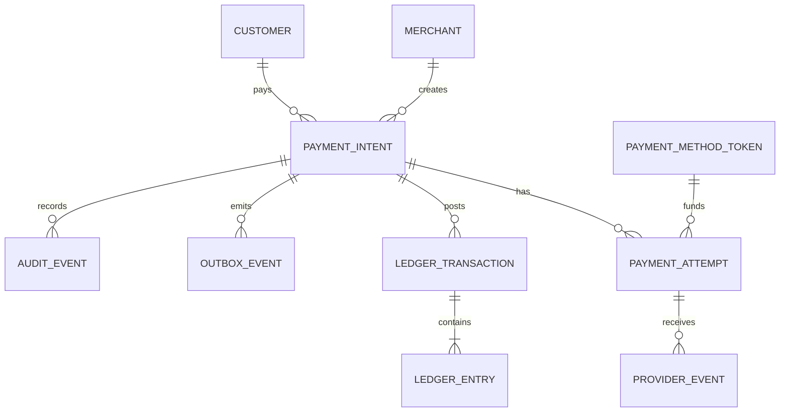
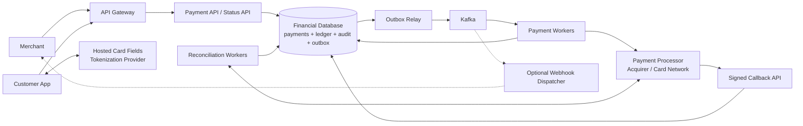
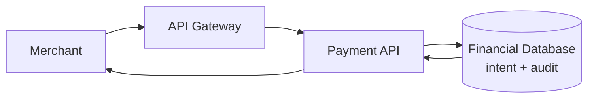
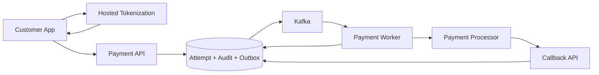
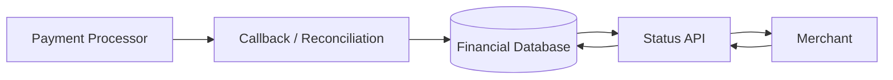
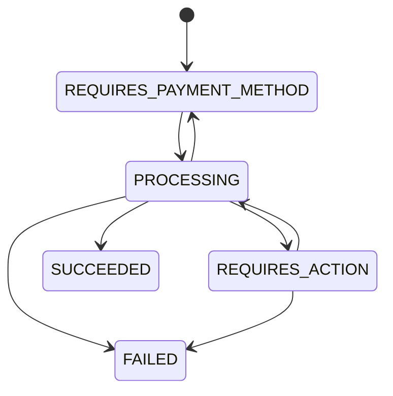
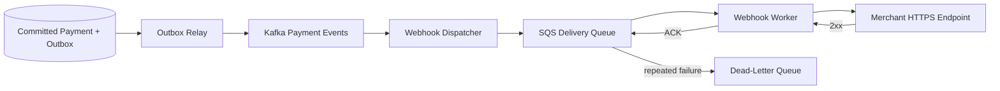

# Card Payment Processing System

This is an original interview guide inspired by the structure and topics in
[Hello Interview's payment-system breakdown][source]. It focuses on the
decisions most useful in a 60-minute system design interview rather than
reproducing the source.

[source]: https://www.hellointerview.com/learn/system-design/problem-breakdowns/payment-system

Source reviewed: 2026-09-08.

## 0. One-Minute Design

A merchant first creates a `PaymentIntent` containing an immutable amount,
currency, and merchant order reference. The customer enters card details in
provider-hosted fields, so raw card numbers go directly to a PCI-compliant
tokenization provider rather than through our servers.

The customer confirms the intent using the resulting payment-method token. In
one PostgreSQL transaction, the Payment API creates a durable attempt, audit
record, and outbox event before returning `202 Accepted`. An outbox relay
publishes the command to Kafka, and a payment worker calls the external payment
processor using the stable attempt ID as its idempotency key.

Processor responses and signed callbacks advance a strict payment state
machine. A definitive success atomically updates the payment, writes a balanced
double-entry ledger transaction, records an audit event, and emits another
outbox event. Timeouts remain `PROCESSING`; they are resolved through processor
lookup, callbacks, or reconciliation instead of issuing a blind second charge.

Stateless APIs and workers scale horizontally. Kafka partitions by payment ID,
and PostgreSQL is partitioned and eventually sharded when one financial
database no longer handles the write volume. Outbound merchant webhooks are an
optional consumer of committed payment events and never block payment
processing.

## 1. Requirements

### Functional

1. Merchants can initiate a payment request for a customer and a specific
   amount.
2. Customers can pay using a credit or debit card.
3. Merchants can retrieve payment status such as pending, succeeded, or
   failed.

### Out of Scope

- Saving cards for future use.
- Full or partial refunds.
- Transaction-history reports and analytics.
- Bank transfers, digital wallets, and other payment methods.
- Subscriptions and recurring payments.
- Merchant payouts and settlement implementation.
- Fraud-model design and chargeback workflows.

### Non-Functional

| Goal | Target |
|---|---|
| Security | The system is highly secure, minimizes PCI scope, and never exposes raw card data unnecessarily |
| Durability and auditability | No acknowledged transaction data is lost within the configured fault domain; every state change remains reconstructable |
| Transaction safety and financial integrity | Retries, duplicate callbacks, concurrency, and asynchronous external networks never create an untracked or duplicate financial effect |
| Scalability | Sustain at least 10,000 payment transactions per second at peak |

The platform can guarantee its own records and state transitions. It cannot
make an external card network synchronous or perfectly available, so ambiguous
outcomes remain pending until they are reconciled.

### Capacity Estimate

At 10,000 payment confirmations per second:

```text
10,000 confirmations/second
  x approximately 5-10 durable records over a payment lifecycle
  = approximately 50,000-100,000 financial and audit writes/second at peak

10,000 Kafka events/second x approximately 1 KB/event
  = approximately 10 MB/second before broker replication
```

The exact write amplification depends on the number of attempts, state
changes, ledger entries, and callbacks. External authorization latency is
usually far larger than internal database latency, so queues need enough
capacity to absorb processor slowdowns without losing work.

## 2. Core Entities

| Entity | Purpose |
|---|---|
| Merchant | Business accepting a payment |
| Customer | Person paying the merchant |
| PaymentIntent | Merchant's immutable request to collect an amount and currency |
| PaymentMethodToken | Opaque reference to card data held by a PCI-compliant token vault |
| PaymentAttempt | One idempotent interaction with an external processor |
| ProviderEvent | Signed response or callback received from the processor |
| LedgerTransaction | One balanced financial journal transaction |
| LedgerEntry | One debit or credit belonging to a ledger transaction |
| IdempotencyRecord | Stored result for a retried API operation |
| OutboxEvent | Durable handoff from committed database state to Kafka |
| AuditEvent | Append-only record of who changed what and why |



A `PaymentIntent` is the merchant's logical payment. A `PaymentAttempt` is one
external processor operation:

```text
payment intent pay-701: collect USD 100.00 for order-88

attempt att-1: processor timeout, outcome unknown
attempt att-1: later confirmed succeeded through callback
```

The same attempt ID is reused when resolving an ambiguous request. Creating a
new attempt without proving the first one failed could charge the customer
twice.

## 3. APIs

Merchant APIs use HTTPS with OAuth service tokens or mTLS. Customer operations
use a short-lived client token scoped to one payment intent. API credentials,
idempotency keys, and content types are HTTP headers; card details are sent
only to provider-hosted tokenization fields.

| Functional requirement | API |
|---|---|
| Initiate a payment request | `POST /v1/payment-intents` |
| Pay by card | Provider-hosted tokenization plus `POST /v1/payment-intents/{paymentId}/confirm` |
| Retrieve status | `GET /v1/payment-intents/{paymentId}` |

### Functional Requirement 1: Initiate a Payment

```http
POST /v1/payment-intents
Authorization: Bearer <merchant-access-token>
Idempotency-Key: order-88-create
Content-Type: application/json
```

```json
{
  "merchantOrderId": "order-88",
  "customerId": "customer-42",
  "amountMinor": 10000,
  "currency": "USD",
  "description": "Order 88"
}
```

```http
HTTP/1.1 201 Created
Location: /v1/payment-intents/pay-701
Content-Type: application/json
```

```json
{
  "paymentId": "pay-701",
  "status": "REQUIRES_PAYMENT_METHOD",
  "amountMinor": 10000,
  "currency": "USD",
  "clientToken": "pay_client_opaque_abc",
  "version": 1
}
```

Money is an integer in the currency's minor unit, never a floating-point
number. For USD, `10000` means `$100.00`.

The `clientToken` is safe to give to the customer application and is scoped to
confirming this intent; it is not the merchant's secret credential.
`Idempotency-Key` is scoped to the merchant. The database stores the request
hash and original response so a retry cannot create a second intent.

### Functional Requirement 2: Pay by Card

The customer enters card details in the processor's hosted fields or mobile
SDK:

```text
Customer browser -> PCI tokenization provider -> pm_tok_abc
```

Our frontend receives only the opaque token and confirms the intent:

```http
POST /v1/payment-intents/pay-701/confirm
Authorization: Bearer <payment-client-token>
Idempotency-Key: pay-701-confirm-1
Content-Type: application/json
```

```json
{
  "paymentMethodToken": "pm_tok_abc"
}
```

```http
HTTP/1.1 202 Accepted
Content-Type: application/json
```

```json
{
  "paymentId": "pay-701",
  "attemptId": "att-9001",
  "status": "PROCESSING",
  "version": 2
}
```

`202 Accepted` means the attempt, audit record, and processing command are
durable. It does not mean the issuer approved or captured the payment.

Some processors may require customer interaction such as 3-D Secure. In that
case, status becomes `REQUIRES_ACTION` and includes a short-lived provider
action token or redirect URL. The customer completes that action before the
same attempt continues.

### Functional Requirement 3: Retrieve Payment Status

```http
GET /v1/payment-intents/pay-701
Authorization: Bearer <merchant-access-token>
```

```http
HTTP/1.1 200 OK
Content-Type: application/json
```

```json
{
  "paymentId": "pay-701",
  "merchantOrderId": "order-88",
  "amountMinor": 10000,
  "currency": "USD",
  "status": "SUCCEEDED",
  "latestAttemptId": "att-9001",
  "processorReference": "proc-5542",
  "version": 4,
  "updatedAt": "2026-09-08T19:10:04.220Z"
}
```

The API returns the latest committed internal state. `PROCESSING` means the
external result is not yet definitive. `SUCCEEDED` is returned only after a
confirmed processor success and the corresponding ledger transaction commit.

Polling this endpoint satisfies the core requirement. The bonus webhook design
later provides asynchronous merchant updates.

## 4. High-Level Design



The three core workflows below use subsets of this architecture. The processor
callback is inbound communication from the payment network. The optional
merchant webhook is outbound communication from our platform.

### Concrete Component Choices

| Component | Default choice | Why / alternative |
|---|---|---|
| API entry | API gateway with OAuth/mTLS, WAF, and rate limits | Central authentication and request controls |
| Financial database | PostgreSQL or Aurora PostgreSQL | ACID transactions, constraints, WAL, and mature backup/replication; Spanner or CockroachDB are distributed alternatives |
| Durable event handoff | Transactional outbox plus CDC relay such as Debezium | Atomically connects financial state to Kafka without a dual-write loss window |
| Event backbone | Kafka | Durable partition ordering, replay, and backpressure; SQS is simpler when replay is unnecessary |
| Payment workers | Stateless containers partitioned by processor and region | Independent scaling and fault isolation |
| Payment-rail adapters | Acquirer, gateway, or card-network APIs | Normalize external requests, responses, errors, and idempotency; Stripe or Adyen can fill this role in a merchant-owned payment layer |
| Tokenization | Processor-hosted fields or a PCI token vault | Keeps PAN and CVV out of application servers |
| Key management | Cloud KMS plus HSM-backed payment keys | Controlled encryption, signing, and rotation |
| Audit archive | Append-only tables plus S3 Object Lock | Tamper-evident long-term retention |
| Reconciliation | Scheduled workers using processor APIs and settlement files | Finds outcomes missed because of timeouts or callbacks |

The concrete interview design uses **PostgreSQL, a transactional outbox,
Debezium, Kafka, hosted tokenization, KMS/HSM, and S3 Object Lock**. Financial
correctness comes from invariants and reconciliation, not from a particular
vendor.

### 4.1 Workflow for API 1: Initiate a Payment



1. **Authenticate and authorize.** The gateway validates the merchant token,
   permissions, rate limit, and request size.
2. **Validate financial fields.** Confirm that the currency is supported and
   `amountMinor` is a positive integer within configured limits.
3. **Deduplicate creation.** Look up `(merchant_id, operation,
   Idempotency-Key)`. The same key and request returns the original response;
   the same key with different content returns `409 Conflict`.
4. **Commit atomically.** One PostgreSQL transaction inserts the payment intent,
   idempotency result, and append-only audit event.
5. **Return the client token.** The API returns `201 Created` only after commit.
   No processor call occurs yet.

**Why these choices:** separating intent creation from card confirmation gives
the merchant a stable payment ID before customer interaction; integer amounts
avoid rounding errors; and an ACID transaction prevents a retry from creating
two logical payments.

### 4.2 Workflow for API 2: Pay by Card



1. **Tokenize outside our servers.** Hosted fields send the PAN and CVV directly
   to the vault or processor. The customer application receives an opaque,
   short-lived payment-method token.
2. **Claim the intent once.** The confirm API verifies the scoped client token,
   amount, currency, expiration, and current intent version. A conditional
   transition prevents concurrent confirmations from creating separate charges.
3. **Persist before processing.** In one transaction, create `PaymentAttempt`,
   set the intent to `PROCESSING`, append an audit event, and insert a
   `PAYMENT_ATTEMPT_READY` outbox event. Then return `202 Accepted`.
4. **Call the processor idempotently.** The relay publishes to Kafka. A worker
   sends the request using `attemptId` as the processor idempotency key.
5. **Classify the result.** Additional authentication becomes
   `REQUIRES_ACTION`; a recoverable decline returns to
   `REQUIRES_PAYMENT_METHOD`; a terminal decline becomes `FAILED`; and a
   timeout remains `PROCESSING` because the processor may have accepted the
   charge.
6. **Commit success and ledger together.** On definitive capture, one financial
   transaction updates the attempt and intent, writes a balanced ledger
   transaction, appends an audit event, and creates a `PAYMENT_SUCCEEDED`
   outbox event.
7. **Accept callbacks idempotently.** Verify the processor signature, store the
   provider event under its unique event ID, and apply only valid forward state
   transitions.

**Why these choices:** tokenization reduces PCI exposure; the outbox guarantees
that accepted work reaches processing; Kafka absorbs processor latency; stable
attempt IDs prevent duplicate external charges; and the state-plus-ledger
transaction prevents a successful payment without its financial record.

### 4.3 Workflow for API 3: Retrieve Status



1. **Update state from authoritative evidence.** Synchronous processor results,
   signed callbacks, and reconciliation records all pass through the same
   idempotent transition function.
2. **Store before acknowledging callbacks.** Persist the provider event and any
   resulting state, ledger, audit, and outbox rows before returning `2xx` to the
   processor.
3. **Read the committed payment.** The Status API authorizes the merchant and
   reads the payment by `paymentId`. Financial status reads use the primary or
   a consistency-capable replica rather than a stale cache.
4. **Expose ambiguity honestly.** A timeout or delayed callback stays
   `PROCESSING`; the API never converts lack of evidence into `FAILED`.
5. **Return a version.** The monotonically increasing payment version lets
   clients detect newer states and lets callbacks use conditional updates.

**Why these choices:** all evidence uses one state machine, preventing a late
callback from moving a payment backward; primary financial reads avoid
misleading stale success or failure; and an explicit pending state matches the
asynchronous external network.

## 5. Shared Payment and Financial Semantics

### Payment State Machine



`SUCCEEDED` and `FAILED` are terminal for this no-refund scope. A network
timeout is not a failure transition. Every update checks the current state and
`version`, so duplicated or out-of-order events cannot move state backward.

### Identifier Roles

| Identifier | Purpose |
|---|---|
| `merchantOrderId` | Merchant's business reference; not sufficient alone for retry safety |
| `paymentId` | Stable identity of one logical payment intent |
| `attemptId` | Stable identity and processor idempotency key for one external charge attempt |
| `Idempotency-Key` | Deduplicates one merchant or customer API operation |
| `providerEventId` | Deduplicates processor callbacks |
| `ledgerTransactionId` | Deduplicates one balanced financial posting |
| `eventId` | Deduplicates one outbox/Kafka event |

Idempotency applies at every boundary. An API idempotency key cannot replace a
processor idempotency key, and neither can replace a unique ledger reference.

### Double-Entry Ledger

For a captured `$100.00` payment with a `$3.00` platform fee:

```text
Debit  Processor clearing receivable  USD 100.00
Credit Merchant payable               USD  97.00
Credit Platform fee revenue           USD   3.00
                                       ----------
Total debits = total credits           USD 100.00
```

Each journal transaction must satisfy:

```text
sum(debits) = sum(credits), per currency
```

Ledger entries are append-only. Corrections use new reversing entries rather
than editing history. The external customer bank movement remains the
processor's responsibility; our ledger records our claims and obligations.

### HTTP Result Semantics

| Response | Meaning |
|---|---|
| `201 Created` | Payment intent and idempotency result committed |
| `202 Accepted` | Confirmation attempt and processing command committed |
| `200 OK` | Latest internal payment state returned |
| `409 Conflict` | Idempotency body mismatch or invalid concurrent transition |
| `422 Unprocessable Content` | Invalid amount, currency, token, or payment state |

## 6. Data Model

A relational financial store is the default because several records must
commit atomically. Use immutable history and unique constraints rather than
relying only on application checks.

| Table | Important key or invariant |
|---|---|
| `payment_intents` | PK `payment_id`; index `(merchant_id, merchant_order_id)`; amount minor, currency, status, and version |
| `payment_attempts` | PK `attempt_id`; index `payment_id`; unique `(processor, processor_idempotency_key)` |
| `idempotency_records` | PK `(actor_id, operation, idempotency_key)`; request hash and stored response |
| `provider_events` | PK `(processor, provider_event_id)`; encrypted payload or immutable object reference, hash, and receive time |
| `ledger_transactions` | PK `ledger_transaction_id`; unique `(payment_id, financial_event_type)` |
| `ledger_entries` | PK `(ledger_transaction_id, entry_number)`; account, side, amount minor, and currency |
| `audit_events` | Append-only PK `(payment_id, sequence)` with actor, action, old/new state, timestamp, and previous-event hash |
| `outbox_events` | PK `event_id`; sharded pending index; aggregate ID, type, and payload |

### Critical Constraints

```text
amount_minor > 0
payment currency is immutable after creation
one current version wins each state transition
provider_event_id is processed once
ledger financial event is posted once
ledger debits equal ledger credits per currency
```

Do not place PAN, CVV, full magnetic-stripe data, or unredacted processor
secrets in these tables, Kafka events, logs, traces, or audit payloads.

### Partitioning

Start with partitioned PostgreSQL or Aurora and replicas; do not introduce
distributed transactions prematurely. When one cluster is insufficient:

- Route creation by a virtual shard derived from
  `(merchant_id, merchant_order_id)`.
- Encode the shard in `paymentId`, so later confirmation and status requests
  route directly.
- Keep a payment, its attempts, ledger transaction, audit events, idempotency
  records, and outbox events on the same shard.
- Use separate analytical pipelines for cross-merchant reporting, which is out
  of scope for the transactional path.

This preserves a local ACID boundary for every payment.

## 7. Deep Dives

Each primary deep dive corresponds directly to one specified non-functional
requirement:

| Non-functional requirement | Deep dive |
|---|---|
| Security | 7.1 Tokenization, PCI scope, encryption, and access control |
| Durability and auditability | 7.2 ACID state, outbox, immutable audit, backup, and reconciliation |
| Transaction safety and financial integrity | 7.3 Layered idempotency, state machine, ledger, and ambiguity handling |
| Scalability | 7.4 Servers, Kafka, database partitioning, and processor isolation |

### 7.1 Security: How Do We Protect Payment Data?

**Addresses:** a highly secure system with minimized sensitive-data exposure.

The safest card data is card data our application never receives:

```text
customer -> provider-hosted field -> token vault
customer <- opaque payment-method token
our API  <- token only
```

Core controls:

- Use TLS externally, mTLS for sensitive service-to-service calls, OAuth scopes,
  and short-lived credentials.
- Keep PAN and CVV out of application memory, databases, queues, logs, and
  traces by using hosted tokenization.
- Never store CVV after authorization. Store only a provider token and masked
  display fields such as brand and last four digits when required.
- Encrypt sensitive fields at rest with envelope encryption. Keep key-encryption
  and signing keys in KMS/HSM systems with rotation and separation of duties.
- Apply least-privilege service identities, network segmentation, WAF/rate
  limits, secret rotation, and administrator multi-factor authentication.
- Redact structured logs by default and continuously scan logs and Kafka
  schemas for prohibited fields.
- Maintain append-only access audit logs and alert on unusual payment,
  credential, and key-management activity.
- Let the processor handle 3-D Secure or equivalent customer authentication
  challenges.

PCI DSS compliance is a program involving people, process, and infrastructure,
not a checkbox achieved by encryption alone. Tokenization reduces scope but
does not eliminate security obligations.

### 7.2 Durability and Auditability: How Do We Lose No Transaction Data?

**Addresses:** preserving every accepted attempt and reconstructing every state
change after failures.

The API commits related records before returning success:

```text
BEGIN
  insert/update payment state
  insert payment attempt
  insert idempotency result
  append audit event
  insert outbox event
COMMIT
```

The outbox closes the database/Kafka dual-write gap. Debezium or a polling relay
publishes committed rows. If the relay crashes after Kafka acknowledges but
before marking publication, the event may appear twice; consumers deduplicate
`eventId`. Duplicates are recoverable, while missing financial work is not.

Durability layers include:

- PostgreSQL WAL with synchronous multi-AZ replication before acknowledging
  critical writes.
- An explicit RPO of zero for the promised failure domain. If that domain
  includes complete regional loss, use a multi-region quorum database or
  synchronously replicate WAL to another region before acknowledging; an
  asynchronous cross-region replica alone cannot satisfy the promise.
- Point-in-time recovery, encrypted backups in a separate failure domain, and
  regularly tested restoration.
- Kafka replication with strong producer acknowledgements and sufficient
  retention for replay.
- Append-only payment audit events and ledger entries.
- Periodic immutable archives in retention-locked object storage.
- Reconciliation against processor APIs and settlement files to find external
  effects that callbacks or internal consumers missed.

Audit events contain stable actor, request, attempt, provider, and state
version identifiers. Hash-chain the events and archive signed checkpoints so
tampering is detectable. A payment can be reconstructed without trusting
mutable application logs.

### 7.3 Transaction Safety: How Do We Preserve Financial Integrity?

**Addresses:** duplicate requests, races, and ambiguous external outcomes.

Exactly-once execution cannot span our database and a card network. Instead,
make each boundary idempotent:

| Boundary | Idempotency mechanism |
|---|---|
| Merchant creates intent | `(merchant_id, operation, Idempotency-Key)` |
| Customer confirms | Intent version plus confirmation idempotency record |
| Worker calls processor | Stable `attemptId` as processor idempotency key |
| Processor retries callback | Unique `(processor, providerEventId)` |
| Kafka redelivers event | Unique `eventId` and conditional state update |
| Success posts ledger | Unique `(payment_id, financial_event_type)` |

Use a saga-like state machine rather than two-phase commit with the processor.
A critical timeout scenario is:

```text
1. Processor captures the card.
2. Our worker loses the response.
3. The attempt outcome is unknown.
```

Do not mark it failed and do not create a new charge. Keep the same attempt
`PROCESSING`, query the processor by idempotency key, await its signed callback,
and let reconciliation provide the final backstop.

A new payment attempt is allowed only after the previous attempt has a
definitive non-success outcome. An ambiguous attempt is never replaced by a
new one.

Within our database, lock the payment row or use optimistic compare-and-swap on
`version`. Only valid forward transitions succeed. On definitive success,
state, balanced ledger entries, audit, and outbox commit atomically.

Reconciliation compares internal attempts and ledger postings with processor
transactions:

```text
processor success + internal pending -> repair state and post missing journal
internal success + no processor record -> alert and investigate
amount or currency mismatch           -> quarantine and alert
```

Repairs are new audited transactions, never silent history edits.

### 7.4 Scalability: How Do We Sustain 10,000 TPS?

**Addresses:** high transaction throughput without weakening per-payment
ordering or financial invariants.

#### Servers

- Keep API and worker instances stateless and scale them horizontally.
- Use bounded database pools, strict timeouts, bulkheads, and backpressure.
- Separate worker pools by processor, region, and operation so one provider
  outage cannot consume every thread.
- Rate-limit merchants and shed nonessential status traffic before payment
  confirmation traffic.

#### Kafka

- Partition payment commands and events by `paymentId` so one payment's events
  remain ordered while different payments process concurrently.
- Provision enough partitions for target consumer parallelism and growth.
- Use replicated brokers, producer acknowledgements, idempotent producers, and
  consumer-lag alarms.
- Pause or slow intake when a processor is throttling rather than creating an
  unbounded retry storm.

#### Database

- Keep transactions short and index only required access paths.
- Partition large attempt, audit, outbox, and ledger tables by time and shard.
- Route each payment to one financial shard so its state and ledger transaction
  retain a local ACID boundary.
- Add shards using virtual buckets to avoid moving every merchant at once.
- Avoid a global balance row or sequence that serializes all payments.
- Send reporting and audit exports to replicas or analytical storage, not the
  primary write path.

At 10,000 confirmations/second, a payment may generate many internal state and
ledger writes. Capacity planning must target the amplified database and Kafka
load, not only incoming API TPS.

Assign each payment a home region and fence the old region before failover.
Uncoordinated active-active processing of the same payment risks duplicate
processor calls and split-brain ledger state. Promote another region only
after its financial state satisfies the configured RPO.

## 8. Bonus Deep Dive: How Do We Support Merchant Webhooks?

Processor callbacks and merchant webhooks point in opposite directions:

```text
processor -> our callback API       = inbound evidence
our platform -> merchant endpoint   = outbound notification
```

### Registration API

```http
POST /v1/webhook-endpoints
Authorization: Bearer <merchant-access-token>
Content-Type: application/json
```

```json
{
  "url": "https://merchant.example/payments/webhook",
  "eventTypes": ["payment.succeeded", "payment.failed"]
}
```

```json
{
  "webhookEndpointId": "whe-88",
  "signingSecret": "whsec_returned_once"
}
```

The response status is `201 Created`.

Return the signing secret once, store only an encrypted value, and support
rotation with an overlap period.

### Delivery Flow



1. A committed payment transition emits one immutable event with a unique
   `eventId`; payment processing never calls merchant code directly.
2. The dispatcher resolves subscribed endpoints and creates one durable
   delivery row per `(eventId, webhookEndpointId)`.
3. A worker sends an HTTPS `POST` containing the event ID, payment ID, type,
   creation time, payment version, and data.
4. Sign `timestamp + "." + rawBody` with the endpoint secret using HMAC-SHA256.
   The merchant verifies the signature and rejects timestamps outside a replay
   window.
5. Treat any `2xx` response as success. Retry timeouts, `429`, and `5xx` using
   capped exponential backoff with jitter.
6. After the retry limit or event expiry, move the delivery to a DLQ, alert the
   merchant, and allow controlled replay.

SQS is a convenient managed delivery queue because visibility timeouts recover
worker crashes and a configured redrive policy supplies the DLQ. A
`next_attempt_at` table plus scheduler is an alternative when retry timing
needs more control. Delayed retry queues or that scheduler implement backoff;
the worker acknowledges the current SQS message only after the retry is
durably scheduled.

Webhook delivery is **at least once**. Merchants must deduplicate by `eventId`.
Retries can arrive out of order, so consumers should use `payment.version` and
fetch the latest payment when ordering matters.

### Webhook Safety and Operations

- Require HTTPS and protect against SSRF, private-network destinations, DNS
  rebinding, redirect chains, and oversized responses.
- Use short connect/read timeouts and isolated egress worker pools.
- Rate-limit each endpoint and open a circuit after repeated failures.
- Record attempt number, response status, latency, and next retry time without
  storing response secrets.
- Let merchants disable endpoints, inspect attempts, rotate secrets, and replay
  selected events.

Suggested tables:

```text
webhook_endpoints(
  endpoint_id, merchant_id, url, encrypted_secret, event_types, status
)

webhook_deliveries(
  event_id, endpoint_id, status, attempt_count, next_attempt_at
)

UNIQUE(event_id, endpoint_id)
```

The unique key makes dispatcher replay safe, while the queue and DLQ isolate
slow merchant systems from the payment path.

## 9. Important Tradeoffs and Failures

| Situation | Decision |
|---|---|
| Merchant retries intent creation | Return the stored response for the same idempotency key and body |
| Two clients confirm one intent | Conditional state transition allows one attempt |
| Worker crashes before processor call | Kafka redelivers the same attempt |
| Processor captures but response is lost | Keep `PROCESSING`; query by attempt ID and reconcile |
| Processor callback repeats | Unique provider event ID prevents duplicate transition |
| Callback arrives after a terminal state | Store the evidence; duplicate state is a no-op, while conflicting state is quarantined and reconciled |
| Database commits but Kafka publish fails | Transactional outbox relays after recovery |
| Kafka redelivers | Consumer event ID and database constraints make processing idempotent |
| Ledger transaction is unbalanced | Database/service invariant rejects the entire transaction |
| Database primary fails | Synchronous standby takes over; no acknowledged financial record is lost |
| One processor is unavailable | Circuit-break and isolate its workers; keep attempts pending for retry |
| Reconciliation finds a mismatch | Quarantine, alert, and repair with an audited transaction |
| Merchant webhook endpoint fails | Retry independently and eventually move delivery to its DLQ |

The central tradeoff is **availability versus financial certainty**. It is
better to leave a payment pending than to guess and create either a duplicate
charge or an unrecorded success.

## 10. Main Design Decisions

| Decision | Why |
|---|---|
| PaymentIntent before confirmation | Separates merchant intent from customer and processor interaction |
| Hosted tokenization | Keeps raw PAN and CVV out of our system |
| Integer minor-unit amounts | Avoids floating-point financial errors |
| Layered idempotency | Retries are safe at API, processor, callback, Kafka, and ledger boundaries |
| PostgreSQL ACID transaction | Commits payment, ledger, audit, and outbox changes together |
| Transactional outbox to Kafka | Durable state cannot be lost in a database/broker dual write |
| Explicit `PROCESSING` state | Represents ambiguous asynchronous outcomes honestly |
| Append-only double-entry ledger | Preserves balanced, auditable financial history |
| Reconciliation | Repairs missing callbacks and detects external/internal disagreement |
| Home-region ownership | Prevents concurrent cross-region processing of one payment |
| Asynchronous merchant webhooks | Merchant failures cannot block payment processing |

## 11. Suggested 60-Minute Interview Walkthrough

| Time | Topic |
|---:|---|
| 0-5 min | Clarify processor boundary, capture semantics, statuses, and scale |
| 5-10 min | Three functional requirements and four specified NFRs |
| 10-15 min | Entities, APIs, money representation, and idempotency |
| 15-20 min | Draw the shared high-level design |
| 20-25 min | Workflow 1: create a payment intent |
| 25-34 min | Workflow 2: tokenize and confirm a card payment |
| 34-38 min | Workflow 3: callbacks, reconciliation, and status reads |
| 38-43 min | Deep dive 1: PCI scope, tokenization, and key management |
| 43-48 min | Deep dive 2: outbox, immutable audit, and durability |
| 48-54 min | Deep dive 3: idempotency, ambiguity, and double-entry ledger |
| 54-58 min | Deep dive 4: servers, Kafka, database, and 10,000 TPS |
| 58-60 min | Bonus: outbound webhook delivery |

If time is limited, prioritize tokenization, durable acceptance, stable
processor idempotency, the unknown-timeout case, atomic ledger posting, and
reconciliation. Refunds, payouts, subscriptions, and full fraud systems are
separate designs.

## References

- [Hello Interview: Design a Payment System][source]
- [PCI Security Standards Council](https://www.pcisecuritystandards.org/)
- [RFC 9110: HTTP Semantics](https://www.rfc-editor.org/rfc/rfc9110)
- [PostgreSQL: Write-Ahead Log](https://www.postgresql.org/docs/current/wal-intro.html)
- [Transactional Outbox Pattern](https://microservices.io/patterns/data/transactional-outbox.html)
- [Apache Kafka Documentation](https://kafka.apache.org/documentation/)
- [Stripe: Idempotent Requests](https://docs.stripe.com/api/idempotent_requests)
- [Stripe: Webhook Signatures](https://docs.stripe.com/webhooks/signature)
- [OWASP: SSRF Prevention Cheat Sheet](https://cheatsheetseries.owasp.org/cheatsheets/Server_Side_Request_Forgery_Prevention_Cheat_Sheet.html)
- [Amazon S3 Object Lock](https://docs.aws.amazon.com/AmazonS3/latest/userguide/object-lock.html)
