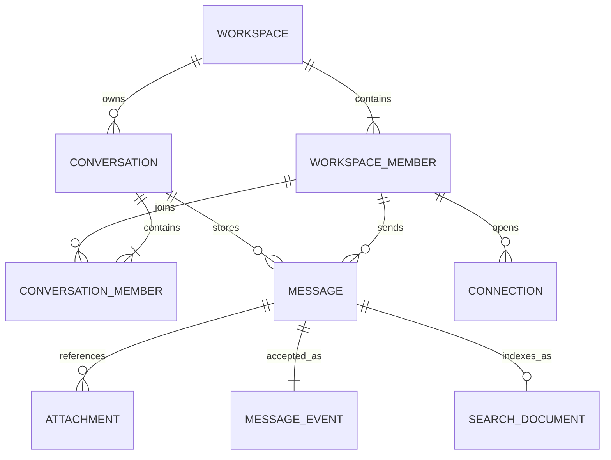
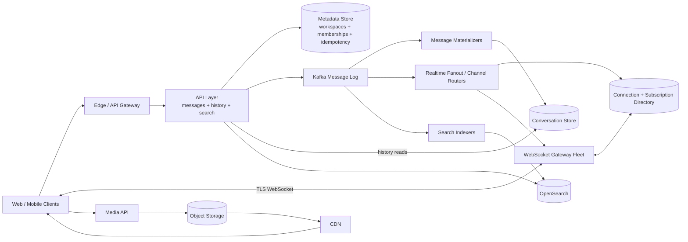
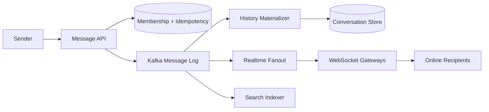
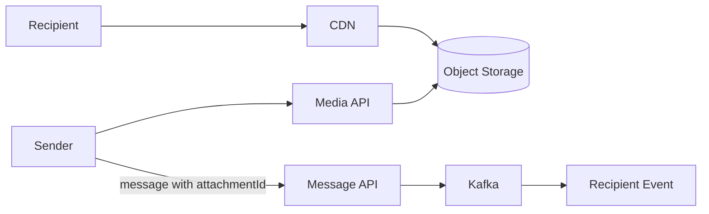
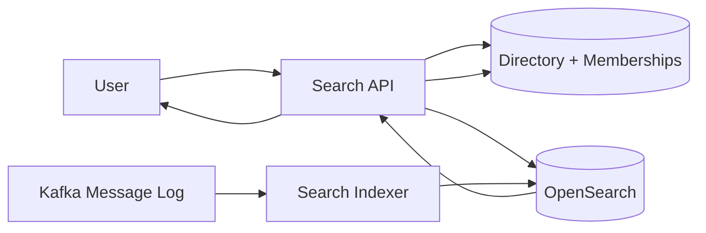

# Slack-Like Workspace Messaging System

This is an original interview guide using the requirements supplied for this
design and the format of the other guides in this repository. Public
[Slack realtime architecture][slack-realtime] and
[permission-aware search][slack-search] articles inform the tradeoffs without
attempting to reproduce Slack's production implementation.

[slack-realtime]: https://slack.engineering/real-time-messaging/
[slack-search]: https://slack.engineering/how-we-built-enterprise-search-to-be-secure-and-private/

Sources reviewed: 2026-09-15.

## 0. One-Minute Design

Users send text to an existing direct message or channel through a stateless
Message API. The API verifies workspace and conversation membership, claims a
client idempotency key, and publishes the message to a replicated Kafka log
partitioned by `conversationId`. It returns success only after Kafka confirms a
quorum write.

Independent consumers materialize each message into a sharded conversation
store, index it in OpenSearch, and send a realtime event to subscribed
WebSocket gateways. Kafka is the durable ingestion boundary; the conversation
store is the long-term history source; WebSockets are the low-latency path; and
OpenSearch is a rebuildable, eventually consistent search projection.

For DMs and small channels, realtime fanout resolves online members directly.
For large channels, gateways subscribe to a consistently hashed channel router
and receive one event per interested gateway, avoiding a durable write per
member. Offline users fetch conversation history after their last opaque
cursor rather than relying on a WhatsApp-style per-device inbox.

Media bytes bypass Kafka and message servers. Clients upload to object storage
through signed URLs and send only a ready attachment ID in the message.
Search resolves a mutable username to stable user IDs and filters keyword
results through current workspace and conversation permissions.

## 1. Requirements

### Functional

1. Send and receive text messages in one-to-one direct messages and channels.
2. Send and receive media attachments.
3. Search messages by sender username and keyword.

Existing workspaces, users, channels, DMs, and memberships are assumed.

### Out of Scope

- Workspace, channel, and account administration.
- Threads, reactions, emoji, pins, bookmarks, and message scheduling.
- Presence, typing indicators, read receipts, and unread counts.
- Message edits, deletes, legal holds, and export workflows.
- Voice, video, and screen sharing.
- Cross-workspace federation and external enterprise search.

### Non-Functional

| Goal | Target |
|---|---|
| Write scale | Sustain a peak of 1 million accepted text-message writes/second |
| Realtime latency | Deliver to connected recipients within 500 ms at p95 |
| Durability and availability | Never lose a durably accepted message; tolerate service, broker, store, or gateway failures |
| Search | Return permission-safe results within 1 second at p95 and index 99% of messages within 5 seconds |

Search and realtime delivery may lag the durable write. A `201` response means
the message is safely accepted, not that every client received it or that it is
already searchable.

### Capacity Estimate

Interpret 1 million QPS as the **peak message-ingest rate**, before fanout:

```text
1,000,000 messages/second x approximately 1 KB/message
  = approximately 1 GB/second of raw text events at peak
  = approximately 3 GB/second through Kafka at replication factor 3
```

If average traffic is 100,000 messages/second:

```text
100,000 x 86,400
  = 8.64 billion messages/day
  = approximately 8.6 TB/day before indexes and replication
```

Media is excluded because its bytes use object storage. Delivery can be much
larger than ingestion:

```text
realtime events
  = messages x online recipient clients or subscribed gateways
```

At an average of 20 online destinations, one million message writes could
produce 20 million socket deliveries/second. Avoiding per-member durable
fanout for large channels is therefore a core design decision.

## 2. Core Entities

| Entity | Purpose |
|---|---|
| Workspace | Tenant and primary authorization boundary |
| WorkspaceMember | Stable user ID plus workspace username and role |
| Conversation | A two-member DM or a public/private channel |
| ConversationMember | Membership and authorization version for a conversation |
| Message | Immutable accepted text and attachment references |
| MessageEvent | Durable Kafka representation of a message and its log position |
| Attachment | Object metadata, ownership, processing state, and storage key |
| SearchDocument | Derived full-text representation with authorization metadata |
| Connection | Online client, gateway, and subscribed-conversation association |
| IdempotencyRecord | Client message ID, payload hash, message ID, and publication state |



A DM and channel use the same `Conversation` abstraction:

```text
DM      -> exactly two conversation members
Channel -> many members, with PUBLIC or PRIVATE visibility
```

The durable message is stored once. Realtime delivery events and search
documents are derived projections and can be replayed or rebuilt.

## 3. APIs

Use HTTPS for durable commands, history, search, and media control. Clients
maintain a TLS WebSocket for pushed message events. Every API derives the user
and workspace from a validated access token rather than trusting IDs supplied
in the request body.

| Functional requirement | API |
|---|---|
| Send and receive text | `POST /v1/conversations/{id}/messages`, WebSocket `message.created`, and history `GET` |
| Send and receive media | Attachment initialization/completion plus the normal message API |
| Search by username and keyword | `GET /v1/workspaces/{workspaceId}/search/messages` |

### Functional Requirement 1: Send and Receive Text

```http
POST /v1/conversations/conv-7/messages
Authorization: Bearer <access-token>
Idempotency-Key: laptop-a-1042
Content-Type: application/json
```

```json
{
  "clientMessageId": "laptop-a-1042",
  "text": "The deployment completed successfully.",
  "attachmentIds": []
}
```

```http
HTTP/1.1 201 Created
Content-Type: application/json
```

```json
{
  "messageId": "msg-3021",
  "conversationId": "conv-7",
  "senderUserId": "user-a",
  "position": "epoch-3:offset-88201",
  "createdAt": "2026-09-15T22:10:03.412Z"
}
```

The position is an opaque cursor derived from the ordered log, not necessarily
a contiguous integer for this conversation.

Connected recipients receive:

```json
{
  "type": "message.created",
  "eventId": "evt-7002",
  "messageId": "msg-3021",
  "workspaceId": "ws-1",
  "conversationId": "conv-7",
  "senderUserId": "user-a",
  "text": "The deployment completed successfully.",
  "attachmentIds": [],
  "position": "epoch-3:offset-88201",
  "createdAt": "2026-09-15T22:10:03.412Z"
}
```

After reconnecting, a client recovers missed history:

```http
GET /v1/conversations/conv-7/messages?after=epoch-3%3Aoffset-88000&limit=100
Authorization: Bearer <access-token>
```

```json
{
  "messages": ["..."],
  "nextCursor": "epoch-3:offset-88201",
  "hasMore": false
}
```

The server authorizes membership on send, realtime subscription, and history
read. A public workspace channel still requires workspace membership.

### Functional Requirement 2: Send and Receive Media

Initialize an attachment:

```http
POST /v1/attachments
Authorization: Bearer <access-token>
Content-Type: application/json
```

```json
{
  "workspaceId": "ws-1",
  "contentType": "image/png",
  "sizeBytes": 2482103,
  "sha256": "8f..."
}
```

```json
{
  "attachmentId": "att-91",
  "uploadId": "upload-55",
  "signedUploadUrls": ["https://object-store.example/signed/part-1"]
}
```

The client uploads directly and completes the attachment:

```http
PUT <signedUploadUrl>
POST /v1/attachments/att-91/complete
```

The media service verifies the object, checksum, type, and size, performs
malware scanning or required processing, and changes the state from
`UPLOADING` to `READY`. The client can then create a normal message containing:

```json
{
  "text": "Architecture diagram",
  "attachmentIds": ["att-91"]
}
```

The Message API verifies that each attachment is `READY`, belongs to the same
workspace and sender, and has not already been attached incompatibly.
Authorized recipients obtain short-lived signed download URLs and fetch
through a CDN.

### Functional Requirement 3: Search Messages

```http
GET /v1/workspaces/ws-1/search/messages?q=deployment&fromUsername=alice&limit=20
Authorization: Bearer <access-token>
```

```http
HTTP/1.1 200 OK
Content-Type: application/json
```

```json
{
  "results": [
    {
      "messageId": "msg-3021",
      "conversationId": "conv-7",
      "senderUserId": "user-a",
      "senderUsername": "alice",
      "highlight": "The <em>deployment</em> completed successfully.",
      "createdAt": "2026-09-15T22:10:03.412Z"
    }
  ],
  "nextCursor": "search-after-opaque-token",
  "indexedThrough": "2026-09-15T22:10:01.000Z"
}
```

`fromUsername` is resolved through the current workspace directory to stable
user IDs. Search documents store `senderUserId`, not the mutable username, so a
rename does not require reindexing every message.

The Search API returns only messages from conversations the requesting user can
currently access. `indexedThrough` communicates eventual indexing lag.

## 4. High-Level Design



This is one architecture with three asynchronous projections from the same
durable message log: conversation history, realtime delivery, and search. The
workflows below use subsets of these components.

### Concrete Component Choices

| Component | Default choice | Why / alternative |
|---|---|---|
| API layer | Stateless services behind an L7 gateway | Independent scaling for message, history, and search traffic |
| Durable message log | Kafka with `acks=all` and replication factor 3 | High write throughput, per-partition order, replay, and consumer isolation |
| Metadata and idempotency | DynamoDB with optional Redis cache | Conditional writes and direct workspace/conversation membership lookups; PostgreSQL is an alternative |
| Conversation store | ScyllaDB or Cassandra | Horizontally scalable ordered writes and range reads; DynamoDB is a managed alternative |
| Realtime routing | Consistently hashed channel routers plus Redis connection metadata | One channel owner routes to subscribed gateways; NATS is an alternative event fabric |
| Client delivery | Regional WebSocket gateways | Persistent low-latency push and local subscription maps |
| Search | OpenSearch | Distributed inverted indexes, filters, relevance, highlights, and `search_after` pagination |
| Client history | SQLite | Durable local cache and reconnect cursors |
| Media | S3-compatible object storage plus CDN | Direct multipart upload and scalable authorized downloads |

The exact Slack production stack differs and evolves. The important interview
design is the separation between durable ingestion, long-term history,
ephemeral realtime fanout, and rebuildable search.

### 4.1 Workflow for API 1: Send and Receive Text



1. **Authenticate and authorize.** Verify the access token, workspace
   membership, and current conversation membership. A DM must contain the
   sender; a channel must be visible and writable to that user.
2. **Claim idempotency.** Conditionally create
   `(sender_client_id, clientMessageId)` with a payload hash and deterministic
   `messageId`. Reusing the ID with different content returns `409 Conflict`.
3. **Append durably.** Publish the event to Kafka using `conversationId` as the
   partition key and wait for `acks=all` with the configured minimum in-sync
   replicas. Then return `201 Created` with the broker position.
4. **Recover ambiguous API retries.** If the API crashes after Kafka commit but
   before responding, the retry republishes the same `messageId`. Materializers
   and realtime consumers deduplicate it. If Kafka never accepted it, retry
   safely resumes publication from the pending idempotency record.
   After an ACK, store the Kafka position as `PUBLISHED`; unresolved `PENDING`
   records remain retryable and are cleaned only after their outcome is known.
5. **Materialize history.** A consumer writes the message idempotently to the
   conversation store ordered by its opaque log position.
6. **Deliver in realtime.** Fanout resolves subscribed gateways and pushes one
   event over each relevant WebSocket. Clients persist and deduplicate by
   `messageId`.
7. **Recover offline.** Reconnecting clients request conversation history after
   their last stored cursor. The durable history, not the WebSocket event, is
   the delivery backstop.
8. **Index independently.** A separate consumer creates the OpenSearch
   document. Index lag cannot block message acceptance or delivery.

**Why these choices:** Kafka handles the one-million-write burst and provides
an ordered replay point; separate consumers isolate slow search from realtime
delivery; ScyllaDB serves durable range history; and WebSockets avoid polling.

### 4.2 Workflow for API 2: Send and Receive Media



1. **Initialize metadata.** Authorize the workspace, validate content metadata,
   create an `UPLOADING` attachment, and return signed multipart-upload URLs.
2. **Upload directly.** The client sends bytes to object storage rather than
   through API servers, Kafka, ScyllaDB, or WebSocket gateways.
3. **Complete and process.** Verify checksums and parts, scan for malware,
   extract safe metadata or previews, and atomically mark the attachment
   `READY`.
4. **Attach by reference.** The normal message request contains only
   `attachmentId`. The Message API verifies readiness, ownership, workspace,
   and authorization before publishing the message event.
5. **Download securely.** A recipient authorized for the conversation receives
   a short-lived CDN URL. The origin object remains private.

**Why these choices:** signed direct upload prevents large files from consuming
message-ingest capacity; object storage and CDN are purpose-built for bytes;
and the readiness state prevents messages from referencing partial or unsafe
uploads.

### 4.3 Workflow for API 3: Search Messages



1. **Authorize the workspace.** Validate the user and load current workspace
   and private-conversation memberships.
2. **Resolve the username.** Map `fromUsername` to stable sender user IDs in the
   workspace directory. If display names are not unique, require a canonical
   handle or explicit user selection.
3. **Build the search query.** Use an analyzed keyword query plus filters for
   `workspaceId`, `senderUserId`, time, visibility, and conversations the user
   may access.
4. **Query the inverted index.** OpenSearch returns ranked candidates,
   highlights, and a `search_after` cursor without scanning the message store.
5. **Reauthorize and enrich candidates.** Batch-check current membership and
   load current usernames before returning private-channel and DM messages.
   Over-fetch index candidates until the response page is full or exhausted.
   The search index is never the final authorization authority.
6. **Expose freshness.** Return the indexer's watermark. Newly accepted
   messages may not appear until the Kafka consumer indexes them.
7. **Rebuild when needed.** Replay retained Kafka events or scan the
   conversation store to recreate a damaged index.

**Why these choices:** an inverted index supports keyword search far better
than database substring scans; stable sender IDs avoid reindexing on username
changes; asynchronous indexing protects writes; and query-time authorization
prevents stale ACLs from leaking private messages.

## 5. Shared Message, Order, and Delivery Semantics

### Identifier Roles

| Identifier | Purpose |
|---|---|
| `clientMessageId` | Makes a sender-device retry idempotent |
| `messageId` | Stable logical identity used by every projection and client |
| `eventId` | Identifies one realtime or pipeline event |
| `position` | Opaque conversation cursor derived from the ordered log |
| `attachmentId` | Stable reference to one authorized object |

### Acceptance and Projection States

```text
Kafka quorum ACK
  -> message is durably ACCEPTED

Conversation-store write
  -> message is MATERIALIZED for history

OpenSearch write
  -> message is INDEXED and searchable

WebSocket event
  -> message is pushed to an online client
```

`201 Created` promises only the first state. Later projections are idempotent
and independently retryable.

### Ordering

All events for a conversation use the same Kafka partition key. Broker offsets
therefore define a stable order of arrival for that conversation, although
other conversations sharing the partition create gaps between its positions.
Clients treat positions as opaque and request history after a cursor rather
than assuming `next = current + 1`.

Strict order across unrelated conversations is unnecessary. A very hot channel
cannot be split across Kafka partitions without either a sequencer or relaxed
ordering.

### Fanout Modes

```text
DM or small channel:
  resolve online users -> route to their gateways

large channel:
  channel router -> one event per subscribed gateway
  gateway -> all locally connected channel members
```

The second mode avoids one central fanout operation per channel member. Neither
mode creates permanent inbox rows for every recipient; offline recovery reads
the shared conversation history.

Realtime delivery is at least once. A gateway reconnect or consumer retry may
repeat an event, so clients deduplicate by `messageId`.

## 6. Data Model

The model separates small authorization metadata, high-volume ordered history,
ephemeral connection state, and full-text search.

### Metadata Store

| Data | Key / index | Main access |
|---|---|---|
| `Workspace` | PK `workspace_id` | Tenant metadata and policy |
| `WorkspaceMember` | PK `(workspace_id, user_id)`; GSI `(workspace_id, normalized_username)` | Authorize a user or resolve a username |
| `Conversation` | PK `conversation_id` | Type, workspace, visibility, and current membership version |
| `ConversationMember` | PK `(conversation_id, user_id)`; GSI `(user_id, conversation_id)` | Authorize access or list subscriptions |
| `MessageIdempotency` | PK `(sender_client_id, client_message_id)` | Payload hash, deterministic message ID, Kafka publication state/position, and cleanup time |
| `Attachment` | PK `attachment_id` | Owner, workspace, object key, checksum, type, size, and state |

### Conversation Store

Use time-bucketed partitions so a long-lived channel does not create one
unbounded storage partition:

```text
Partition key:
  (conversation_id, time_bucket)

Clustering order:
  (stream_epoch, log_offset)

Columns:
  message_id, sender_user_id, text, attachment_ids, created_at
```

A message-ID lookup table or index supports direct links. Materializers use a
conditional `messageId` insert so Kafka replay cannot duplicate history.

### Search Document

```json
{
  "messageId": "msg-3021",
  "workspaceId": "ws-1",
  "conversationId": "conv-7",
  "visibility": "PRIVATE",
  "senderUserId": "user-a",
  "text": "The deployment completed successfully.",
  "createdAt": "2026-09-15T22:10:03.412Z",
  "position": "epoch-3:offset-88201"
}
```

Do not index a copied username or a large list of authorized users. Usernames
change, and per-document ACL lists become large and stale. Resolve names and
permissions through current metadata.

### Connection Directory

```text
user_id + client_id -> gateway_id, region, heartbeat_expiry
conversation_id     -> subscribed gateway IDs
```

Redis or an in-memory distributed directory can store this soft state with
short TTLs. Gateways remain authoritative for their local sockets.

## 7. Deep Dives

Each deep dive corresponds directly to one non-functional requirement:

| Non-functional requirement | Deep dive |
|---|---|
| Write scale | 7.1 Kafka ingestion, storage sharding, hot channels, and fanout amplification |
| Realtime latency | 7.2 Regional WebSockets, channel routing, and reconnect recovery |
| Durability and availability | 7.3 Quorum acceptance, idempotent replay, and failure isolation |
| Search | 7.4 Inverted indexing, freshness, authorization, and query scaling |

### 7.1 Write Scale: How Do We Handle 1 Million Messages/Second?

**Addresses:** peak durable ingest plus much larger derived history, realtime,
and search workloads.

Kafka partitions by `conversationId`, batches records, compresses network
payloads, and spreads unrelated conversations across brokers. Use `acks=all`,
replication factor 3, and a minimum in-sync replica count. The required
partition count depends on measured bytes/second, producer latency, and
consumer throughput; at approximately 1 GB/second, expect hundreds or
thousands rather than a handful.

Scale each projection independently:

- Message materializers form one consumer group and write to ScyllaDB shards.
- Realtime consumers form another group and route only to online gateways.
- Search indexers form another group and bulk-index OpenSearch documents.
- Slow search consumers do not slow history materialization or message
  acceptance.

ScyllaDB partitions by `(conversationId, timeBucket)` and replicates across
nodes. Time buckets bound partition size, while consistent hashing distributes
conversations. Add nodes to expand write and storage capacity.

A single extremely active conversation remains one Kafka hot partition if
strict order is required. Rate-limit pathological channels, move them to
dedicated partitions, or introduce substreams plus a merge sequencer. Relaxing
strict order is the only easy way to split one conversation freely.

Do not write one durable inbox row per channel member. Large-channel fanout
targets subscribed gateways, and offline members read the one shared history
copy. This prevents a million-member channel from turning one message into a
million database writes.

### 7.2 Realtime Latency: How Do We Deliver Within 500 ms?

**Addresses:** fast online delivery without making WebSockets the durability
layer.

Clients connect to a nearby regional WebSocket gateway. Each gateway keeps
local socket and subscription maps. Consistent hashing assigns every
conversation to an in-memory channel router, similar in role to the Channel
Servers described in Slack's public realtime architecture.

The latency path is:

```text
client -> Message API -> Kafka quorum ACK -> realtime consumer
       -> channel router -> subscribed gateway -> recipient socket
```

Keep it short:

- Reuse TLS, Kafka, metadata, and router connections.
- Cache memberships with a version and invalidate changes quickly.
- Batch Kafka writes for throughput without exceeding the latency budget.
- Route one large-channel event to each subscribed gateway, then fan out
  locally.
- Keep text and metadata small; media bytes use S3 and a CDN.
- Track ingest, broker, router, gateway-queue, and socket latency separately.

Bound each socket's output buffer. A slow client is disconnected rather than
allowed to consume gateway memory; it reconnects and reads history after its
last cursor. Heartbeats detect half-open connections, and reconnect jitter
prevents a failed gateway from causing a simultaneous connection storm.

The sender may render optimistically using `clientMessageId`, then replace the
pending UI state with the server `messageId` and position after acceptance.

### 7.3 Durability and Availability: How Do We Avoid Message Loss?

**Addresses:** preserving accepted messages while treating realtime and search
as recoverable projections.

The Message API returns `201` only after Kafka acknowledges the record from all
required in-sync replicas. If Kafka lacks quorum, the API fails rather than
claiming the message is durable.

Client retry cases:

```text
crash before Kafka ACK
  -> retry resumes or republishes the pending idempotency record

crash after Kafka ACK but before HTTP response
  -> retry may republish the same messageId
  -> consumers and clients deduplicate
```

Materializers checkpoint Kafka offsets only after the conversation-store write
succeeds. Kafka retains enough history to replay a prolonged outage, while
ScyllaDB uses multi-node replication and backups for long-term storage.
Alert and apply backpressure before materializer lag approaches Kafka
retention; otherwise an accepted record could expire before reaching permanent
history.

Realtime routers, connection metadata, and OpenSearch are not sources of
truth:

- A lost WebSocket event is recovered from conversation history.
- Stale connection entries expire through heartbeats.
- A failed search index is rebuilt from Kafka or the conversation store.
- A failed consumer resumes from its committed offset.

Use availability zones and failure-isolated cells to limit blast radius. Assign
each workspace or conversation a home write cell so two regions do not accept
conflicting order simultaneously. Cross-region replicas serve disaster
recovery; failover increments the stream epoch so cursors remain unambiguous.

### 7.4 Search: How Do We Search by Username and Keyword Safely?

**Addresses:** sub-second queries, five-second indexing freshness, and strict
workspace/channel authorization.

OpenSearch builds an inverted index from analyzed message text. A Kafka
consumer bulk-indexes documents and publishes a watermark measuring
acceptance-to-index lag. If lag exceeds five seconds, messaging still works and
search reports degraded freshness.

Resolve `fromUsername` to stable user IDs before querying:

```text
workspace username "alice" -> user-a
OpenSearch filter          -> senderUserId = user-a
```

This avoids reindexing historical messages after a rename. Search documents
include `workspaceId`, `conversationId`, and visibility, but current membership
remains authoritative.

Permission-safe query flow:

1. Require workspace membership.
2. Include public channels visible to the workspace.
3. Add the user's current private-channel and DM conversation IDs.
4. Query keyword and sender filters in OpenSearch.
5. Batch-reauthorize returned private candidates before exposing text or
   highlights.

Do not rely only on a stale ACL embedded in the index. Membership removal must
stop future searches even before old documents are reindexed.

Partition indexes by workspace/cell and time tier. Isolate very large tenants,
use replicas for query throughput, bulk-index writes, and paginate with
`search_after` rather than deep numeric offsets. Cache only permission-safe
query metadata; highly variable keyword results have limited cache value.

Because server-side keyword search requires access to message text, this design
uses TLS in transit and server-managed encryption at rest rather than
WhatsApp-style end-to-end encryption where the server cannot read content.

## 8. How This Differs from WhatsApp

| Concern | Slack-like design | WhatsApp-like design |
|---|---|---|
| Primary model | Multi-tenant workspaces, DMs, and potentially large channels | Personal messaging and bounded groups |
| Server history | Centralized durable history is a core product feature | Server primarily retains pending delivery for a bounded period |
| Offline recovery | Read shared conversation history after a cursor | Replay a per-device inbox |
| Large fanout | Route once per subscribed gateway and fan out locally | Fan out durable delivery state to each recipient device |
| Search | Server-side OpenSearch index with ACL filtering | Usually local-device search because content is end-to-end encrypted |
| Ordering | Per-conversation Kafka partition position | Server timestamp or optional per-chat sequence |
| Authorization | Workspace, public/private channel, and DM membership | Chat membership |
| Media | Signed object-storage upload and CDN | Similar direct object-storage path |

The realtime surface is similar—both use persistent sockets and recover from
missed events—but the durability and search models are substantially
different.

## 9. Important Tradeoffs and Failures

| Situation | Decision |
|---|---|
| API crashes before Kafka quorum ACK | Return no success; client retries the pending idempotency record |
| API crashes after Kafka ACK | Retry may republish the same message ID; consumers deduplicate |
| Kafka loses quorum | Reject new writes rather than acknowledge nondurable messages |
| History materializer crashes | Replay from its last committed Kafka offset |
| Realtime router or gateway fails | Reconnect with jitter and fetch history after the last cursor |
| Connection directory is stale | Gateway heartbeats and short TTLs remove dead routes |
| Search indexer falls behind | Messaging continues; report an older `indexedThrough` watermark |
| OpenSearch is unavailable | Text delivery and history remain available; search fails separately |
| User leaves a private channel | Query-time membership check blocks stale indexed documents |
| Username changes | Directory resolves the new name to the stable sender ID |
| One channel becomes a hot partition | Dedicate capacity, rate-limit, or relax ordering and split the stream |
| Large channel amplifies fanout | Publish once per subscribed gateway, not one durable row per member |
| Media upload is partial or unsafe | Do not allow attachment references until state is `READY` |

The central tradeoff is **one ordered durable write versus several eventually
consistent projections**. History, realtime delivery, and search can progress
at different speeds without losing the accepted message.

## 10. Main Design Decisions

| Decision | Why |
|---|---|
| HTTPS writes plus WebSocket events | Durable request semantics and low-latency reception |
| Kafka as acceptance log | Handles one-million-QPS bursts with replicated ordered replay |
| Partition by conversation | Preserves stable order inside a DM or channel |
| Idempotent materializers | Kafka and client retries cannot duplicate stored messages |
| ScyllaDB time-bucketed history | Scales ordered conversation writes and range reads |
| Hybrid realtime fanout | Avoids per-member amplification for large channels |
| Shared history instead of device inboxes | Slack retains centralized searchable history |
| OpenSearch projection | Supports keyword relevance and filters without scanning history |
| Resolve usernames at query time | Mutable names do not require message reindexing |
| Authorize search at query time | A stale search index cannot expose private content |
| Signed S3 upload plus CDN | Keeps media bytes off message, Kafka, and WebSocket paths |

## 11. Suggested 60-Minute Interview Walkthrough

| Time | Topic |
|---:|---|
| 0-5 min | Clarify channel size, retention, search freshness, and the one-million-write peak |
| 5-10 min | Three functional requirements, four NFRs, and capacity |
| 10-15 min | Core entities and HTTP/WebSocket APIs |
| 15-21 min | Draw the shared event-driven design |
| 21-29 min | Workflow 1: accept, materialize, and deliver text |
| 29-34 min | Workflow 2: direct media upload and download |
| 34-40 min | Workflow 3: username/keyword search with ACLs |
| 40-46 min | Deep dive 1: Kafka, ScyllaDB, hot channels, and fanout scale |
| 46-51 min | Deep dive 2: WebSocket routing and latency |
| 51-56 min | Deep dive 3: durable acceptance and replay |
| 56-59 min | Deep dive 4: OpenSearch freshness and permission safety |
| 59-60 min | Contrast Slack with WhatsApp and summarize tradeoffs |

If time is limited, prioritize Kafka as the acceptance boundary, conversation
partitioning, large-channel gateway fanout, history-based reconnect, and
permission-aware asynchronous search.

## References

- [Slack Engineering: Real-Time Messaging][slack-realtime]
- [Slack Engineering: Secure and Private Enterprise Search][slack-search]
- [Slack Engineering: Traffic 101](https://slack.engineering/traffic-101-packets-mostly-flow/)
- [RFC 6455: The WebSocket Protocol](https://www.rfc-editor.org/rfc/rfc6455)
- [Apache Kafka Design](https://kafka.apache.org/documentation/#design)
- [Apache Cassandra Data Modeling](https://cassandra.apache.org/doc/latest/cassandra/developing/data-modeling/)
- [OpenSearch: Full-Text Queries](https://docs.opensearch.org/latest/query-dsl/full-text/)
- [Amazon S3 Presigned URLs](https://docs.aws.amazon.com/AmazonS3/latest/userguide/using-presigned-url.html)
