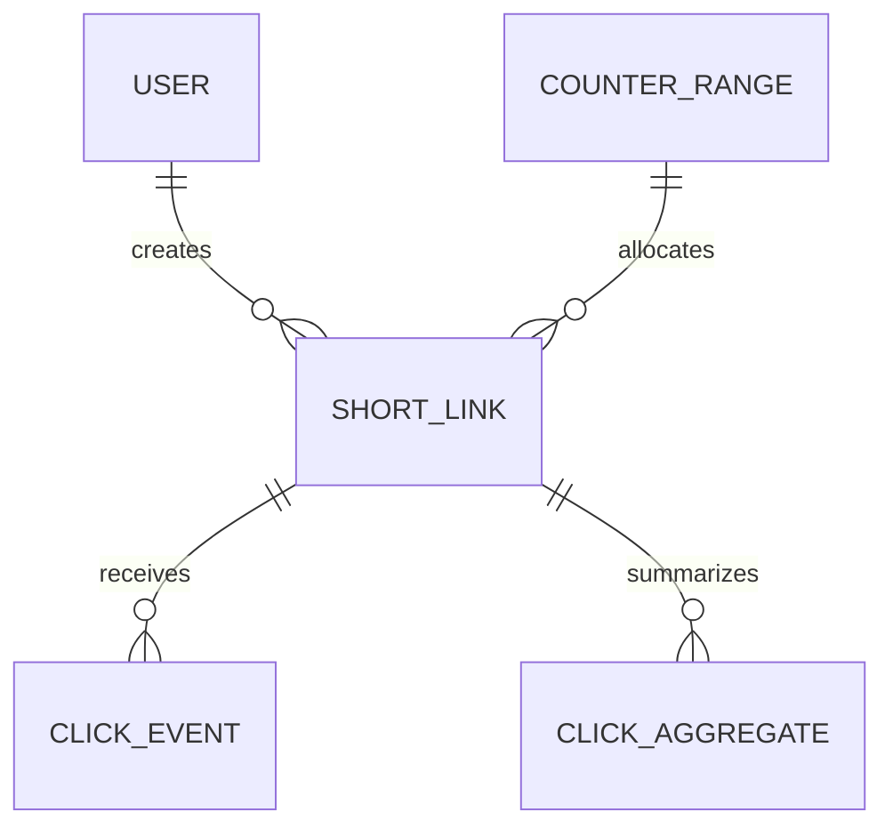
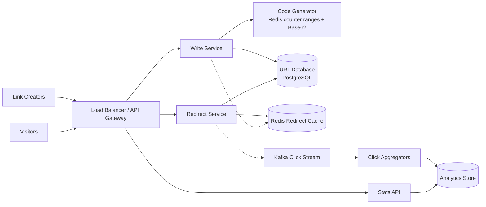
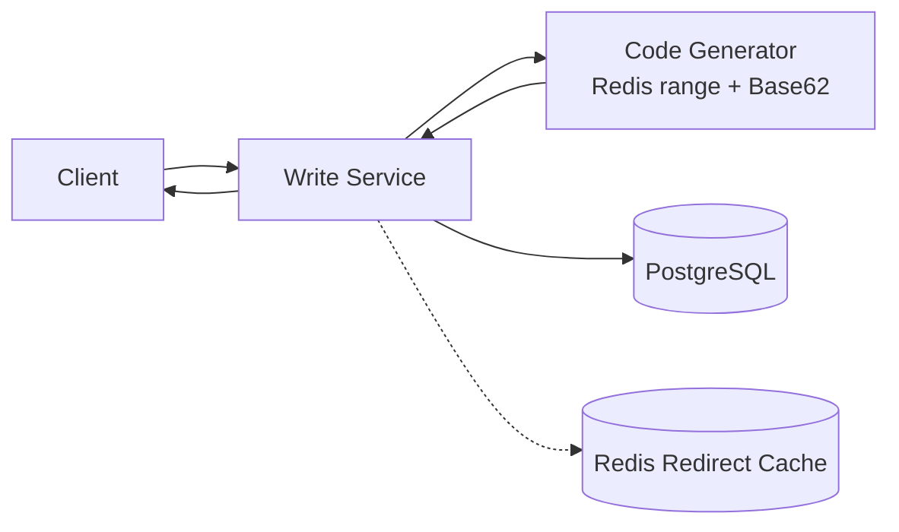
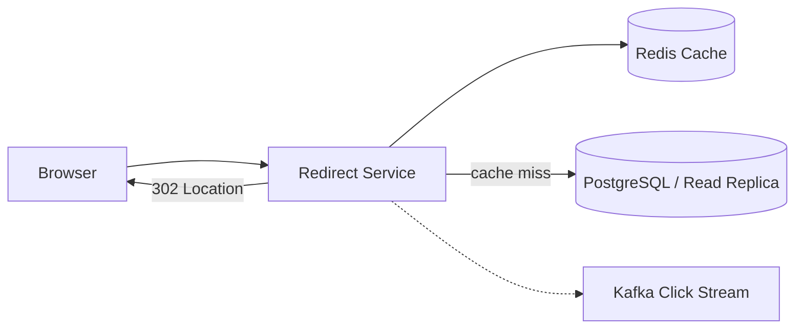
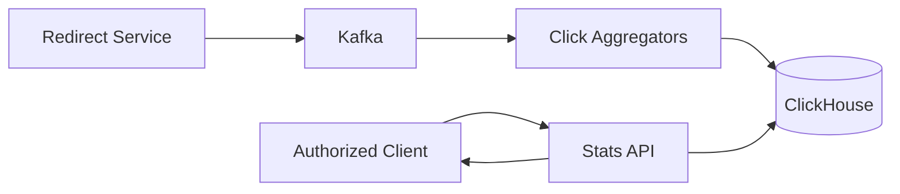

# URL Shortening Service

This is an original interview guide inspired by the structure and topics in
[Hello Interview's Bitly breakdown][source]. It focuses on the decisions most
useful in a 60-minute system design interview rather than reproducing the
source.

[source]: https://www.hellointerview.com/learn/system-design/problem-breakdowns/bitly

Source reviewed: 2026-09-08.

## 0. One-Minute Design

A stateless write service accepts a long URL, optional custom alias, and
optional expiration time. For generated links, it obtains a unique integer
from a Redis counter-range allocator and Base62-encodes it into a short code.
PostgreSQL stores the mapping and enforces a unique constraint on the code.

A separate redirect service handles the much larger read workload. It resolves
the short code through a Redis cache, falls back to an indexed PostgreSQL read,
checks expiration, and returns `302 Found` with the long URL in the `Location`
header.

Every successful redirect also creates a click event. The redirect does not
wait for analytics processing: it publishes asynchronously to Kafka, and
stream consumers update basic per-link and per-day aggregates in an analytics
store. The stats API reads those eventually consistent aggregates.

This design separates writes, redirects, and analytics because URL shortening
is extremely read-heavy and click processing must never delay navigation.

## 1. Requirements

### Functional

1. Submit a long URL and receive a short URL, optionally with a custom alias
   and expiration time.
2. Visit a short URL and redirect to the original URL.
3. Track successful redirect clicks and retrieve basic total and time-bucketed
   click counts.

### Out of Scope

- User authentication and account management.
- Geographic, device, referrer, and conversion analytics.
- Dashboards and arbitrary analytics queries.
- Malicious-link detection, spam prevention, and abuse moderation.
- Editing a destination after link creation.

### Non-Functional

| Goal | Target |
|---|---|
| Uniqueness | Every short code maps to at most one long URL and is never reassigned |
| Redirect latency | p99 below 100 ms |
| Availability | 99.99% availability, favoring redirect availability over immediate consistency |
| Scale | Support 1 billion short links and 100 million daily active users |

Click aggregates may lag by up to a minute and should not be treated as
billing-grade exact counts. This keeps analytics outside the redirect
availability and latency contract.

### Capacity Estimate

Assume:

- 100 million redirects per day.
- 100,000 new short links per day.
- A 1,000:1 redirect-to-create ratio.
- Approximately 500 bytes per stored mapping including indexes and metadata.

```text
100,000,000 redirects / 86,400
  ~= 1,160 redirects/second average
  ~= 12,000 redirects/second at 10x peak

100,000 new links / 86,400
  ~= 1.2 creates/second average

1 billion mappings x 500 bytes
  ~= 500 GB before replication and backups
```

Each redirect also produces one click event, so the analytics stream follows
redirect volume. The strong read/write imbalance drives the cache and the
separation of read and write services.

## 2. Core Entities

| Entity | Purpose |
|---|---|
| User | Optional owner of a short link; authentication details are out of scope |
| ShortLink | Mapping from one unique short code to a long URL, status, and expiration |
| CounterRange | Block of unique numeric IDs permanently allocated to one write-service instance |
| ClickEvent | Immutable observation that a short link was successfully resolved |
| ClickAggregate | Total or time-bucketed click count for one short code |



The short code is the public lookup key. A generated code and a user-selected
alias share the same uniqueness rule:

```text
abc123 -> https://example.com/a/very/long/path
summer -> https://shop.example.com/sale
```

The service does not deduplicate by long URL by default. Two users may need
different aliases, expirations, ownership, and click statistics for the same
destination. Expired codes are not reused because old bookmarks and caches
must never begin resolving to an unrelated destination.

## 3. APIs

Use HTTPS REST APIs because the operations are request/response based. The
public redirect endpoint is intentionally separate from the versioned
management APIs. Authentication mechanics are out of scope; assume an upstream
gateway supplies a stable caller identity for idempotency and private stats.

| Functional requirement | API |
|---|---|
| Create a short link | `POST /v1/urls` |
| Resolve and redirect | `GET /{shortCode}` |
| Track and read clicks | Redirect emits an internal event; `GET /v1/urls/{shortCode}/stats` reads aggregates |

### Functional Requirement 1: Create a Short Link

```http
POST /v1/urls
Idempotency-Key: create-link-7f24
Content-Type: application/json
```

```json
{
  "longUrl": "https://example.com/a/very/long/path?campaign=fall",
  "customAlias": "fall-sale",
  "expiresAt": "2026-10-01T00:00:00Z"
}
```

Both optional fields may be omitted:

```json
{
  "longUrl": "https://example.com/a/very/long/path"
}
```

```http
HTTP/1.1 201 Created
Location: https://sho.rt/fall-sale
Content-Type: application/json
```

```json
{
  "linkId": "link-701",
  "shortCode": "fall-sale",
  "shortUrl": "https://sho.rt/fall-sale",
  "longUrl": "https://example.com/a/very/long/path?campaign=fall",
  "expiresAt": "2026-10-01T00:00:00Z"
}
```

Validate the URL syntax, allow only supported schemes such as HTTPS, bound its
length, and reject an expiration in the past. A custom alias must satisfy the
allowed character and length rules.

`Idempotency-Key` is an HTTP header, not part of the JSON body. A retry with
the same caller, key, and body returns the original link. Reusing the key with
a different body or claiming an existing custom alias returns `409 Conflict`.

### Functional Requirement 2: Redirect

```http
GET /abc123 HTTP/1.1
Host: sho.rt
```

```http
HTTP/1.1 302 Found
Location: https://example.com/a/very/long/path
Cache-Control: no-store
```

The browser follows `Location` automatically. The redirect service returns:

| Condition | Response |
|---|---|
| Active mapping | `302 Found` with `Location` |
| Unknown code | `404 Not Found` |
| Expired code | `410 Gone` |

`302` is preferred over `301 Moved Permanently` because the service retains
control over expiration and observes future clicks. A browser may cache a
`301` and bypass the service entirely. `Cache-Control: no-store` makes the
chosen behavior explicit.

### Functional Requirement 3: Track and Read Clicks

Each successful redirect creates an internal event:

```json
{
  "clickEventId": "clk-5501",
  "shortCode": "abc123",
  "counterShard": 7,
  "clickedAt": "2026-09-08T18:20:04.120Z"
}
```

The public redirect API does not wait for aggregation. An authorized caller
reads the eventual result through:

```http
GET /v1/urls/abc123/stats?from=2026-09-01&to=2026-09-08&granularity=day
```

```http
HTTP/1.1 200 OK
Content-Type: application/json
```

```json
{
  "shortCode": "abc123",
  "range": {
    "from": "2026-09-01T00:00:00Z",
    "to": "2026-09-08T23:59:59Z"
  },
  "totalClicks": 12842,
  "buckets": [
    {
      "start": "2026-09-07T00:00:00Z",
      "clicks": 1704
    },
    {
      "start": "2026-09-08T00:00:00Z",
      "clicks": 1831
    }
  ],
  "dataThrough": "2026-09-08T18:19:00Z"
}
```

`dataThrough` communicates aggregation lag. Authorization for private stats is
assumed but not designed in this interview scope.

## 4. High-Level Design



This is one architecture with independently scalable write, redirect, and
analytics paths. The three workflows below use subsets of these same
components.

### Concrete Component Choices

| Component | Default choice | Why / alternative |
|---|---|---|
| API entry | L7 load balancer or API gateway | Routes management, redirect, and stats paths to separate services |
| Write service | Stateless application instances | Creation traffic is small, but instances can scale and fail independently |
| Code generator | Redis `INCRBY` range allocator plus Base62 | Generates compact unique IDs; a PostgreSQL sequence or Snowflake-style IDs are alternatives |
| URL database | PostgreSQL | A primary-key lookup and unique constraint fit the model; MySQL or DynamoDB also work |
| Redirect cache | Redis Cluster with cache-aside reads | In-memory lookup serves hot links; Memcached is a simpler alternative |
| Click stream | Kafka | Batching, partitioning, replay, and independent consumers; Kinesis or Pub/Sub are managed alternatives |
| Analytics worker | Kafka Streams, Flink, or a simple consumer fleet | Aggregates events outside the redirect path |
| Analytics store | ClickHouse | Efficient time-bucket and aggregate queries; DynamoDB counters or PostgreSQL work for basic counts |

The concrete interview design uses **PostgreSQL, Redis, Kafka, and ClickHouse**.
The storage size and write rate do not require exotic technology; the main
challenge is serving a very large read workload quickly and reliably.

### 4.1 Workflow for API 1: Create a Short Link



1. **Validate the request.** Check the long URL, optional expiration, custom
   alias syntax, request size, and idempotency key.
2. **Handle a custom alias.** If an alias is supplied, attempt to insert it
   directly. PostgreSQL's unique `short_code` constraint is the final authority;
   two simultaneous claims cannot both succeed.
3. **Generate a normal code.** Without an alias, use the next integer from the
   write instance's local counter range and Base62-encode it. When the range is
   exhausted, reserve another block using Redis `INCRBY`.
4. **Separate namespaces.** Reserve a prefix or character pattern for generated
   codes, or retry generated values that collide with custom aliases.
5. **Persist synchronously.** Insert the short-code mapping, expiration, and
   owner metadata in PostgreSQL before returning `201 Created`.
6. **Update the cache safely.** After the database commit, invalidate any
   negative cache entry for the code. Optionally populate the positive mapping,
   or let the first redirect fill it through cache-aside loading.

**Why these choices:** counter values guarantee uniqueness without repeated
random collision checks; Base62 produces compact URL-safe text; range
allocation removes one Redis call per creation; and the database unique
constraint remains the safety net during races or counter failover.

### 4.2 Workflow for API 2: Redirect



1. **Parse and validate the code.** Reject malformed or reserved paths before
   touching storage.
2. **Check Redis first.** A cache hit returns the long URL, status, and
   expiration in a few milliseconds.
3. **Use cache-aside on a miss.** Query PostgreSQL by the indexed primary key,
   then populate Redis for later requests. A brief negative cache can protect
   the database from repeated requests for a nonexistent code.
4. **Enforce expiration on every path.** Compare `expiresAt` even on a cache
   hit. The Redis TTL must be no longer than the remaining link lifetime.
5. **Return the redirect.** Send `302 Found` with `Location` immediately.
6. **Emit analytics asynchronously.** Create a `clickEventId` and enqueue the
   click with a nonblocking Kafka producer. Aggregation never delays the
   browser response.

**Why these choices:** indexed key lookup avoids table scans; Redis absorbs the
read-heavy hot set; cache-aside keeps the database authoritative; a `302`
preserves expiration and click visibility; and asynchronous analytics protects
the sub-100 ms path.

### 4.3 Workflow for API 3: Track and Read Clicks



1. **Publish a minimal event.** The redirect service emits the event ID, short
   code, and server click time. Advanced personal or geographic dimensions are
   intentionally omitted.
2. **Partition and consume.** Kafka partitions by
   `(shortCode, counterShard)`. Consumers process batches and can replay
   retained events after a failure.
3. **Deduplicate retries.** Consumers use `clickEventId` within a retention
   window before updating an aggregate. If strict deduplication is too costly,
   document that counts are approximate.
4. **Aggregate by time.** Append batched total and UTC time-bucket deltas. The
   sharded partial counters are merged at query time.
5. **Query precomputed data.** The stats API reads aggregates from ClickHouse
   rather than scanning raw events and returns the latest completed watermark.

**Why these choices:** Kafka decouples redirect availability from analytics,
retains events for replay, and supports multiple consumers; pre-aggregation
keeps stats queries cheap; and a watermark makes eventual consistency visible
to API callers.

## 5. Shared Link and Redirect Semantics

### Identifier Roles

| Identifier | Purpose |
|---|---|
| `linkId` | Internal immutable identity for one short-link resource |
| `shortCode` | Public unique lookup key placed in the URL path |
| `Idempotency-Key` | Identifies one create operation across client retries |
| `clickEventId` | Deduplicates one asynchronously processed click event |

### Redirect Status Codes

| Status | Meaning |
|---|---|
| `201 Created` | The short-link mapping was synchronously stored |
| `302 Found` | The active short code currently resolves to `Location` |
| `404 Not Found` | No mapping has ever been assigned to the code |
| `410 Gone` | The mapping existed but has expired |
| `409 Conflict` | A custom alias or idempotency key conflicts with existing state |

An expired link remains logically unavailable even if physical cleanup has not
deleted its row. Cache entries include `expiresAt`, and their TTL is bounded by
that timestamp. Retain at least a compact code tombstone after deleting any
sensitive destination data so an expired code can never be reassigned.

### Base62

Base62 uses:

```text
0-9, a-z, A-Z
```

It avoids `/`, which is a URL path separator, and `+`, which can be interpreted
specially in URLs. Its code space grows quickly:

```text
62^5 ~= 916 million
62^6 ~= 56.8 billion
62^8 ~= 218 trillion
```

Six characters can represent a billion counter values. A generated prefix or
additional character may be reserved to separate generated codes from custom
aliases and leave room for growth.

## 6. Data Model

PostgreSQL is a good default because the data fits comfortably on modern
storage and creation throughput is low. Correct indexes matter more than
choosing a specialized database.

### PostgreSQL Tables

| Table | Important key or index |
|---|---|
| `short_links` | PK `short_code`; unique `link_id`; fields for `long_url`, `owner_id`, `created_at`, `expires_at`, and `status` |
| `idempotency_keys` | PK `(caller_id, idempotency_key)`; stores request hash and original `link_id` |
| `counter_ranges` | Optional audit row for allocated region/instance ranges |

The primary key directly supports the redirect lookup:

```sql
SELECT long_url, status, expires_at
FROM short_links
WHERE short_code = $1;
```

The database does not need an index on `long_url` unless product requirements
later add long-URL deduplication or reverse lookup.

### Analytics Data

| Data | Key / partitioning |
|---|---|
| Kafka click event | Partition by `hash(short_code, counter_shard)` for distributed consumption |
| Click aggregate | `(short_code, bucket_start, counter_shard)` |
| Optional raw archive | Date-partitioned objects in S3 for replay or audit |

`counter_shard` spreads writes for a viral link. The stats API sums the small
set of partial counters for the requested time buckets.

### Cache Entries

```text
Key:   redirect:abc123
Value: { longUrl, status, expiresAt }
TTL:   min(configured_cache_ttl, expiresAt - now)
```

A short negative-cache TTL for `404` and `410` responses reduces repeated
database misses without hiding a newly created alias for long.

## 7. Deep Dives

Each deep dive corresponds directly to one non-functional requirement:

| Non-functional requirement | Deep dive |
|---|---|
| Uniqueness | 7.1 Short-code generation and collision handling |
| Redirect latency | 7.2 Indexing, caching, and hot-link protection |
| Availability | 7.3 Multi-AZ operation and dependency failures |
| Scale | 7.4 Read/write separation, partitioning, and click aggregation |

### 7.1 Uniqueness: How Do We Generate Short Codes?

**Addresses:** every code mapping to at most one long URL and never being
reassigned.

Three common approaches are:

| Approach | Benefit | Cost |
|---|---|---|
| Random Base62 string | Decentralized and less predictable | Must detect collisions; collision probability rises as the space fills |
| Truncated hash of URL plus salt | Deterministic or pseudorandom and easy to distribute | Truncation can collide; unsalted hashing prevents multiple codes per URL |
| Unique counter encoded as Base62 | Compact and collision-free when the counter is unique | Requires coordination and produces predictable codes |

Choose the counter for this design. Redis atomically reserves ranges:

```text
INCRBY global_url_counter 1000
```

If Redis returns `2,001,000`, the writer owns a block such as
`2,000,001..2,001,000` and serves IDs locally. Unused IDs after a crash create
gaps, which do not matter because uniqueness, not continuity, is required.

PostgreSQL's unique `short_code` constraint is still authoritative. If Redis
fails over and repeats an unreplicated range, conflicting inserts fail and the
writer obtains a new range.

For multiple regions, allocate disjoint high-order ranges or include a region
identifier before applying a uniqueness-preserving encoding. Avoid synchronous
cross-region counter increments.

Counter-derived codes are enumerable. If links should be difficult to guess,
use random cryptographic codes or apply a keyed, bijective permutation before
Base62 encoding. Unpredictability is defense in depth, not authorization.

Custom aliases use the same database uniqueness constraint. A reserved
generated-code namespace prevents a future counter value from colliding with
an alias; otherwise the generator simply skips conflicts.

### 7.2 Redirect Latency: How Do We Stay Below 100 ms?

**Addresses:** fast resolution under a read-heavy workload.

PostgreSQL's primary-key index already makes a cold lookup logarithmic rather
than a full scan. Redis then serves the frequently accessed working set from
memory:

```text
cache hit  -> validate expiry -> 302
cache miss -> database lookup -> cache result -> 302
```

Use cache-aside because PostgreSQL remains the source of truth. Populate on
read, use LRU or LFU eviction, and cap each entry's TTL at link expiration.
Briefly cache missing and expired codes to absorb scans and repeated bad links.

A viral code can cause a cache stampede when its key expires. Use request
coalescing or a short distributed lock so one request reloads the mapping while
others wait briefly or use a still-valid stale value.

Redis Cluster spreads keys across shards and replicas. If Redis is unavailable,
fall back to the database rather than fail the redirect immediately. Protect
the database with timeouts, connection pools, and load shedding.

`301` can reduce service traffic through browser and intermediary caching, but
it weakens expiration control and click tracking. This design uses `302` plus
`Cache-Control: no-store`; optional edge workers can cache mappings while still
emitting click events if the product later needs global edge latency.

### 7.3 Availability: How Do We Reach 99.99%?

**Addresses:** about 52 minutes of downtime per year while favoring redirects
over immediate consistency.

- Run stateless redirect and write instances across multiple availability
  zones behind health-checked load balancers.
- Use a PostgreSQL primary with standby failover, read replicas, continuous
  backups, and tested restoration.
- Serve redirects from replicas because mappings are immutable in this scope.
  A newly created link may briefly return `404` during replication lag; retry
  the primary on a replica miss when capacity permits.
- Use Redis Cluster or a managed multi-AZ cache. If it fails, bypass it and read
  PostgreSQL.
- Let writers continue from preallocated counter ranges during a short Redis
  counter outage. Pause new creation when ranges are exhausted rather than risk
  duplicate codes.
- Keep Kafka and analytics outside the redirect success condition. Buffer
  asynchronously and tolerate a rare missing analytic event rather than fail a
  valid redirect.

Availability over consistency is safe here because a code's destination does
not change after creation. The primary inconsistency is a short delay before a
new link becomes visible everywhere.

For multi-region reads, replicate mappings and warm regional Redis caches.
Generated code ranges must be disjoint by region. Route creation to a home
region and serve redirects from the closest healthy region.

### 7.4 Scale: How Do We Support a Billion Links and Clicks?

**Addresses:** one billion mappings, 100 million daily users, and a
1,000:1 read/write ratio.

Separate write, redirect, and analytics services so each scales according to
its own load:

```text
low write QPS  -> write service + counter allocator + primary database
high read QPS  -> redirect fleet + Redis + read replicas
click events   -> Kafka partitions + aggregation fleet + analytics store
```

At roughly 500 GB, one strong PostgreSQL deployment may be sufficient. Do not
shard prematurely. If one node no longer meets storage or throughput needs,
shard mappings by `hash(short_code)` so every redirect deterministically finds
its shard.

Counter range allocation keeps horizontally scaled writers independent. In a
multi-region system, preassign disjoint regions of the ID space and replicate
completed mappings asynchronously.

Kafka partitions click events for parallel processing. A single viral short
code can hot-spot one partition or aggregate row, so assign each event a small
random `counter_shard`, partition by `(short_code, counter_shard)`, and merge
partial counts when serving stats. Consumers batch updates rather than writing
once per click.

Raw events may be retained in Kafka briefly and archived to S3 if replay is
needed. ClickHouse stores precomputed totals and time buckets, avoiding raw
event scans on every stats request.

## 8. Important Tradeoffs and Failures

| Situation | Decision |
|---|---|
| Two clients request the same custom alias | Database unique constraint chooses one winner; the other receives `409` |
| Writer crashes with unused counter IDs | Leave gaps; uniqueness does not require continuous IDs |
| Redis counter fails over and repeats IDs | Database uniqueness rejects conflicts; allocate another range |
| Redirect cache is unavailable | Fall back to PostgreSQL with strict timeouts |
| A hot cache key expires | Coalesce reloads to prevent a database stampede |
| Cache entry outlives the link | Check `expiresAt` on every hit and bound the Redis TTL |
| PostgreSQL primary fails | Redirect replicas continue; promote a standby for writes |
| New link has not reached a replica | Retry the primary or accept a brief `404` under availability-first semantics |
| Kafka is unavailable | Continue redirecting; buffer briefly or lose an analytic event |
| Click event is delivered twice | Deduplicate by `clickEventId` or document approximate counts |
| Link has expired but row still exists | Return `410`; physical deletion is asynchronous |

The central tradeoff is **redirect availability and latency versus immediate
consistency and exact analytics**. Navigation remains available even when a
cache, replica, or analytics dependency is degraded.

## 9. Main Design Decisions

| Decision | Why |
|---|---|
| Separate write and redirect services | The workload is roughly 1,000 reads per write |
| Counter plus Base62 | Produces compact codes without normal collisions |
| Redis counter ranges | Reduces coordination between write instances |
| PostgreSQL unique primary key | Provides the final uniqueness guarantee and direct lookup |
| Redis cache-aside | Keeps hot redirects below the latency target |
| `302` with `Cache-Control: no-store` | Preserves expiration control and click observation |
| Asynchronous Kafka click events | Analytics cannot delay or fail redirects |
| Precomputed ClickHouse aggregates | Makes total and time-bucket queries inexpensive |
| Expiration checked on cache hits | Prevents stale cache entries from reviving expired links |
| Delay sharding until required | One billion mappings are manageable on modern storage |

## 10. Suggested 60-Minute Interview Walkthrough

| Time | Topic |
|---:|---|
| 0-5 min | Clarify custom aliases, expiration, redirect semantics, and click accuracy |
| 5-10 min | Three functional requirements, four NFRs, and capacity |
| 10-15 min | Core entities and REST APIs |
| 15-20 min | Draw the shared high-level design |
| 20-27 min | Workflow 1: create a short link |
| 27-34 min | Workflow 2: resolve and redirect |
| 34-39 min | Workflow 3: track and query clicks |
| 39-45 min | Deep dive 1: unique code generation |
| 45-50 min | Deep dive 2: caching and redirect latency |
| 50-55 min | Deep dive 3: dependency failures and availability |
| 55-59 min | Deep dive 4: billion-link and click-stream scale |
| 59-60 min | Summarize invariants and tradeoffs |

If time is limited, prioritize the database uniqueness constraint, Base62
counter tradeoff, cache-aside redirect path, `301` versus `302`, and
availability-first failure behavior. Multi-region ranges and exact click
deduplication are senior-level follow-ups.

## References

- [Hello Interview: Design Bitly][source]
- [RFC 9110: HTTP Semantics](https://www.rfc-editor.org/rfc/rfc9110)
- [PostgreSQL: Unique Indexes](https://www.postgresql.org/docs/current/indexes-unique.html)
- [Redis `INCR`](https://redis.io/docs/latest/commands/incr/)
- [Redis Cache-Aside Pattern](https://redis.io/learn/howtos/solutions/microservices/caching)
- [Apache Kafka Documentation](https://kafka.apache.org/documentation/)
- [ClickHouse Documentation](https://clickhouse.com/docs)
