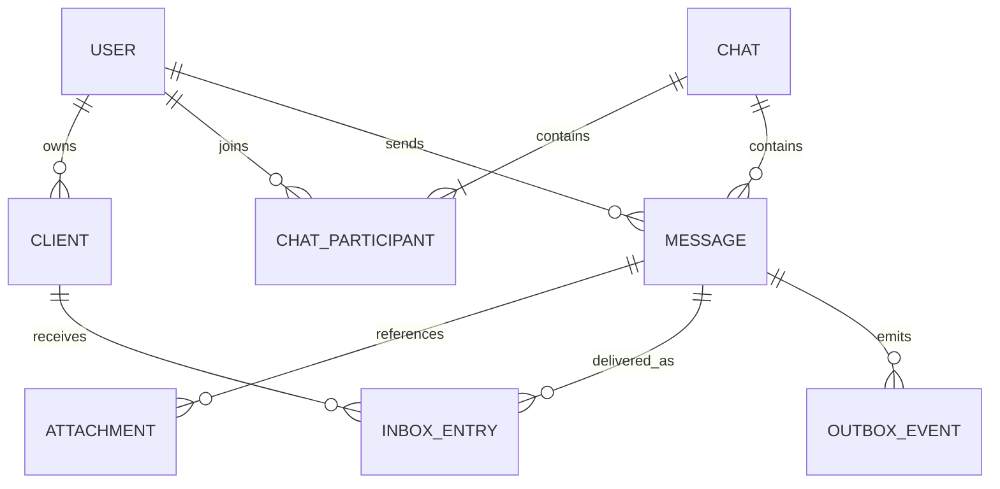
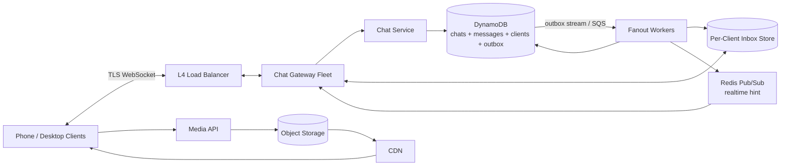
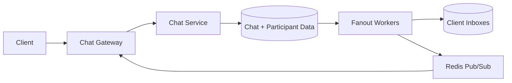
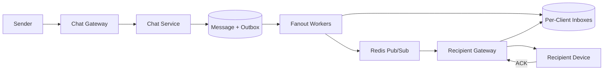
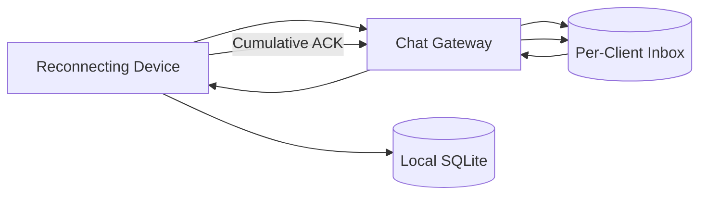
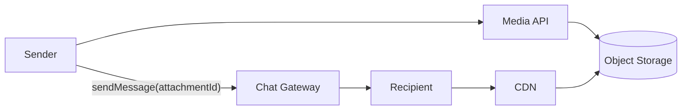

# WhatsApp-Like Messaging System

This is an original interview guide inspired by the structure and topics in
[Hello Interview's WhatsApp breakdown][source]. It focuses on the decisions
most useful in a 60-minute system design interview rather than reproducing the
source.

[source]: https://www.hellointerview.com/learn/system-design/problem-breakdowns/whatsapp

Source reviewed: 2026-09-08.

## 0. One-Minute Design

Clients maintain TLS WebSocket connections to a fleet of chat gateways behind
an L4 load balancer. A send command is acknowledged only after the message and
a durable fanout event are stored.

Fanout workers resolve chat participants and their active devices, then create
one durable inbox entry per destination device. Only after that do they publish
a realtime hint through Redis Pub/Sub. A connected gateway pushes the event
immediately; an offline or disconnected device replays its inbox later.

Each device durably stores received messages in a local database and
acknowledges a contiguous delivery sequence. The server can then remove the
acknowledged inbox entries. Pub/sub provides low latency, while the per-device
inbox provides reliable, at-least-once delivery.

Media bytes bypass the chat path. Clients upload encrypted files directly to
object storage using signed HTTP URLs and send only attachment metadata through
the WebSocket.

## 1. Requirements

### Functional

1. Start one-to-one or group chats with at most 100 participants.
2. Send and receive text messages.
3. Receive messages sent while a device was offline, for up to 30 days.
4. Send and receive media attachments.

### Out of Scope

- Audio and video calls.
- Business messaging.
- Registration and profile management.
- Read receipts, typing indicators, reactions, and presence.
- Full end-to-end encryption key management.
- Spam, scraping, and contact discovery.

### Non-Functional

| Goal | Target |
|---|---|
| Online latency | p95 under 500 ms when sender and recipient are connected |
| Reliability | Every durably accepted message eventually reaches each active recipient device despite component failures |
| Scale | Billions of accounts, about 200 million concurrent connections, and tens of thousands of messages/second |
| Retention efficiency | Deliver offline messages for up to 30 days, logically expire them after that window, and keep media outside the message database |

The delivery promise is bounded by active devices and the 30-day retention
window. It does not guarantee that a human reads a message.

### Capacity Estimate

Assume:

- 200 million daily active users.
- 20 messages sent per user per day.
- Up to three active devices per user.

```text
200,000,000 users x 20 messages/day
  = 4 billion messages/day

4,000,000,000 / 86,400
  ~= 46,000 messages/second average
```

A one-to-one message usually creates one message write and one or more inbox
writes. Including groups and multiple devices, roughly 100,000 writes/second
is a useful baseline. The fleet must also maintain about 200 million long-lived
connections; socket capacity and fanout are separate scaling concerns.

## 2. Core Entities

| Entity | Purpose |
|---|---|
| User | Account that participates in chats |
| Client | One linked phone, tablet, or computer belonging to a user |
| Chat | One-to-one or group conversation with a maximum of 100 participants |
| ChatParticipant | Membership, role, join time, and membership version |
| Message | One logical text or media message stored once |
| InboxEntry | Pending delivery of an event to one client device |
| Attachment | Metadata and object-storage location for an uploaded media file |
| OutboxEvent | Durable handoff from accepted state to asynchronous fanout |



A `Message` is shared conversation data. An `InboxEntry` is device-specific
delivery state:

```text
msg-3021 -> one logical encrypted message

phone-b  -> pending delivery of msg-3021
laptop-b -> pending delivery of msg-3021
```

Bob's phone can acknowledge the message without deleting the laptop's pending
delivery.

## 3. APIs

WebSockets carry small, frequent, bidirectional chat commands and events. HTTP
is used for large media uploads. The client authenticates during the WebSocket
handshake with a short-lived token, and the server binds the connection to a
`user_id` and `client_id`.

| Functional requirement | API |
|---|---|
| Create a chat | `createChat` WebSocket command |
| Send and receive messages | `sendMessage`, `newMessage`, and `ackEvent` WebSocket messages |
| Replay offline messages | `syncInbox`, `syncBatch`, and `ackEvent` WebSocket messages |
| Transfer media | Attachment HTTP endpoints plus `sendMessage(attachmentId)` |

### Functional Requirement 1: Create a Chat

```jsonc
// Client -> server
{
  "type": "createChat",
  "requestId": "req-100",
  "participants": ["user-a", "user-b", "user-c"],
  "name": "Weekend trip"
}
```

```jsonc
// Server -> requesting client
{
  "requestId": "req-100",
  "status": "SUCCESS",
  "chatId": "chat-7",
  "chatVersion": 1
}
```

`requestId` correlates the asynchronous response. The server stores the result
under `(client_id, requestId)`, making a retried command idempotent. The
authenticated creator is implicit and must be included in the final
membership. The server rejects duplicate participants and groups larger than
100.

A later `modifyChatParticipants` command can add or remove members using the
same authorization and versioning model, but it is not required for the core
interview scope.

### Functional Requirement 2: Send and Receive a Message

```jsonc
// Client -> server
{
  "type": "sendMessage",
  "requestId": "req-101",
  "clientMessageId": "phone-a:1042",
  "chatId": "chat-7",
  "message": "base64-encrypted-payload",
  "attachmentIds": []
}
```

```jsonc
// Server -> sender after durable acceptance
{
  "requestId": "req-101",
  "status": "SUCCESS",
  "messageId": "msg-3021",
  "serverReceivedAt": "2026-09-08T18:10:03.412Z"
}
```

`clientMessageId` is generated by the sending device and deduplicates a retry.
`SUCCESS` means the message and fanout intent are durable; it does not mean
every recipient has received the message.

Each destination device later receives its own event:

```jsonc
// Server -> recipient device
{
  "type": "newMessage",
  "eventId": "evt-laptop-8804",
  "deliverySeq": 8804,
  "messageId": "msg-3021",
  "chatId": "chat-7",
  "senderId": "user-a",
  "message": "base64-encrypted-payload",
  "attachmentIds": [],
  "serverReceivedAt": "2026-09-08T18:10:03.412Z"
}
```

After storing it locally, the device acknowledges the highest contiguous
sequence it has persisted:

```jsonc
// Client -> server
{
  "type": "ackEvent",
  "ackThroughDeliverySeq": 8804
}
```

The recipient is implicit in the authenticated WebSocket connection.

### Functional Requirement 3: Replay Offline Messages

After connecting or detecting a sequence gap, a device requests the events
after its local cursor:

```jsonc
// Client -> server
{
  "type": "syncInbox",
  "requestId": "sync-20",
  "afterDeliverySeq": 8802,
  "limit": 100
}
```

```jsonc
// Server -> client
{
  "type": "syncBatch",
  "requestId": "sync-20",
  "events": [
    {
      "eventId": "evt-laptop-8803",
      "deliverySeq": 8803,
      "messageId": "msg-3020",
      "chatId": "chat-2"
    },
    {
      "eventId": "evt-laptop-8804",
      "deliverySeq": 8804,
      "messageId": "msg-3021",
      "chatId": "chat-7"
    }
  ],
  "oldestAvailableDeliverySeq": 8803,
  "historyTruncated": false,
  "lastDeliverySeq": 8804,
  "hasMore": false
}
```

The device stores the page in one local transaction and sends
`ackThroughDeliverySeq: 8804`. If `hasMore` is true, it requests the next page
after 8804 before entering realtime mode. If the requested cursor is older
than the 30-day window, the server sets `historyTruncated: true` and reports
the oldest available sequence so the client can explicitly accept the
retention gap rather than treating it as packet loss.

### Functional Requirement 4: Send and Receive Media

```http
POST /v1/attachments/init
Authorization: Bearer <access-token>
Content-Type: application/json

{
  "contentType": "image/jpeg",
  "sizeBytes": 2482103,
  "sha256": "8f..."
}
```

```json
{
  "attachmentId": "att-91",
  "signedUploadUrl": "https://object-store.example/signed/..."
}
```

The client uploads bytes directly and then completes the attachment:

```http
PUT <signedUploadUrl>
POST /v1/attachments/att-91/complete
```

After the service validates the size and checksum and marks the attachment
`READY`, the client sends a normal `sendMessage` containing:

```json
{
  "attachmentIds": ["att-91"]
}
```

Recipients obtain a short-lived download URL from the attachment service and
download the bytes through a CDN.

## 4. High-Level Design



This is one messaging architecture. The four workflows below use subsets of
the same components rather than introducing separate designs.

### Concrete Component Choices

| Component | Default choice | Why / alternative |
|---|---|---|
| Client transport | TLS WebSocket | Persistent bidirectional connection avoids polling; raw TLS TCP is an alternative |
| Load balancer | L4 network load balancer | Only connection distribution is required; an L7 balancer also works when header or path routing is needed |
| Chat gateways | Stateful connection servers | Maintain local `(user_id, client_id) -> socket` maps and heartbeat state |
| Chat and message data | DynamoDB | Horizontal write scaling and direct key access; Cassandra or ScyllaDB are alternatives |
| Durable fanout | DynamoDB outbox relayed through Streams or polling into SQS | Keeps fanout recoverable without blocking the socket request on every recipient write |
| Device inbox | DynamoDB keyed by `(client_id, delivery_seq)` | Ordered replay, conditional writes, and 30-day TTL |
| Realtime routing | Redis Pub/Sub | Very low latency; Kafka or NATS are alternatives, but durability is supplied by the inbox |
| Client storage | SQLite | Durable local message history and cursor updates in one transaction |
| Media | S3-compatible object storage plus CDN | Cheap scalable bytes, signed URLs, and edge delivery |

The concrete interview design uses **WebSockets, DynamoDB, an outbox relay,
SQS, Redis Pub/Sub, SQLite, and S3 plus a CDN**. DynamoDB Streams can wake the
outbox relay; polling is a simpler alternative. The important design choice is
the role of each component, not the brand name. The primary store and inbox are
separate logical DynamoDB tables and may share the same regional cluster.

### 4.1 Workflow for API 1: Create a Chat



1. **Authenticate and validate.** The gateway uses the identity bound to the
   socket. The service validates unique participants, the 100-user limit, and
   the creator's permissions.
2. **Deduplicate the command.** `requestId` is scoped to the requesting client,
   so a timeout and retry return the original `chatId`.
3. **Persist membership.** Store the `Chat` and `ChatParticipant` records. A
   small chat can use a DynamoDB transaction. Near the maximum size, create the
   chat in `CREATING`, write memberships in idempotent batches, and then change
   it to `ACTIVE`.
4. **Index both directions.** Use `(chat_id, user_id)` to list chat members and
   a GSI on `(user_id, chat_id)` to list a user's chats.
5. **Notify participants.** Emit a durable `chatUpdate` fanout event. Workers
   place it in each active client's inbox before publishing the realtime hint.

**Why these choices:** the state transition prevents clients from observing a
partially created large chat; the two indexes match the required membership
queries; and routing membership events through the normal inbox path lets an
offline device learn about the chat later.

### 4.2 Workflow for API 2: Send and Receive a Message



1. **Authorize and deduplicate.** Verify that the sender belongs to the chat,
   then look up `(sender_client_id, clientMessageId)`. A retry returns the same
   server `messageId`.
2. **Accept durably.** In one DynamoDB transaction, store the message and an
   outbox event. Stamp `serverReceivedAt` using synchronized server time, then
   return `SUCCESS`.
3. **Resolve fanout.** Workers load chat participants and each user's active
   clients. They include the sender's other devices so all of the sender's
   clients remain synchronized.
4. **Write before publishing.** For every destination client, create one
   idempotent inbox entry. A DynamoDB transaction conditionally creates a
   `(client_id, message_id)` dedupe marker, advances that client's sequence,
   and writes the inbox row at the new `deliverySeq`.
5. **Take the fast path.** After the inbox write succeeds, publish to the
   recipient user's Redis topic. The gateway subscribed for that connected
   user pushes `newMessage` over the correct device sockets.
6. **Acknowledge safely.** The client stores the message and cursor in one
   SQLite transaction, then sends `ackEvent`. The server removes or advances
   the acknowledged inbox entries.

**Why these choices:** WebSockets and Redis minimize online latency; the
DynamoDB message and inbox records survive gateway or Redis failure; fanout
workers keep group expansion off the sender's latency path; and per-client
acknowledgements let a phone and laptop advance independently.

### 4.3 Workflow for API 3: Replay Offline Messages



1. **Resume the device, not only the user.** After authentication, the gateway
   identifies the exact `client_id`. Bob's phone and laptop have independent
   inboxes and cursors.
2. **Request after the local cursor.** The device sends its highest contiguous,
   durably stored `deliverySeq`.
3. **Read ordered pages.** Query DynamoDB where `client_id` matches and
   `delivery_seq` is greater than the cursor, ordered ascending with a bounded
   page size. If the cursor predates retention, report the oldest available
   sequence and a history-truncated flag.
4. **Persist before acknowledging.** The device writes the batch and updated
   cursor in one SQLite transaction. It acknowledges only the highest
   contiguous sequence, never skipping a gap unless the server explicitly
   identifies it as expired history.
5. **Advance server state.** The gateway deletes acknowledged rows or advances
   a compact inbox cursor. It repeats until `hasMore` is false.
6. **Expire abandoned work.** Entries become ineligible after 30 days;
   DynamoDB TTL and a sweeper remove them physically, and inactive clients are
   eventually revoked.

**Why these choices:** a per-client inbox prevents one online device from
deleting another device's pending work; pagination bounds memory and response
size; a cumulative ACK reduces write volume; and the local transaction
prevents a crash between storing a message and advancing the cursor.

An alternative is one sequence per chat plus one cursor per `(client, chat)`.
The per-client delivery sequence is convenient because one cursor replays
messages and control events across every chat.

### 4.4 Workflow for API 4: Send and Receive Media



1. **Initialize metadata.** The authenticated client sends content type, size,
   and checksum to the media API.
2. **Upload directly.** The API returns an `attachmentId` and short-lived signed
   URL. The client uploads encrypted bytes directly to S3, bypassing chat
   gateways and DynamoDB.
3. **Complete the upload.** The media service verifies object existence, size,
   and checksum before changing the attachment from `UPLOADING` to `READY`.
4. **Send only a reference.** A normal `sendMessage` contains the
   `attachmentId`. The chat service rejects attachments that are not ready or
   do not belong to the sender.
5. **Download from the edge.** Recipients obtain authorized signed download
   URLs and fetch through the CDN.

**Why these choices:** object storage is cheaper and more scalable for large
bytes; signed URLs keep application servers off the data path; the completion
step prevents messages from referencing partial files; and a CDN reduces
latency and repeated origin bandwidth.

## 5. Shared Message and Delivery Semantics

These identifiers solve different problems:

| Identifier | Scope and purpose |
|---|---|
| `requestId` | Correlates one WebSocket command and response |
| `clientMessageId` | Makes a sender-device retry idempotent |
| `messageId` | Identifies one logical message shared by all recipients |
| `eventId` | Identifies one delivery event for one destination client |
| `deliverySeq` | Orders one client's unified replay stream and supports cumulative ACKs |

The sender and recipient confirmations also mean different things:

```text
sendMessage SUCCESS
  = message + durable fanout intent committed

ackEvent RECEIVED
  = this client durably stored events through deliverySeq N
```

Device delivery is **at least once**. If an ACK is lost, the server may replay
the event. Clients deduplicate by `messageId` or `eventId` and acknowledge it
again.

Strict global ordering is unnecessary. Stamp messages with synchronized server
receive time and display by `(serverReceivedAt, messageId)`. This favors low
latency but can occasionally insert a late message above one already shown. If
the product requires a stable total order inside each chat, add a `chatSeq`
assigned by the chat's partition leader at the cost of a potential hot
partition and reduced availability during leader failure.

## 6. Data Model

DynamoDB is a reasonable default because the dominant operations are
high-volume key lookups and ordered partition queries.

| Data | Key / index | Main access |
|---|---|---|
| `Chat` | PK `chat_id` | Fetch chat metadata and version |
| `ChatParticipant` | PK `(chat_id, user_id)` | List members of a chat |
| Participant GSI | `(user_id, chat_id)` | List chats for a user |
| `Client` | PK `(user_id, client_id)` | Resolve active devices for a user |
| `Message` | PK `message_id`; GSI `(chat_id, server_time#message_id)` | Fetch payload or read ordered chat history |
| `InboxEntry` | PK `(client_id, delivery_seq)` | Replay pending device events |
| `InboxDedupe` | PK `(client_id, message_id)` | Conditionally map one logical message to one client delivery sequence |
| `SendIdempotency` | PK `(sender_client_id, client_message_id)` | Return the original result for retries |
| `Attachment` | PK `attachment_id` | Validate ownership, state, and object metadata |
| `OutboxEvent` | PK `event_id`; GSI `(state#outbox_shard, created_at#event_id)` | Scan pending fanout work without one hot unpublished partition |

### Retention

- Give every inbox entry a `deliver_until` timestamp 30 days after acceptance.
  Reads reject an entry immediately after that time.
- Keep a message payload while a nonexpired inbox entry can reference it, but
  never make it deliverable after `deliver_until`. An asynchronous sweeper
  removes expired inbox and message rows.
- DynamoDB TTL performs eventual physical deletion, not exact-time deletion.
  If strict deletion at 30 days is required, run an explicit deletion job in
  addition to TTL.
- Remove or revoke inactive clients so abandoned devices do not generate
  unnecessary inbox writes.
- Keep long-term chat history primarily in each client's SQLite database unless
  the product explicitly requires centralized history.
- Apply separate S3 lifecycle rules to attachments and delete incomplete
  uploads quickly.

## 7. Deep Dives

Each deep dive corresponds directly to one non-functional requirement:

| Non-functional requirement | Deep dive |
|---|---|
| Reliability | 7.1 Durable delivery across failures and multiple devices |
| Online latency | 7.2 WebSocket fast path and connection health |
| Scale | 7.3 Persistent connections, routing, and fanout |
| Retention efficiency | 7.4 Inbox, message, and media lifecycle |

### 7.1 Reliability: How Do We Deliver Across Failures and Devices?

**Addresses:** eventual delivery to every active client despite gateway,
worker, pub/sub, or network failures.

The durable path and realtime path have different responsibilities:

```text
Durable path:
message + outbox -> fanout worker -> per-client inbox

Fast path:
per-client inbox -> Redis Pub/Sub -> gateway -> WebSocket
```

Important invariants:

1. Acknowledge the sender only after the message and fanout intent commit.
2. Make fanout idempotent with a conditional `(client_id, message_id)` marker.
3. Write each inbox entry before publishing its realtime hint.
4. Let a client ACK only after its local transaction commits.
5. Delete pending delivery state only for the client that acknowledged it.

Redis Pub/Sub is at-most-once and can drop a hint when there is no subscriber
or a broker fails. The inbox still contains the event, so reconnect sync,
sequence-gap detection, and periodic polling recover it.

Multiple devices require a `Client` table and one inbox per client. Fanout
targets every active client, including the sender's other devices. Bound the
number of linked clients, such as three per account, and explicitly revoke old
devices.

An ACK loss can cause a duplicate delivery. That is preferable to loss:
clients deduplicate and ACK again. These are at-least-once, not exactly-once,
semantics.

### 7.2 Online Latency: How Do We Stay Below 500 ms?

**Addresses:** fast delivery when sender and recipient are connected.

WebSockets avoid a new HTTP/TLS handshake or polling delay for every message.
Each gateway holds a local map:

```text
user_id -> [(client_id, websocket), ...]
```

Gateways subscribe to Redis topics for the users currently connected to them.
The online path is:

```text
sender socket -> chat service -> durable write -> inbox fanout
              -> Redis hint -> recipient gateway -> recipient socket
```

Keep the latency path small:

- Reuse database and Redis connections.
- Cache chat membership briefly with version-based invalidation.
- Publish IDs and small metadata rather than media bytes.
- Bound gateway output buffers and disconnect slow consumers so they recover
  through inbox replay.
- Measure durable-commit, fanout, pub/sub, and socket latency separately.

Application-level `ping` and `pong` heartbeats detect half-open connections
faster than TCP keepalive. A missed heartbeat closes the socket and triggers
reconnect with randomized delay, preventing a failed gateway from causing a
simultaneous reconnect storm.

Do not delay the realtime path to enforce perfect cross-server ordering.
Server receive timestamps give a stable-enough display order without waiting
for potentially late messages.

### 7.3 Scale: How Do We Handle Connections, Routing, and Fanout?

**Addresses:** roughly 200 million concurrent sockets, 46,000 average
messages/second, and approximately 100,000 database writes/second.

Scale gateways horizontally. The L4 load balancer distributes new connections,
while each established WebSocket remains pinned to one gateway. Gateways
should drain during deploys, cap connections and memory, and add reconnect
jitter after failures.

When sender and recipient use different gateways, Redis routes the realtime
hint. Use Redis Cluster or consistent hashing so publishers and subscriber
gateways route a topic to the same shard. Use **per-user topics** by default:

```text
message for Bob -> publish to user:Bob
gateways hosting Bob's devices -> subscribed to user:Bob
```

Per-user topics fit a workload dominated by one-to-one and small chats. A
per-chat topic reduces publishes for a large group but forces every connected
user to maintain many chat subscriptions. An adaptive option is:

```text
small chat -> recipient user topics
large chat -> one chat topic
```

During a routing-mode transition, briefly publish through both paths and
deduplicate by `eventId`.

Keep fanout off the sender's request thread. SQS or DynamoDB Streams partitions
work across horizontally scaled workers. Workers process participant and
client batches, and DynamoDB distributes inbox writes by `client_id`. Monitor
fanout age separately from message-ingest latency.

The 100-participant limit bounds worst-case work. Rate-limit unusually active
chats and clients so a hot partition or abusive sender cannot consume an
entire shard.

### 7.4 Retention: How Do We Minimize Centralized Storage?

**Addresses:** retaining undelivered data for no more than 30 days and keeping
large media outside the message database.

The server-side inbox is pending delivery state, not permanent history:

```text
ACK received       -> remove inbox entry
deliver_until reached -> expire inbox entry
client revoked     -> stop new fanout and clean remaining entries
```

If expiry removes an event before an inactive device reconnects, `syncBatch`
returns the oldest available sequence and `historyTruncated: true`. The device
can then reset its replay baseline explicitly; an unexplained gap still
triggers recovery.

Store one message payload and let lightweight inbox rows reference it. Do not
delete the payload until all possible live references have been acknowledged
or expired. At scale, use a conservative message TTL slightly beyond the inbox
window plus asynchronous cleanup rather than a synchronous global reference
count on every ACK.

Clients keep their own durable chat history in SQLite. This reduces centralized
retention and makes ordinary history reads local. A newly linked device can
receive only the history allowed by the product's bootstrap and retention
policy.

Store attachment bytes in S3, not DynamoDB or Redis. Apply lifecycle rules to
abandoned uploads and expired media, serve downloads through a CDN, and keep
only attachment metadata in chat messages. End-to-end encrypted deployments
store opaque ciphertext on the server.

## 8. Important Tradeoffs and Failures

| Situation | Decision |
|---|---|
| Gateway crashes | Client reconnects with jitter and replays its device inbox |
| Redis drops a realtime hint | Sequence gap or periodic inbox sync recovers the event |
| Fanout worker crashes | Durable outbox or stream redelivers; conditional inbox dedupe prevents duplicate rows |
| Sender retries after a timeout | `clientMessageId` returns the original message |
| Recipient ACK is lost | Event may replay; client deduplicates and ACKs again |
| One device is offline | Its inbox remains independent of the user's online devices |
| Client is too slow | Bound the gateway buffer, disconnect, and use replay |
| Messages arrive out of order | Display by server receive time; add per-chat sequence only if required |
| Media upload is incomplete | Reject the attachment reference until state is `READY` |
| Client stays inactive over 30 days | Expire its pending inbox entries and require normal resynchronization |

The central tradeoff is **durable at-least-once delivery versus a lightweight
low-latency fast path**. The inbox prevents loss; Redis and WebSockets avoid
making every connected device poll.

## 9. Main Design Decisions

| Decision | Why |
|---|---|
| TLS WebSockets | Low-latency bidirectional commands and events |
| L4 load balancer | Efficiently distributes long-lived connections without unnecessary HTTP routing |
| DynamoDB chat and inbox data | Scales key-based reads and high-volume writes horizontally |
| Message plus transactional outbox | Accepted messages cannot disappear before fanout |
| Per-client inbox | Phones and computers synchronize independently |
| Inbox before Redis publish | Pub/sub loss delays but cannot lose delivery |
| Outbox relayed to SQS fanout | Group and multi-device expansion stays recoverable and off the sender path |
| Redis per-user topics | Efficient routing for mostly one-to-one and small chats |
| Server timestamp by default | Avoids strict-order coordination on the latency path |
| Signed S3 upload plus CDN | Keeps large media bytes off gateways, queues, and databases |

## 10. Suggested 60-Minute Interview Walkthrough

| Time | Topic |
|---:|---|
| 0-5 min | Clarify group size, offline window, multiple devices, and delivery meaning |
| 5-10 min | Functional requirements, four NFRs, and capacity |
| 10-15 min | Core entities and WebSocket/HTTP APIs |
| 15-20 min | Draw the shared high-level design |
| 20-24 min | Workflow 1: create a chat |
| 24-31 min | Workflow 2: send and receive online |
| 31-36 min | Workflow 3: reconnect and replay |
| 36-40 min | Workflow 4: media upload and download |
| 40-46 min | Deep dive 1: reliable multi-device delivery |
| 46-51 min | Deep dive 2: low latency and connection health |
| 51-56 min | Deep dive 3: connection, routing, and fanout scale |
| 56-59 min | Deep dive 4: retention and storage lifecycle |
| 59-60 min | Summarize invariants and tradeoffs |

If time is limited, prioritize inbox-before-publish, per-client ACK state,
gateway/pub-sub routing, and direct media upload. Presence, strict ordering,
long-term server history, and full encryption key management are follow-ups.

## References

- [Hello Interview: Design WhatsApp][source]
- [RFC 6455: The WebSocket Protocol](https://www.rfc-editor.org/rfc/rfc6455)
- [Amazon DynamoDB Developer Guide](https://docs.aws.amazon.com/amazondynamodb/latest/developerguide/Introduction.html)
- [Redis Pub/Sub delivery semantics](https://redis.io/docs/latest/develop/interact/pubsub/)
- [Amazon S3 presigned URLs](https://docs.aws.amazon.com/AmazonS3/latest/userguide/using-presigned-url.html)
- [Transactional Outbox Pattern](https://microservices.io/patterns/data/transactional-outbox.html)
