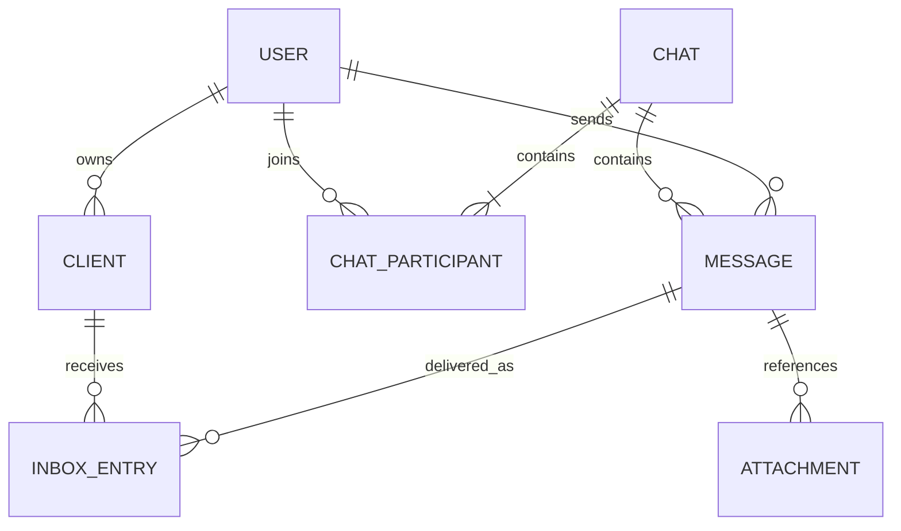
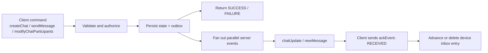
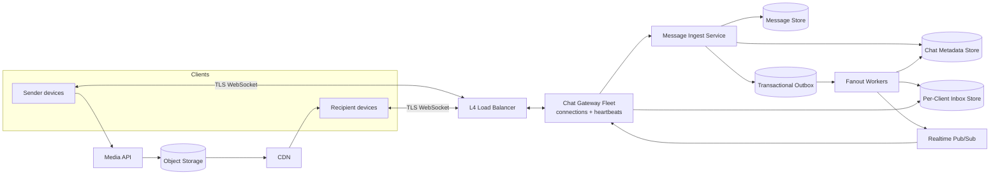
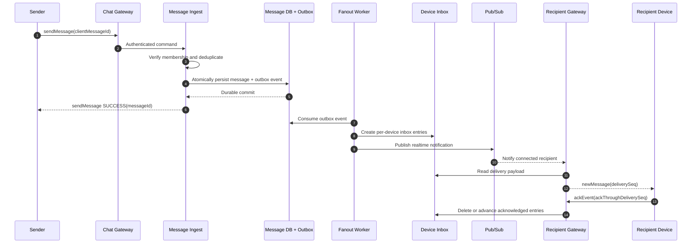
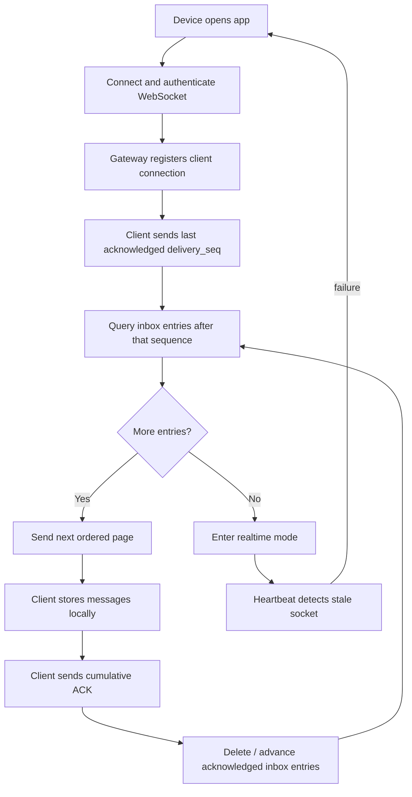
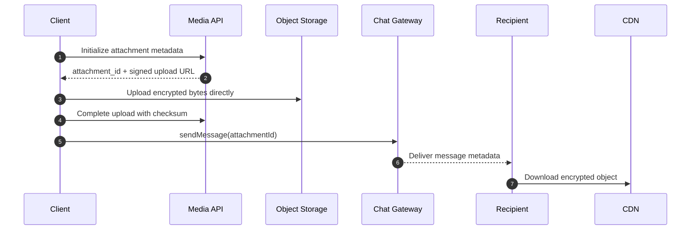

# WhatsApp-Like Messaging System

This is an original, condensed discussion guide inspired by the structure and
topics in [Hello Interview's WhatsApp breakdown][source]. It focuses on
reasoning, examples, and tradeoffs rather than reproducing the source.

[source]: https://www.hellointerview.com/learn/system-design/problem-breakdowns/whatsapp

Source reviewed: 2026-08-25.

## 0. One-Minute Design

Clients maintain TLS WebSocket connections to a fleet of chat gateways.
Sending a message has two paths:

1. **Durable path:** persist the message and create per-device inbox entries.
2. **Fast path:** publish a notification so connected devices receive it
   immediately.

The inbox is the delivery source of truth. Pub/sub is only a low-latency hint.
If a socket or pub/sub delivery fails, a device reconnects and replays its
inbox. Devices acknowledge received messages, allowing inbox entries to be
removed. Media bypasses chat servers and moves through object storage and a
CDN.

## 1. Requirements

### Functional

1. Create one-to-one and group chats, with at most 100 participants.
2. Send and receive text messages.
3. Deliver messages sent while a device is offline, for up to 30 days.
4. Send and receive media attachments.
5. Synchronize multiple devices belonging to one user.

### Out of Scope

- Voice and video calling.
- Business messaging.
- Registration and profile management.
- Read receipts, typing indicators, and reactions.
- Full key-management design for end-to-end encryption.
- Spam, abuse, and contact discovery.

### Non-Functional

| Goal | Target / interpretation |
|---|---|
| Online delivery latency | p95 below 500 ms when both users are connected |
| Delivery | Every durably accepted message eventually reaches each active recipient device |
| Scale | Billions of accounts and hundreds of millions of concurrent sockets |
| Availability | A gateway, pub/sub node, or worker failure must not lose accepted messages |
| Storage | Retain undelivered messages for at most 30 days; keep media outside the message database |
| Security | TLS in transit; message payload can be opaque client-encrypted ciphertext |

### Example Capacity Estimate

Assume:

- 200 million daily active users.
- 20 messages per user per day.
- Five times average traffic at peak.

```text
4 billion messages/day
  / 86,400 seconds
  ~= 46,000 messages/second average
  ~= 230,000 messages/second peak
```

Delivery work is larger than message-ingest work:

```text
delivery writes per message
  = recipient count x active devices per recipient
```

A 50-person chat with two devices per recipient may produce approximately 100
delivery tasks from one message. Fanout, not message creation, is likely the
dominant write path.

## 2. Core Entities

| Entity | Important fields |
|---|---|
| User | `user_id`, account status |
| Client | `client_id`, `user_id`, device status, last active time |
| Chat | `chat_id`, type, created time |
| ChatParticipant | `chat_id`, `user_id`, role, joined time |
| Message | `message_id`, `chat_id`, sender, ciphertext, server time, attachment IDs |
| InboxEntry | `client_id`, delivery sequence, `message_id`, expiry |
| Attachment | `attachment_id`, object key, size, content type, checksum |
| Connection | Client-to-gateway association and heartbeat state |

### Relationships



## 3. Interfaces

Use WebSockets for high-frequency bidirectional commands. Use HTTP for media
upload because large binaries should not pass through the chat gateway.

### WebSocket Commands

| Direction | Command | Purpose |
|---|---|---|
| Client -> server | `createChat` | Create a chat and initial memberships |
| Client -> server | `sendMessage` | Durably submit a message |
| Client -> server | `createAttachment` | Initialize an attachment |
| Client -> server | `modifyChatParticipants` | Add or remove a participant |
| Client -> server | `ackEvent` | Confirm a server event was received |
| Client -> server | `syncInbox` | Request missed events after reconnect |
| Server -> client | `chatUpdate` | Notify devices of chat or membership state |
| Server -> client | `newMessage` | Deliver a message to a device |
| Server -> client | `syncBatch` | Return a page of missed events |
| Both | `ping` / `pong` | Detect dead connections quickly |

State-changing commands produce parallel events for affected devices:

| Accepted command | Pushed event |
|---|---|
| `createChat` | `chatUpdate` to every initial participant device |
| `modifyChatParticipants` | `chatUpdate` to remaining and newly added participant devices |
| `sendMessage` | `newMessage` to every recipient device and the sender's other devices |
| `createAttachment` | No chat event until a later `sendMessage` references the attachment |

Notation used below:

- `-> commandName`: client sends a command to the server.
- `<- eventName`: server pushes an event to a client.
- Command responses report whether the server accepted the operation.
- Server events require an acknowledgement so they can be removed from the
  recipient device's inbox.

The four baseline command shapes follow the source discussion, with production
fields added where they clarify retries and failures.

### `createChat`

```jsonc
// -> createChat
{
  "requestId": "req-100",
  "participants": ["user-b", "user-c"],
  "name": "Weekend trip"
}
```

```jsonc
// response
{
  "status": "SUCCESS",
  "chatId": "chat-7"
}
```

The server validates the participant limit, persists the chat and memberships,
then emits `chatUpdate` to every participant device.

### `sendMessage`

```jsonc
// -> sendMessage
{
  "requestId": "req-101",
  "clientMessageId": "phone-a:1042",
  "chatId": "chat-7",
  "message": "base64-encrypted-payload",
  "attachments": ["att-91"]
}
```

```jsonc
// response
{
  "status": "SUCCESS",
  "messageId": "msg-3021",
  "serverReceivedAt": "2026-08-25T22:10:03.412Z"
}
```

`clientMessageId` makes a retried command idempotent. `SUCCESS` means the
message and fanout event are durable; it does not mean every recipient has
received the message.

### `createAttachment`

The simple interview version puts the body in the command:

```jsonc
// -> createAttachment (baseline)
{
  "body": "<binary-data>",
  "hash": "sha256:8f..."
}
```

```jsonc
// response
{
  "status": "SUCCESS",
  "attachmentId": "att-91"
}
```

The scalable version sends metadata over WebSocket and uploads bytes directly
to object storage:

```jsonc
// -> createAttachment (scalable)
{
  "requestId": "req-102",
  "contentType": "image/jpeg",
  "sizeBytes": 2482103,
  "hash": "sha256:8f..."
}
```

```jsonc
// response
{
  "status": "SUCCESS",
  "attachmentId": "att-91",
  "signedUploadUrl": "https://object-store.example/signed/..."
}
```

### `modifyChatParticipants`

```jsonc
// -> modifyChatParticipants
{
  "requestId": "req-103",
  "chatId": "chat-7",
  "userId": "user-d",
  "operation": "ADD"
}
```

```jsonc
// response
{
  "status": "SUCCESS",
  "chatVersion": 12
}
```

Valid operations are `ADD` and `REMOVE`. The server checks authorization,
updates membership, increments `chatVersion`, and emits `chatUpdate`.

### Server Events and Acknowledgements

When a chat is created or its membership changes:

```jsonc
// <- chatUpdate
{
  "eventId": "evt-7001",
  "deliverySeq": 8803,
  "chatId": "chat-7",
  "chatVersion": 12,
  "name": "Weekend trip",
  "participants": ["user-a", "user-b", "user-c", "user-d"]
}
```

When a message is delivered:

```jsonc
// <- newMessage
{
  "eventId": "evt-7002", // (Unique delivery event for this recipient device; used for acknowledgement and deduplication)
  "deliverySeq": 8804, // (Monotonic per-device sequence used for replay, gap detection, and cumulative acknowledgement)
  "messageId": "msg-3021", // (Server-assigned message ID shared by every device receiving this message)
  "chatId": "chat-7", // (Conversation containing the message)
  "senderId": "user-a", // (User who sent the message, not the recipient)
  "message": "base64-encrypted-payload", // (Encrypted message content)
  "attachments": ["att-91"], // (Identifiers for media metadata referenced by the message)
  "serverReceivedAt": "2026-08-25T22:10:03.412Z" // (Time the server accepted the original message, not successful device-delivery time)
}
```

The recipient is implicit in the WebSocket connection and per-device inbox to
which this event is sent. Fanout creates a separate delivery event for each
recipient device. Delivery is confirmed only after that device sends
`ackEvent`; the server may record that later time separately as
`acknowledgedAt`.

The source's simplified event response is `"RECEIVED"`. Because WebSocket
events are asynchronous, a production protocol makes it an explicit command:

```jsonc
// -> ackEvent
{
  "clientId": "laptop-b",
  "eventId": "evt-7002",
  "status": "RECEIVED"
}
```

For efficiency, a device may cumulatively acknowledge an ordered range:

```jsonc
// -> ackEvent
{
  "clientId": "laptop-b",
  "ackThroughDeliverySeq": 8804,
  "status": "RECEIVED"
}
```

### Reconnect and Heartbeat Additions

```jsonc
// -> syncInbox
{
  "clientId": "laptop-b",
  "afterDeliverySeq": 8790,
  "limit": 100
}
```

```jsonc
// <- syncBatch
{
  "eventId": "evt-sync-20",
  "events": ["...chatUpdate/newMessage events..."],
  "nextDeliverySeq": 8804,
  "hasMore": false
}
```

```jsonc
// -> ping
{
  "sentAt": "2026-08-25T22:10:10Z"
}
```

```jsonc
// <- pong
{
  "sentAt": "2026-08-25T22:10:10Z",
  "serverTime": "2026-08-25T22:10:10.020Z"
}
```

### Command Lifecycle



Example failure response:

```jsonc
{
  "status": "FAILURE",
  "errorCode": "NOT_CHAT_MEMBER",
  "retryable": false
}
```

### Media HTTP API

```text
POST /v1/attachments/init
  -> attachment_id + signed_upload_url

PUT signed_upload_url
  -> upload encrypted bytes directly to object storage

POST /v1/attachments/{attachment_id}/complete
  -> validate size/checksum and mark attachment usable
```

## 4. High-Level Design



### Component Responsibilities

| Component | Responsibility |
|---|---|
| L4 load balancer | Distribute long-lived TCP/WebSocket connections |
| Chat gateway | Authenticate sockets, track local connections, push events, process acks |
| Message ingest | Authorize chat membership, deduplicate, timestamp, persist |
| Message store | Durable message metadata and ciphertext |
| Transactional outbox | Ensure accepted messages cannot be lost before fanout |
| Fanout workers | Resolve recipient devices and create durable inbox entries |
| Inbox store | Source of truth for unacknowledged delivery per device |
| Pub/sub | Notify the gateway currently serving a connected user |
| Media service | Issue signed URLs and validate attachment metadata |

An L7 load balancer can support WebSockets, but L4 is sufficient when no
path/header routing is required and the connection is long-lived.

The message row and outbox event are logical tables that must share one
transaction boundary, even if the diagram draws them separately.

## 5. Critical Flows

### 5.0 Create a Chat

1. Validate that the creator is authenticated and the participant count is
   within the product limit.
2. Write the chat record and initial memberships atomically when possible, or
   use an idempotent batched workflow for the largest allowed groups.
3. Publish `chatUpdate` only after membership state is durable.

### 5.1 Send and Deliver a Message



**Key invariant:** acknowledge the sender only after the message and its outbox
event are durable. Persist recipient inbox entries before sending the realtime
notification.

### 5.2 Offline Delivery and Reconnect



Inbox records use a TTL so messages that remain undelivered beyond the product
retention window are removed automatically.

### 5.3 Media Delivery



This keeps large payloads out of gateways, databases, and pub/sub.

## 6. Data Model and Access Patterns

A DynamoDB-like key/value store is one option; the important part is matching
keys and indexes to access patterns.

| Data | Primary key / ordering | Main access |
|---|---|---|
| Chat | `chat_id` | Fetch chat metadata |
| ChatParticipant | `(chat_id, user_id)` | List users in a chat |
| Participant GSI | `(user_id, chat_id)` | List chats for a user |
| Client | `(user_id, client_id)` | Resolve active devices for a user |
| Message | `(chat_id, server_time#message_id)` | Read chat history in display order |
| InboxEntry | `(client_id, delivery_seq)` | Replay unacknowledged device messages |
| Idempotency | `(sender_client_id, client_message_id)` | Deduplicate retries |
| Attachment | `attachment_id` | Resolve object metadata |

### Why Per-Client Inbox?

Suppose Bob has a phone and laptop:

```text
Bob's phone receives msg-10 and acknowledges it.
Bob's laptop is offline.
```

A user-level inbox would delete `msg-10` too early. Per-client inboxes allow
the phone to advance independently while preserving the laptop's pending
delivery.

### Retention

- Inbox entries expire after the offline-delivery window.
- Message payloads remain available while a live inbox entry can reference
  them, then expire or are deleted after all active devices acknowledge them.
- Chat history is primarily stored on clients unless the product explicitly
  requires longer centralized retention.
- Attachment lifecycle is managed separately in object storage.

## 7. Deep Dives

### 7.1 Scaling Persistent Connections

Each gateway keeps a local map:

```text
user_id -> [(client_id, websocket), ...]
```

Gateways subscribe to realtime topics for locally connected users. A message
for User B can arrive at any ingest node, be published to User B's topic, and
reach whichever gateways currently host B's devices.

Operational considerations:

- Heartbeats remove dead sockets faster than TCP keepalive alone.
- Gateways stop accepting new connections and drain existing ones during
  deployment.
- Reconnect jitter prevents a failed gateway from causing a connection storm.
- Connection counts, outbound buffers, and slow consumers need hard limits.

### 7.2 Pub/Sub Is Not the Durability Layer

An in-memory pub/sub system may drop a notification when:

- No gateway is subscribed.
- A broker fails.
- A gateway is disconnected or overloaded.

That is acceptable because the inbox entry already exists.

Recovery layers:

1. Heartbeats detect dead WebSockets.
2. Delivery sequence numbers reveal gaps.
3. Reconnect replays the inbox.
4. Periodic inbox sync is the final backstop.

The resulting client semantics are **at least once**. Clients deduplicate using
`message_id`.

### 7.3 Ordering

Strict global ordering is unnecessary and expensive. Two practical choices:

| Option | Benefit | Cost |
|---|---|---|
| Server receive timestamp | Simple and low latency | Clock skew and occasional visual reordering |
| Per-chat sequence from one partition leader | Stable total order inside a chat | Hot-chat bottleneck and reduced availability during leader failure |

Example:

```text
M1 reaches the server at 10:00:03.110 -> chat_seq 42
M2 reaches the server at 10:00:03.125 -> chat_seq 43
```

Devices display `42` before `43` even if retries cause `43` to arrive first.
For a simpler interview design, server-received time synchronized with NTP is
often sufficient; introduce per-chat sequencing only when the interviewer
requires stronger ordering.

### 7.4 User Topics vs. Chat Topics

| Routing strategy | Works well when | Problem |
|---|---|---|
| Per-user topic | Chats are mostly one-to-one or small | Large groups require many publishes |
| Per-chat topic | Groups are large | Users with many small chats require many subscriptions |
| Adaptive hybrid | Workload is mixed | Membership changes require careful transition |

Hybrid example:

```text
Small chat -> fanout to recipient user topics.
Large chat -> gateways subscribe to a shared chat topic.
Transition -> temporarily publish through both paths and deduplicate.
```

### 7.5 Fanout and Hot Chats

Do not create hundreds of inbox rows synchronously in the sender request.
Persist one message/outbox event and let horizontally scaled workers fan out.

Protections:

- Partition fanout work by `chat_id` or `message_id`.
- Rate-limit exceptionally active chats.
- Process recipients in chunks.
- Make inbox insertion idempotent on `(client_id, message_id)`.
- Monitor fanout lag separately from ingest latency.

### 7.6 Multiple Devices

- Track a bounded number of active clients per user.
- Fan out to every active client, including the sender's other devices.
- Store delivery state per client.
- Expire or explicitly revoke inactive devices.
- Use cumulative acknowledgements to reduce write volume.

### 7.7 Failure Matrix

| Failure | User-visible behavior | Recovery |
|---|---|---|
| Gateway crashes | Socket disconnects | Reconnect and replay device inbox |
| Pub/sub drops event | Online notification may be late | Inbox sync eventually delivers it |
| Fanout worker crashes | Message accepted but not yet distributed | Durable outbox retries |
| Duplicate client retry | Could create duplicate message | Idempotency record returns original result |
| Recipient ACK is lost | Message may be delivered again | Client deduplicates and ACKs again |
| Slow recipient | Gateway buffer grows | Bound buffer, disconnect, then use inbox replay |
| Media upload is incomplete | Message must not reference unusable media | Require completed attachment state |

### 7.8 Presence / Last Seen (Optional)

Gateways refresh short-lived presence records from heartbeats. When all of a
user's clients disconnect or expire, asynchronously persist a rate-limited
`last_seen_at` value. Presence is best-effort and should never be on the
message-delivery critical path.

## 8. Main Design Decisions

| Decision | Why |
|---|---|
| WebSockets for chat commands | Low-latency bidirectional communication |
| HTTP + object storage for media | Keeps large bytes off the chat path |
| Durable inbox before realtime publish | Pub/sub loss cannot lose accepted messages |
| Inbox per client | Independent synchronization for multiple devices |
| Transactional outbox | Atomic boundary between message acceptance and asynchronous fanout |
| At-least-once device delivery | Practical reliability with client deduplication |
| Server time or optional chat sequence | Avoid expensive global ordering |
| Adaptive pub/sub partitioning | Efficient for both small and unusually large groups |

## 9. End-to-End Example

Alice sends a message to Bob while Bob's phone is online and laptop is offline:

1. Alice sends `clientMessageId=phone-a:1042`.
2. The ingest service persists `msg-3021` and an outbox event.
3. Alice receives a successful `sendMessage` response.
4. Fanout creates one inbox entry for Bob's phone and one for his laptop.
5. Pub/sub wakes the gateway hosting Bob's phone.
6. The phone receives and acknowledges the message; its inbox entry is removed.
7. The laptop entry remains.
8. Hours later, the laptop reconnects with its last acknowledged sequence.
9. The gateway replays `msg-3021`; the laptop acknowledges it.

If pub/sub fails at step 5, the phone still receives the message during its
next inbox sync.

## 10. Discussion Prompts

1. When should the sender receive success: after message persistence, after
   inbox fanout, or after recipient delivery?
2. How would the design change for groups with millions of members?
3. Is Redis Pub/Sub sufficient, or should realtime routing use a durable log?
4. What consistency is required when users are added to or removed from chats?
5. How should a device prove it may decrypt an old message after being linked?
6. Would you choose server timestamps or per-chat sequence numbers?
7. How would you partition the system into regions or failure-isolated cells?
8. What happens when inbox fanout is delayed for several minutes?

## 11. Suggested 30-Minute Walkthrough

| Time | Topic |
|---:|---|
| 0-3 min | Scope, requirements, and scale |
| 3-6 min | Entities and interfaces |
| 6-11 min | High-level architecture |
| 11-17 min | Send, delivery, and offline replay |
| 17-21 min | Media and multi-device behavior |
| 21-27 min | Scaling, ordering, and failure handling |
| 27-30 min | Tradeoffs and interviewer-selected deep dive |

## References

- [Hello Interview: Design WhatsApp][source]
- [RFC 6455: The WebSocket Protocol](https://www.rfc-editor.org/rfc/rfc6455)
- [Transactional Outbox Pattern](https://microservices.io/patterns/data/transactional-outbox.html)
